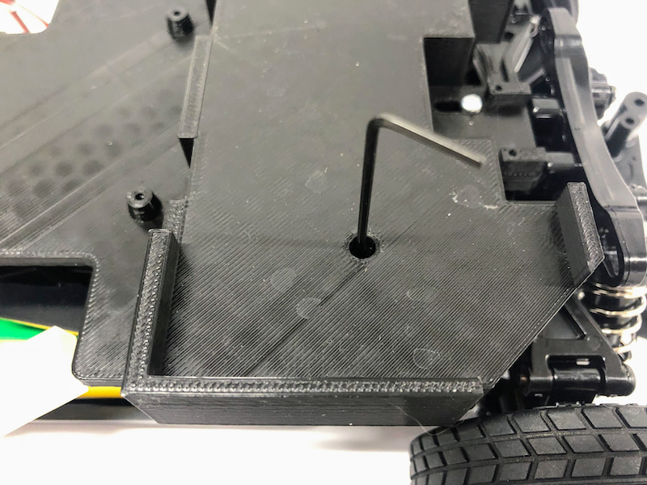
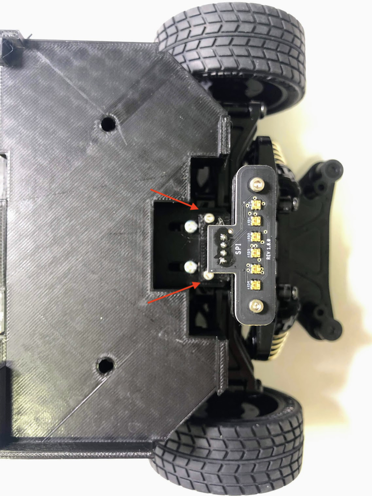
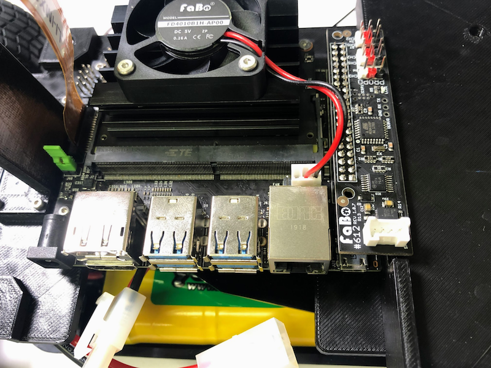

# JetRacerの組み立て(旧式)

TT02をベースにJetRacerを組み立てます。

## シャーシの拡張

矢印のネジを取り外します。

拡張のシャーシを取り付けます。

## バッテリーフォルダの装着

指定位置にバッテリーフォルダを設置します。

M2タッピングネジを用います。

ネジで固定します。

## LEDフォルダの装着

LED基板をフォルダを用意します。

M2タッピングネジで固定します。

固定します。

## Jetson Nanoを固定します。

## Cameraフォルダの装着

カメラとカメラフォルダを用意します。

カメラをフォルダに固定します。

Jetson Nanoのカメラ端子のコネクターを両サイドをつまみ持ち上げます。

カメラのケーブルを指し、真ん中を指で押し、固定します。

フォルダを本体に装着します。

ネジで固定します。

## Jumper Pinの設置

緑のJumper Pinを設置します。

## CPU Fanの取り付け

M2.5 x 24ネジとM2.5ナット、ネジ取り付けジグを用いてCPU Fanを取り付けます。

M2.5ナットを載せて、CPU ヒートシンクの一層目の穴に入れ込みます。

M2.5x24ネジで固定します。

反対側も固定します。

## Controllerボードの装着

Jetson NanoにControllerボードを装着します。

## バッテリーとWifiルーターの固定

固定用の両面テープを貼り付けます。

バッテリーとWifiルーターを固定します。

