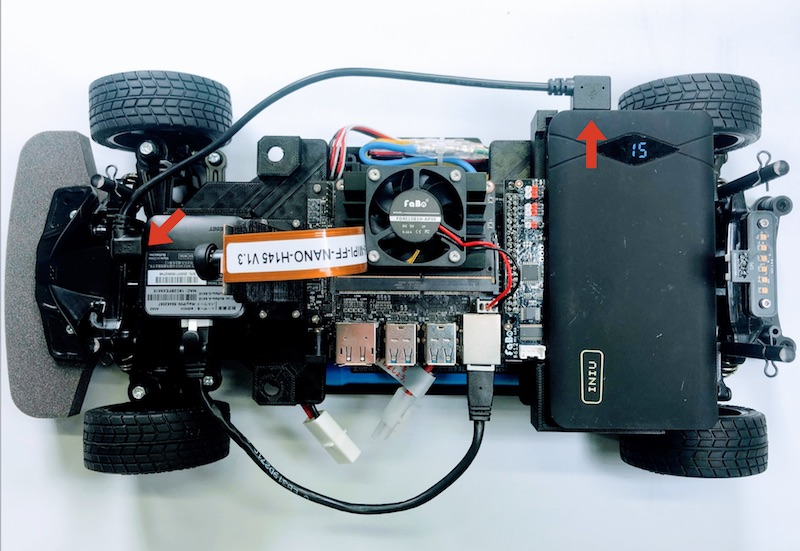
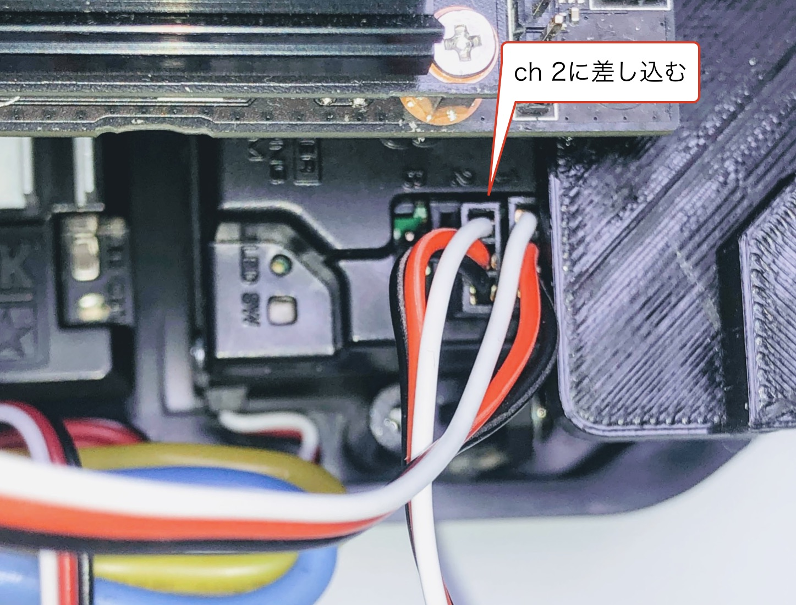
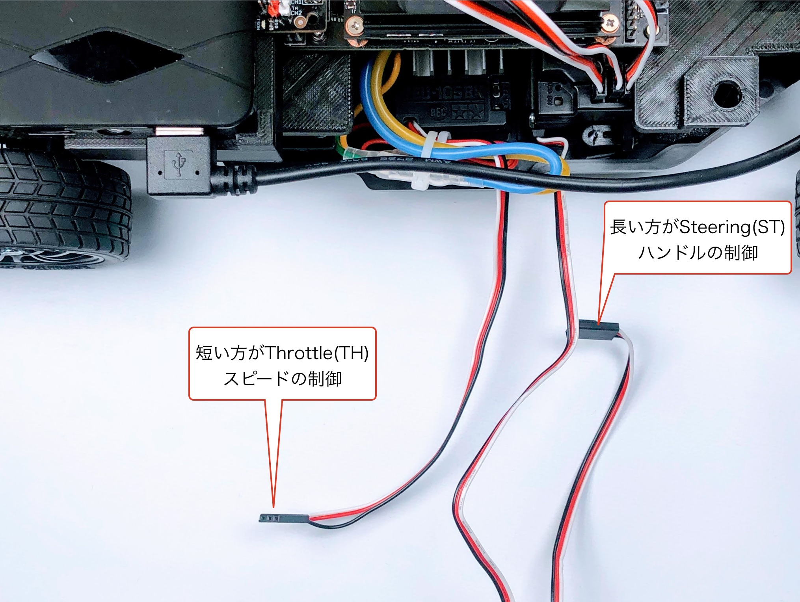
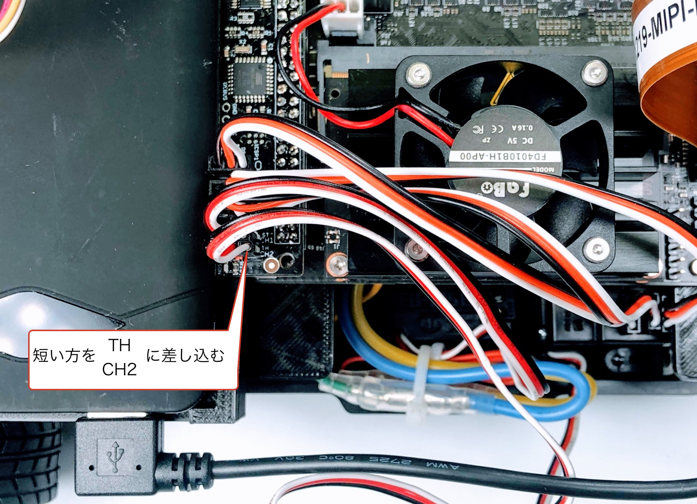
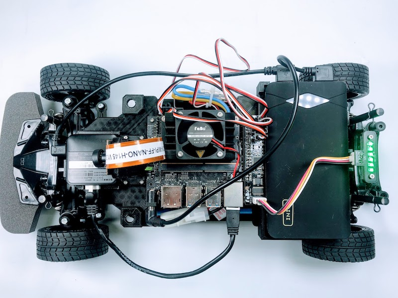
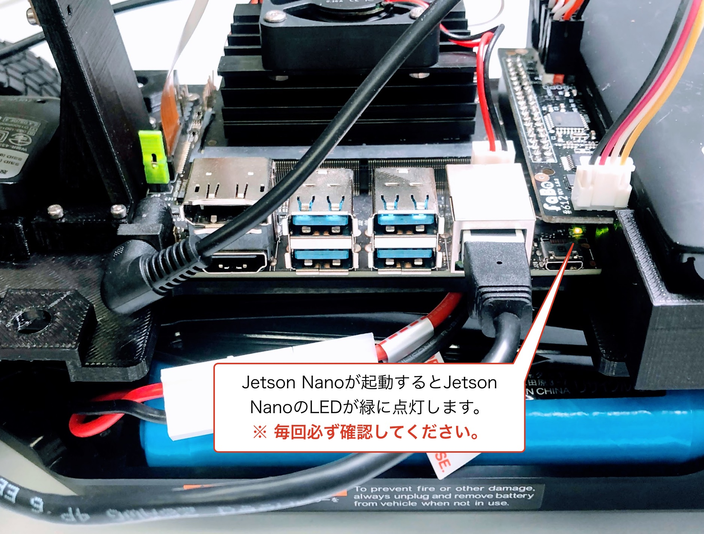
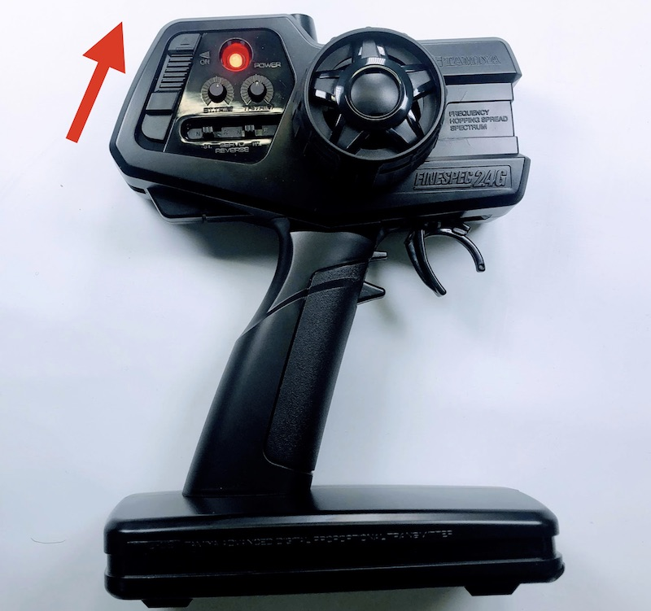

# JetRacerの配線(新型)

## LANケーブル

LANケーブルを接続します。

## Wi-Fiルーター用のUSBケーブル

Wi-FiルーターにUSBケーブルを接続します。

モバイルバッテリーの電源が入る場合は、スイッチ部分をダブルクリックしてOffにしておきます。

## LEDケーブル

LEDケーブルを接続します。

## Jetson Nanoの電源

Jetson Nanoの電源ケーブルを接続します。

## PWMの配線

PWMの配線をおこないます。

ch1の配線をおこないます。

ch2の配線をおこないます。

chB(ch3)の配線をおこないます。

RCカーとの接続をおこないます。

## RCカー本体のバッテリー接続

!!!warining "バッテリーの扱い"
	走行時以外は、バッテリーケーブルを必ず取り外してください。

## プロポに乾電池を挿入

## Jetson Nanoの電源をOn

Jetson Nanoの電源をOnにします。

LEDが緑色に点灯します。

Jetson Nanoの電源がOnになったかは、Jetson Nanoの基板のLEDで確認します。タイミングや電力不足で、Jetson NanoのLEDが光らない場合もありますので、必ずLEDが点灯しているか確認します。

## プロポの電源をOn

## RCカーの電源をOn

## 動作確認

最後に、RCカーモードとAIモードの切り替えの確認をおこないます。

