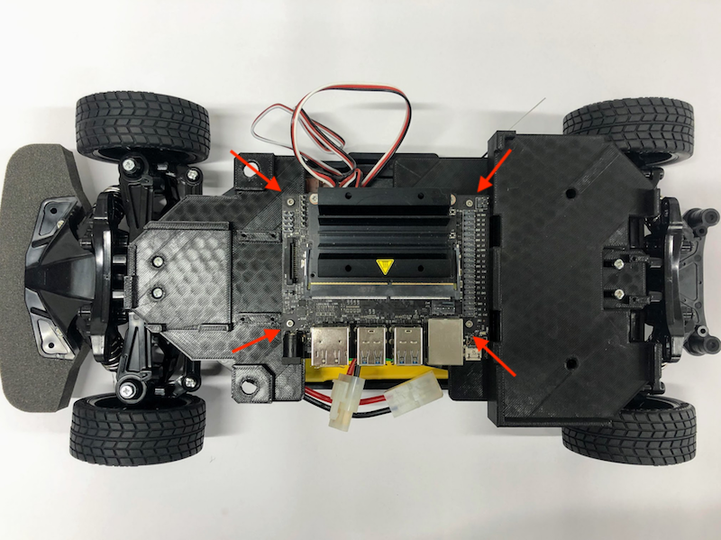
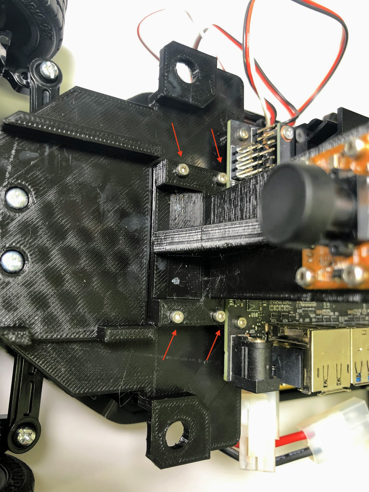
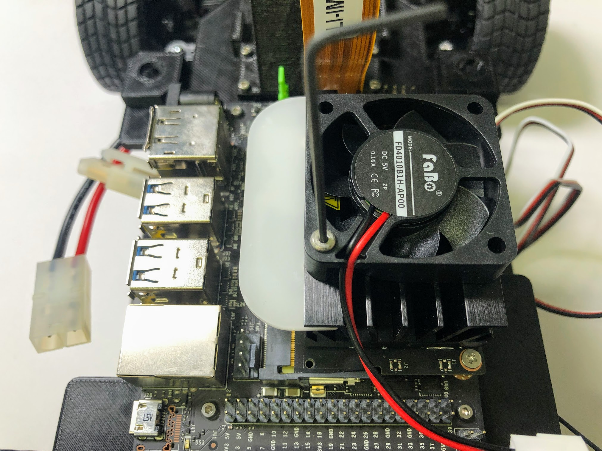

# JetRacerの組み立て(旧型)

TT-02をベースにJetRacerを組み立てます。

## シャーシの拡張

矢印のネジを取り外します。

拡張のシャーシを取り付けます。

## バッテリーマウントの装着

指定位置にバッテリーマウントを設置します。

M2タッピングネジを用います。

ネジで固定します。

## LEDマウントの装着

LED基板をマウントを用意します。

M2タッピングネジで固定します。

固定します。

## Jetson Nanoを固定します。

## カメラマウントの装着

カメラとカメラマウントを用意します。

カメラをマウントに固定します。

Jetson Nanoのカメラ端子のコネクターを両サイドをつまみ持ち上げます。

カメラのケーブルを挿し、真ん中を指で押し、固定します。

マウントを本体に装着します。

ネジで固定します。

## Jumperピンの設置

緑のJumperピンを設置します。

## CPUファンの取り付け

M2.5x24ネジとM2.5ナット、ファン取り付けジグを用いてCPUファンを取り付けます。

M2.5ナットを載せて、CPU ヒートシンクの一層目の穴に入れ込みます。

M2.5x24ネジで固定します。

反対側も固定します。

## コントローラーボードの装着

Jetson Nanoにコントローラーボードを装着します。

## バッテリーとWi-Fiルーターの固定

固定用の両面テープを貼り付けます。

バッテリーとWi-Fiルーターを固定します。

