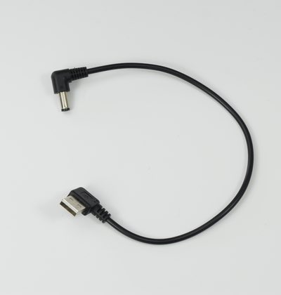

# JetRacer BOM(Carbon Edition)

##JetRacer Carbon Edition 内容物

|写真|部品|個数|
|:--|:--|:--|
||RCカー本体　TT02 XBプロ エキスパートビルド ※完成品 車種はお選びになれません。|１枚|
||Jetson Nano 開発者キットB-01|１枚|
||単三アルカリ乾電池　4本 （プロポに使用）|１枚|
||拡張ボディ　カーボンエディション用カメラマウント 拡張ボディ　‥‥　１カーボンエディション用LEDマウント　‥‥　１ 皿ねじM3*15　‥‥　６ ナット M3　‥‥　６ 六角トラスネジM2.5　‥‥　６|１　袋|
||六角ボルトM3＊１８　‥‥　４ 皿ねじM3*10　‥‥　４ ナット M3　‥‥　４|１　袋|
|jetson_kotei001.jpg)|Jetson固定部品  六角スペーサー（樹脂　両メネジ白10ミリ）・・・・4 皿ネジM2.6×5・・・・4 なべねじM2.6×5・・・・4|１袋|
||拡張ボディ　カーボンアッパーパネル|１枚|
||拡張ボディ　カーボンロワーパネル|１枚|
||FaBo #612 コントローラーボード|１枚|
||Color LEDボード|１枚|
|| Wifiルーター WMR-433W2-BK|１個|
||Intel Dual Bandwireless-AC 8265 Desktop Kit|１個|
||電源用USB Cable 標準A-DCプラグ（A右向き、DC 2.1mm) 0.2m|１個|
||Wifiルータ用 USB Cable 標準A-マイクロB（A 右向き、B左向き）0.25m|１個|
||転送用USBケーブル 3m 　標準A-マイクロB|１個|
||RCケーブル３ピン　メスプラグ  3本|１セット|
||FaBo 4pinケーブル 0.15m|１本|
||LANケーブル 0.15m|１本|
||マイクロSD Card(32GB),SDカードケース サムスンEVO|１個|
||DCファン FD401B1H-AP00 DC5V,0.16A|１個|
||CPU Fan|１個|
||FAN取り付け用アクリル|１個|
||ファンねじ  M2.5×14・・・・4 ナットM2.5・・・・4|１袋|
||六角レンチ 1.5|１本|
||両面テープ|３枚|
||プラスドライバー +2×100|１本|
||精密ドライバー　P柄|１本|
||ナットドライバー ５．５|１本|
||精密ドライバセット　ED−２０|１セット|
||Jumperピン（４GBモデルのみ）|１個|
||スパナ　（４GBモデルのみ）  ８平スパナ|１本|
||結束バンド（４GBモデルのみ）|１本|
||モバイルバッテリー　（BI-B3） ※新パッケージの場合| １個|
||モバイルバッテリー　（BI-B3） ※旧パッケージの場合| １個|

※開封後はすぐ欠品がないかご確認お願いいたします。
