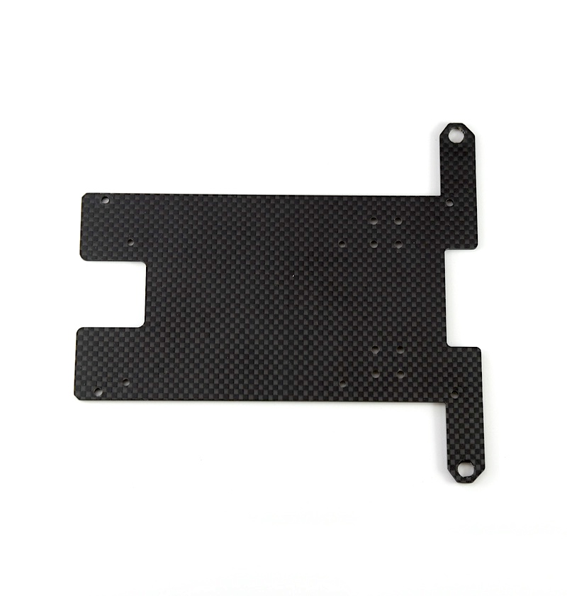
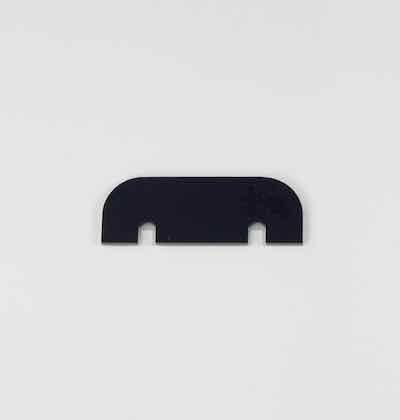

# JetRacer BOM(Carbon Edition)

##JetRacer Carbon Edition 内容物

|写真|部品|個数|
|:--|:--|:--|
|{: .bom_listsize}|RCカー本体　TT02 XBプロ エキスパートビルド ※完成品  ※車種はお選びになれません。|１枚|
|{: .bom_listsize}|Jetson Nano 開発者キットB-01|１枚|
|{: .bom_listsize}|拡張ボディカーボンアッパーパネル|１枚|
|{: .bom_listsize}|拡張ボディカーボンロワーパネル|１枚|
|{: .bom_listsize}|拡張ボディカーボンエディション用カメラマウント・・・1 拡張ボディカーボンエディション用LEDマウント・・・・1 皿ねじM3*15・・・・6 ナット M3・・・・6 六角トラスネジM2.5・・・・6|１袋|
|{: .bom_listsize}|六角ボルトM3＊１８・・・・4 皿ねじM3*10・・・・4 ナット M3・・・・4|１袋|
|{: .bom_listsize}| 六角スペーサー（樹脂　両メネジ白10ミリ）・・・・4 皿ネジM2.6×5・・・・4 なべねじM2.6×5・・・・4|１袋|
|{: .bom_listsize}|FaBo #612 コントローラーボード|１枚|
|{: .bom_listsize}|Color LEDボード|１枚|
|{: .bom_listsize}| Wifiルーター WMR-433W2 ※ボディカラーはお選びになれません。|１個|
|{: .bom_listsize}|Intel Dual Bandwireless-AC 8265 Desktop Kit|１個|
|{: .bom_listsize}|電源用USB Cable 標準A-DCプラグ（A右向き、DC 2.1mm) 0.2m|１個|
|{: .bom_listsize}|Wifiルータ用 USB Cable 標準A-マイクロB（A 右向き、B左向き）0.25m|１個|
||転送用USBケーブル 3m 　標準A-マイクロB|１個|
|{: .bom_listsize}|RCケーブル３ピン　メスプラグ  3本|１セット|
|{: .bom_listsize}|FaBo 4pinケーブル 0.15m|１本|
|{: .bom_listsize}|LANケーブル 0.15m|１本|
|{: .bom_listsize}|マイクロSD Card(32GB),SDカードケース サムスンEVO|１個|
|{: .bom_listsize}|DCファン FD401B1H-AP00 DC5V,0.16A|１個|
|{: .bom_listsize}|FAN取り付け用アクリル|１個|
|{: .bom_listsize}|ファンねじ  M2.5×14・・・・4 ナットM2.5・・・・4|１袋|
|{: .bom_listsize}|六角レンチ 1.5|１本|
|{: .bom_listsize}|両面テープ|３枚|
|{: .bom_listsize}|プラスドライバー +2×100|１本|
|{: .bom_listsize}|精密ドライバー　P柄|１本|
|{: .bom_listsize}|ナットドライバー ５．５|１本|
|{: .bom_listsize}|精密ドライバセット　ED−２０|１セット|
|{: .bom_listsize}|Jumperピン|１個|
|{: .bom_listsize}|スパナ  ８平スパナ|１本|
|{: .bom_listsize}|結束バンド|１本|
|{: .bom_listsize}|モバイルバッテリー　（BI-B3） ※新パッケージの場合| １個|
|{: .bom_listsize}|モバイルバッテリー　（BI-B3） ※旧パッケージの場合| １個|
|{: .bom_listsize}|単三アルカリ乾電池　4本 （プロポに使用） ※写真と異なる場合がございます。|１枚|

※開封後はすぐ欠品がないかご確認お願いいたします。もし欠品がございましたら、[こちら](https://www.fabo.io/contact/)までご連絡ください。
