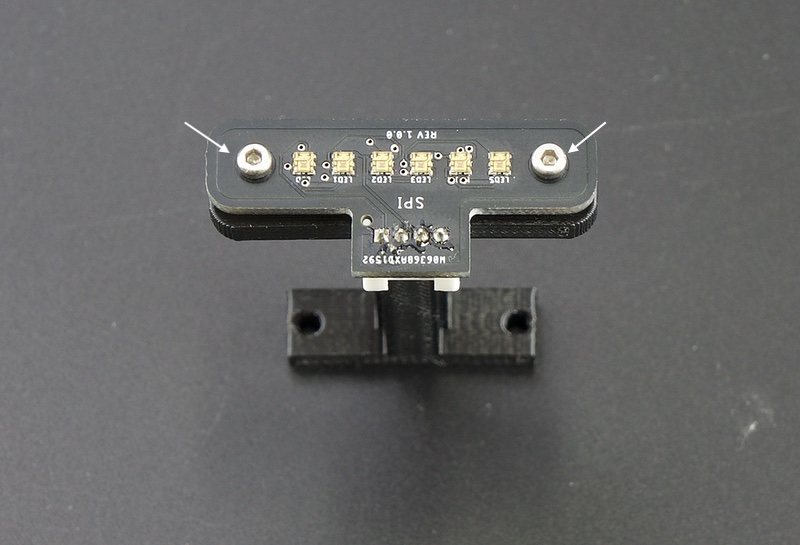
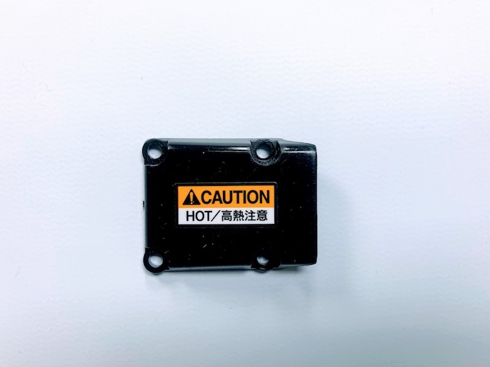
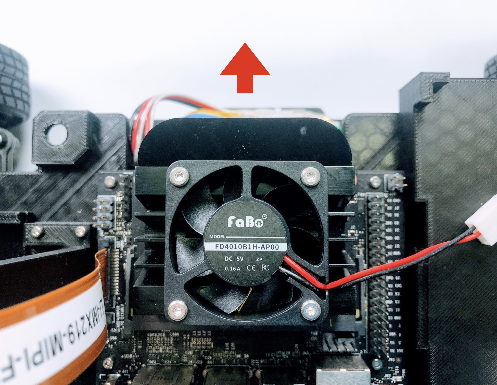

# JetRacerの組み立て(Carbon Edition)

TT02をベースにJetRacerを組み立てます。

### カメラモジュールの取り付け

カメラマウントにカメラモジュール取り付けます。

Cameraを、M2x6のスクリューネジ 4本を六角レンチを用いて取り付けます。

カメラモジュール取り付け完了

### LED基板を取り付けます。

　LEDマウント基板にLEDを取り付けます。

LED基板取り付け方向

LED基板取り付け完了

## シャーシの組み立て（上側）

カーボンロワーパネルに六角スペーサーとねじで締め付けます。

完成

カメラマウントとLEDマウントを取り付けます。

カーボンアッパーパネルにスペーサーとトラスねじで締め付けます。

### Wifiモジュール使用の場合。

Wifiモジュールセットからアンテナを取り出し、カーボンアッパーパネル左右に取り付けます。

完成

# RCカーと結合

矢印の箇所のネジ4本を取り外します。

モーターカバーのネジ4本を取り外し、モーターカバーを取り外します。

バッテリーを装着します。

## Jetson Nanoの取り付け

### Wifiモジュールを取り付け

Jetson Nanoのねじを外します。

Jetsonモジュールを取り外します。

Wifiモジュール基板とWifiアンテナ線を２本接続します。

Wifiモジュール基板を取り付けます。

Jetsonモジュールをふたたび取り付け、元に戻します。

Jetson Nanoを、M2x6のスクリューネジ 4本を用いて取り付けます。

Jetson Nanoのカメラ端子のコネクターを両サイドをつまみ持ち上げます。

Rev B01のカメラ端子が2つあるモデルでは、CAM0の方に差し込みます。

カメラのケーブルを指し、真ん中を指で押し、固定します。

## Jumper Pinの設置

Rev A02(カメラ端子が1つのモデル)を使用する場合は、J48に緑のJumper Pinを差し込みます。これにより、USB端子からの電源供給に変わり、DCジャックから電源供給が可能になります。
Rev B01(カメラ端子が2つのモデル)は、Jumper Pinが標準でついているので、J48に差し込むことで、DCジャックからの電源供給が可能になっています。

## CPU Fanの取り付け

M2.5 x 24ネジとM2.5ナット、ネジ取り付けジグを用いてCPU Fanを取り付けます。

M2.5ナットを載せて、CPU ヒートシンクの一層目の穴に入れ込みます。

M2.5x24ネジで固定します。

反対側も固定します。

Fanの電源コネクターをJetson Nanoに接続します。

## Wifiルーターの固定

Wifiを固定用の両面テープを貼り付け、固定します。

## Controller Boardの装着

## バッテリーの固定

バッテリーを固定用の両面テープを貼り付け、固定します。

## RCカー信号の配線

## ルーターとの配線
