# JetRacerの組み立て(Carbon Edition)

TT02をベースにJetRacerを組み立てます。

<h2>
注意：本テキストは、編集中でございます。組み立てには、しばらくお待ちください。
２０２１年１月１６日完成予定です。
</h2>

### カメラモジュール,LEDマウントの取り付け

|写真|部品または工具|個数|
|:--|:--|:--:|
|{: style="height:210px;width:200px"}|CAM026 IMX219-160°|1|
|{: style="height:210px;width:200px"}|拡張ボディカーボンアッパーパネル|1|
|{: style="height:210px;width:200px"}|拡張ボディカーボンロワーパネル|1|
|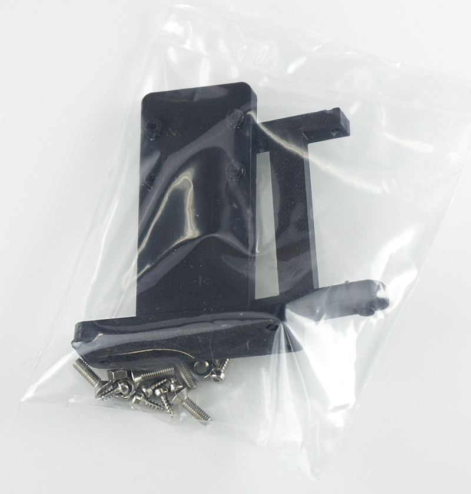{: style="height:210px;width:200px"}|拡張ボディカーボンエディション用カメラマウント・・・1 拡張ボディカーボンエディション用LEDマウント・・・・1 皿ねじM3*15・・・・6 ナット M3・・・・6 六角穴付きボルトタッピングねじM2.5・・・・6|1|
|{: style="height:210px;width:200px"}|六角レンチ 1.5|1|

カメラマウントにカメラモジュール取り付けます。

Cameraを、M2x6のスクリューネジ 4本を六角レンチを用いて取り付けます。

カメラモジュール取り付け完了

### LED基板を取り付けます。

LEDマウントにLEDマウント基板を取り付けます。

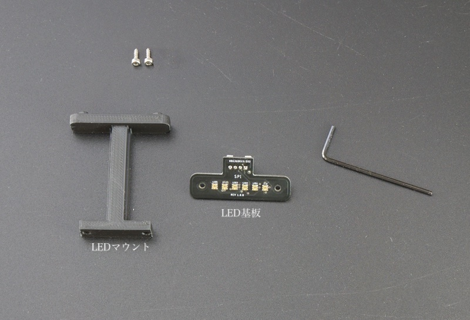

LED基板取り付け方向

LEDマウントの平な方が確認できると思います。

付属の六角レンチよりタッピングねじを２箇所取り付けます。

LED基板取り付け完了

### シャーシの組み立て（上側）

以下の部品を用意します。
拡張ボディアッパーパネル　１枚、拡張ボディアッパーパネルロワーパネル　１枚

M3*15の皿ねじ　６個　、M3ナット 6個

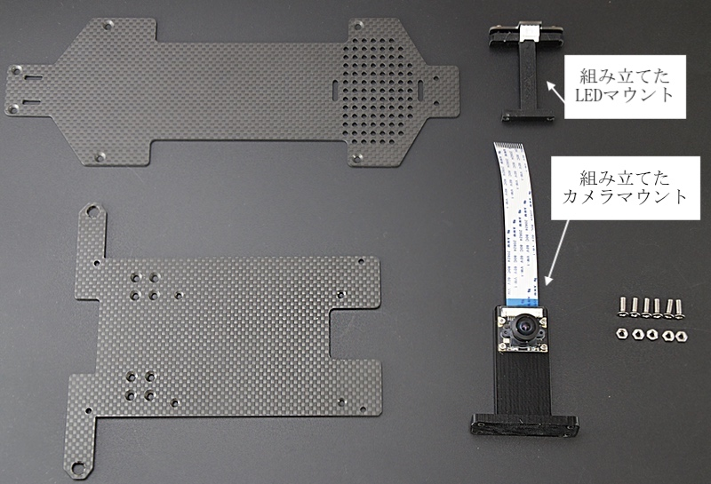

# カメラマウントとアッパーパネルを結合

皿ねじM3*15を付属のナットドライバで４箇所を取り付けます。

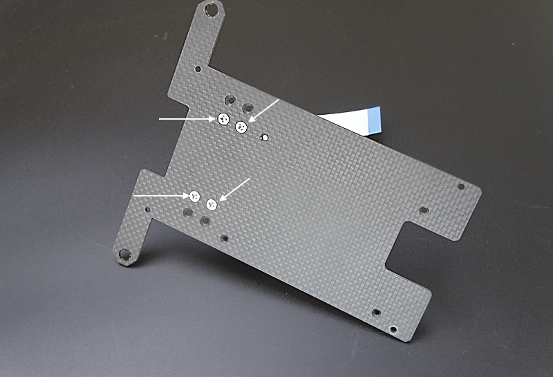

ナットドライバーにてカメラマウントを取り付けます。

カメラモジュールの取り付けは完了です。

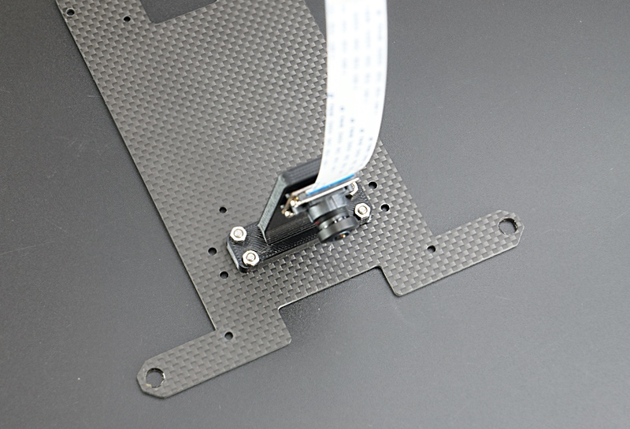

### シャーシの組み立て（下側）

カーボンロワーパネルにLEDマウントを皿ねじとナットで締め取り付けます。

ネジの方向は、窪みがある方向から皿ねじを通します。

下記の矢印のところに、ねじを２箇所取り付けます。

LEDマウント取り付け完了

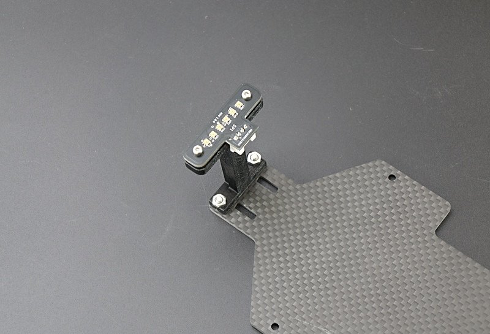

皿ねじM3×10 ４個,スペーサ　M３×18　４個を用意します。

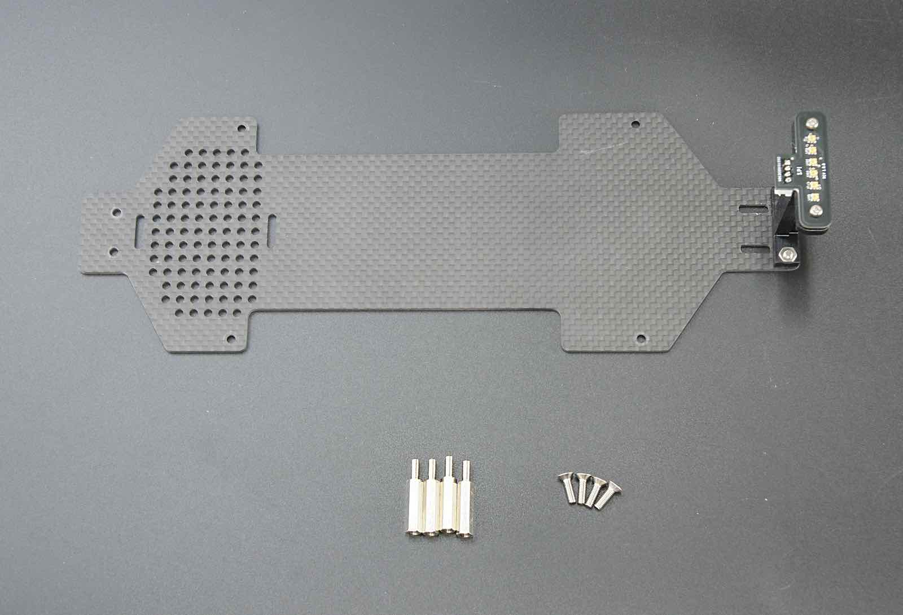

ねじを締めます。

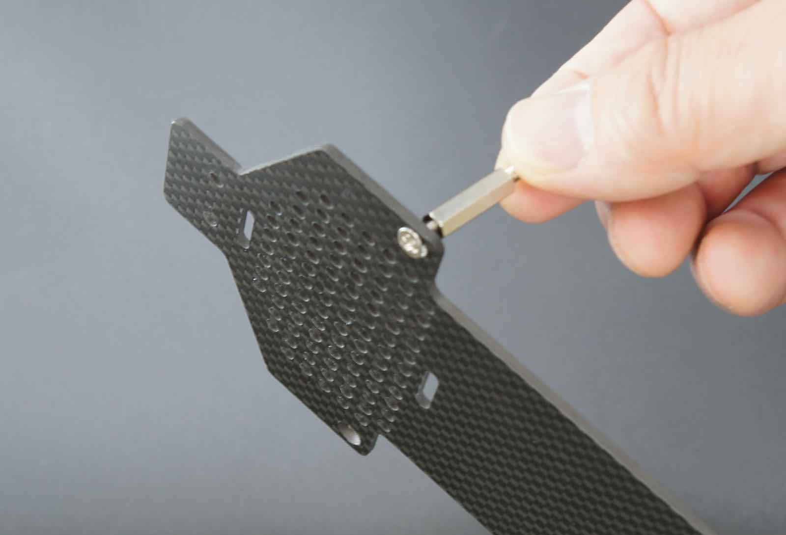

４箇所締めます。

### Wifiアンテナ,Wifiモジュールの取り付け

Wifiモジュールセットからアンテナを取り出し、カーボンアッパーパネル左右に取り付けます。

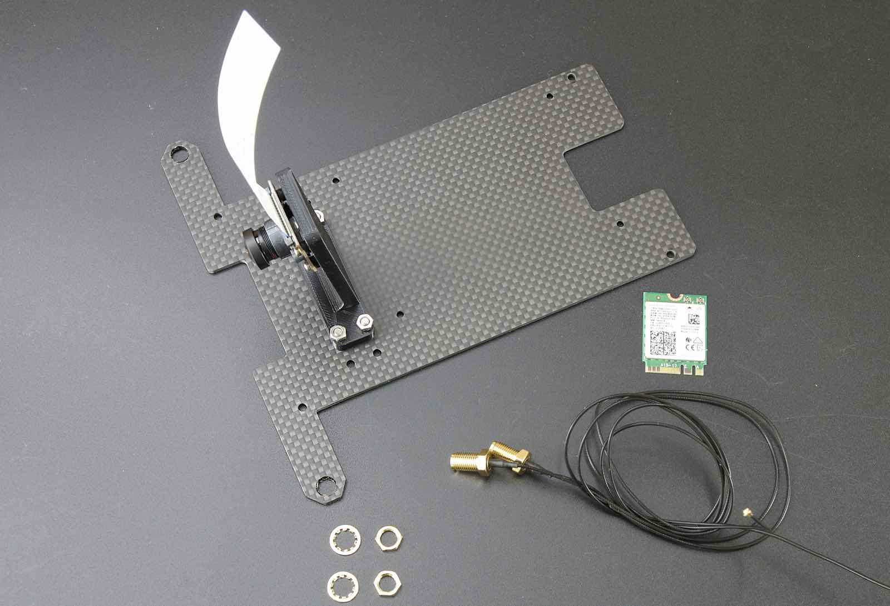

ケーブルを付属のスパナで取り付けます。

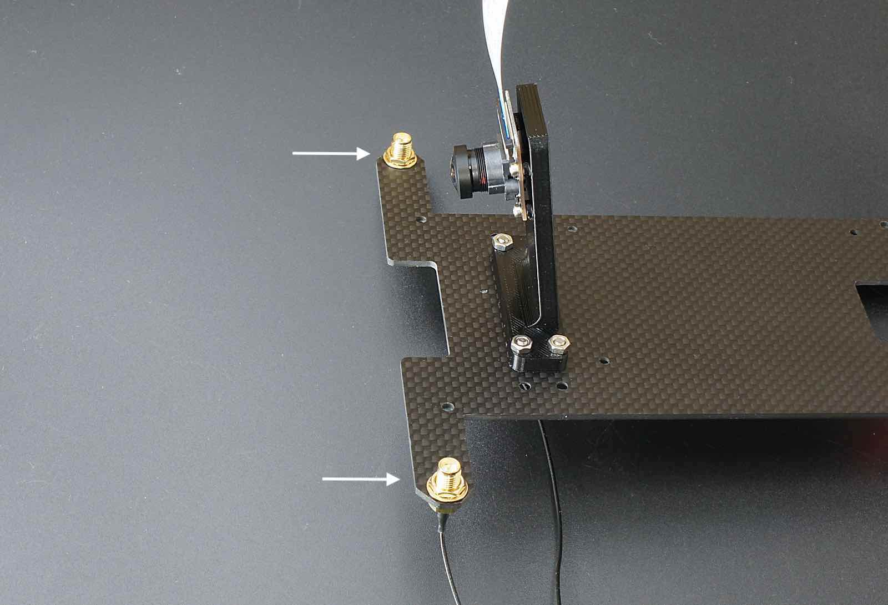

# Wifiモジュールの取り付け

Jetson開発者ボード,DCファン、Wifiモジュール、ファン取り付けツール、ファン取り付けねじ

Jetson開発者ボードの２つのねじを付属の精密ドライバで２箇所はずします。
 ※ねじの山かけに注意します。

Jetson開発者ボードからJetsonNanoを取り外します。JetsonNanoは、２箇所のつめで固定されているので、両側のつめを外側に指で軽く押します。

JetsonNanoが斜めに上がります。

JetsonNanoをはずすと、ねじとスロットが確認できます。

ドライバでねじを取り除きます。

Wifiモジュールをスロットに刺します。

黒いねじでモジュールを取り付けます。

２本のWifiアンテナケーブルとWifiモジュールを繋ぎます。

Wifiアンテナ端子とWifiモジュール端子を接続します。

JetsonNanoを開発ボードへ差し込み、ねじで取り付けます。

### CPUFANの取り付け

DCファンをヒートシンクの上に載せます。

FAN取り付けツールを用意します。

ナットをFAN取り付けツールに写真のように載せます。

FAN取り付けツールをヒートシンクのフィンの間に刺して、ファン取り付けねじをCPUFANに刺します。

六角レンチでねじを締めます。

反対側も同じようにFAN取り付けジグを刺してねじをCPUFANに刺します。

同じように六角棒レンチで２箇所締めます。

ねじの締め付けが終わったら、ファン取り付けツールを取ります。

### CPUFANコネクタの接続

CPUFANのコネクタをJetsonNano開発者ボードにあるコネクタに刺します。

以下の写真のようにコネクタを刺します。

CPUFAN取り付けは完了です。

### JetsonNanoとパネルとの結合

樹脂スペーサ、ねじを用意します。

皿ねじM2.5を４箇所刺して、　

スペーサで取り付けます。

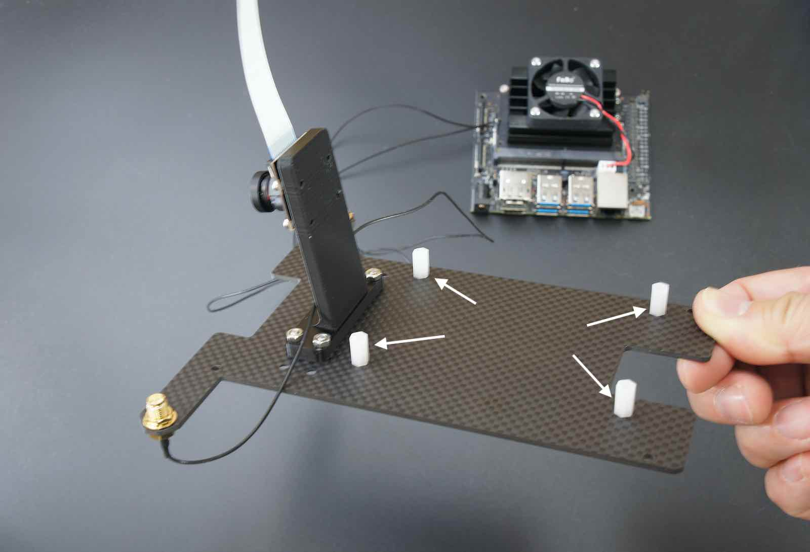

# RCカーと結合

矢印の箇所のネジ4本を取り外します。

モーターカバーのネジ4本を取り外し、モーターカバーを取り外します。

バッテリーを装着します。

ボディーとロワーパネルを用意します。

ロワーパネルをTT-02車体に載せます。

ドライバーでRCカーからはずしたねじで４箇所締めます。

アッパーパネルとJetsonNano、両面テープ３枚、無線LANルータ、モバイルバッテリーを用意します。

モバイルバッテリーに２枚の両面テープを貼ります。

無線LANルーターに両面テープを貼ります。

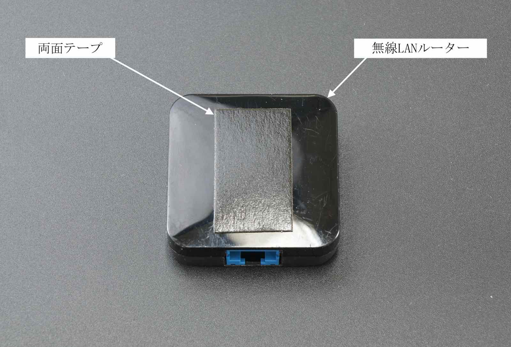

無線LANルーターとモバイルバッテリーをアッパーパネルに貼り付け、ルーターの電源ケーブルを下記の写真のように接続します。

接続すると無線LANルーターが起動しますので、モバイルバッテリーのボタンをダブルクリックして電源を切ります。

ダブルクリックすると電源がきれて、数値が表示されなくなります。

車体にアッパーパネルを載せて、ナットを４箇所をしめます。

ナットドライバーで固定します。

## Jetson Nanoの取り付け

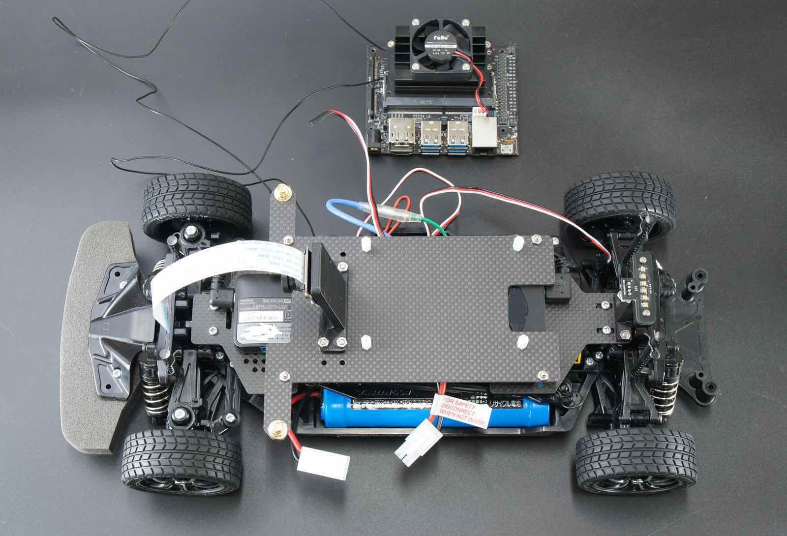

ビスを用意して、JetsonNanoをスペーサーの上の載せます。

JetsonNanoをドライバーで４箇所固定します。

JetsonNano取り付け完了です。

### Wifiモジュールを取り付け

Jetson Nano B01 開発者キットには、CAM0,CAM1の２つのカメラポートがありますが、CAM0にカメラケーブルを接続します。

Jetson Nanoのカメラ端子のコネクタ両サイドのロックを持ち上げます。

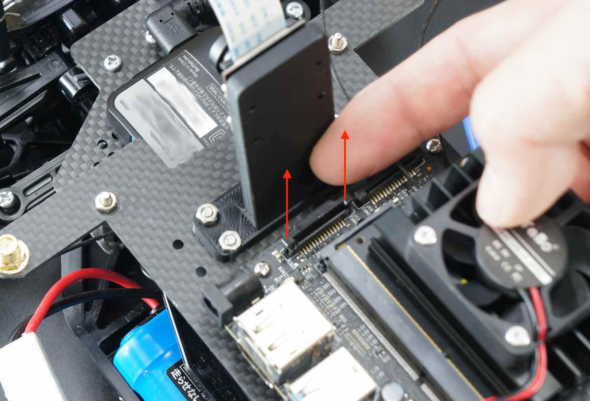

カメラケーブルを刺します。

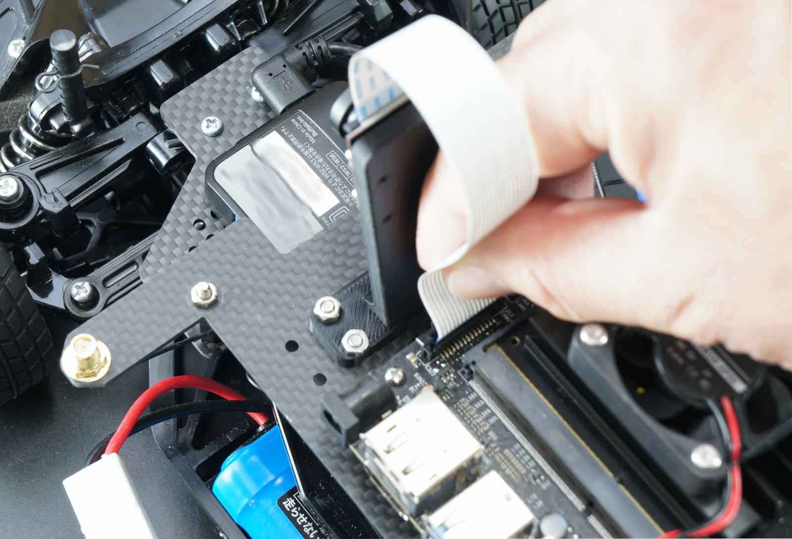

コネクタのロック真ん中を指で押し、固定します。

### Jumper Pinの設定

DCジャックからJetsonNanoへ給電しますので、下の写真のように、ジャンパーピンをオープンからショートにします。

## Controller Boardの装着

コントローラーボードの取り付け完了

## RCカー信号の配線

RCカーの信号入力ケーブルを確認します。スピードコントローラから繋がっているケーブル、サーボモータに繋がっているケーブル

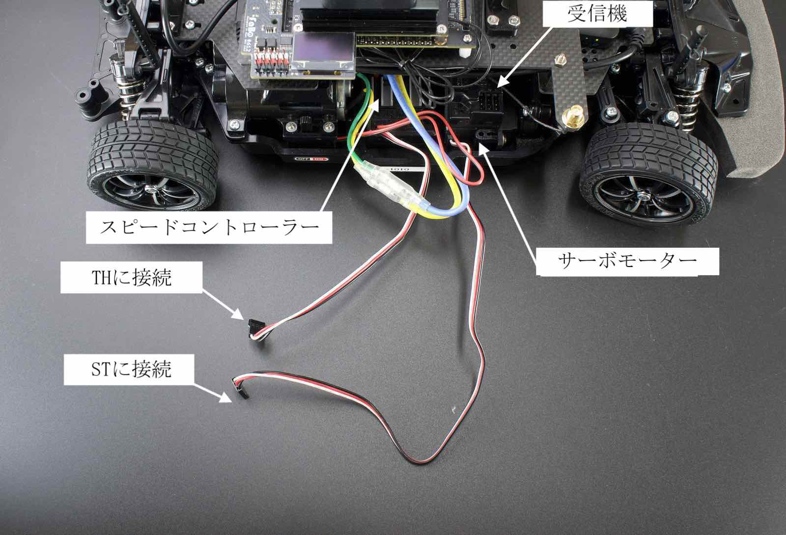

THをスロットル、STをサーボに繋ぎます。

RCカー受信機出力している３つの信号をコントローラボードへ繋ぎます。

RCカー受信機からは、１〜３チャンネルの信号が出力されます。

３ピンケーブルを受信機に各ピンにそれぞれ繋ぎます。

＃６１２コントローラボードの１、２、３へ接続できましたら、RCとの信号配線は完了です。

## ルーターとの配線

無線LANルーターとJetsonNano開発ボードをLANケーブルで繋ぎます。

## 完成

LED基板とコントローラボードを配線します。

Wifiアンテナを回してたてます。

Wifiアンテナ取り付け完了。

### SDカード挿入

JetsonNanoにSDカードをSDカードの端子がこちらから見えるように挿入します。

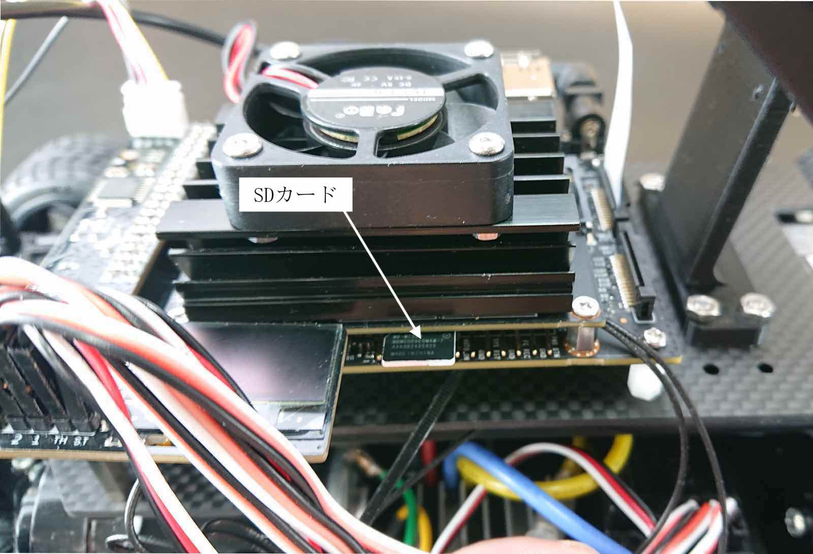

Jetson Nanoに電源を投入します。バッテリーを切断しておき、RCカーの電源は、急発進や暴走の原因となりますので、絶対に電源はオフにします。確認できたら、DCジャックをDCプラグに繋ぎます。

### 電源投入

モバイルバッテリーの電源をONします。

おおよそのバッテリー残量が表示される。

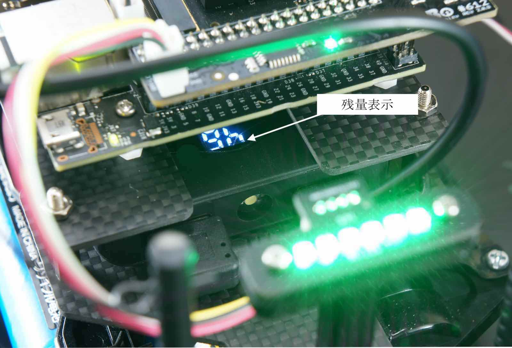

Jetson Nanoの緑色の各LEDが発光します。

コントローラーボードのOLEDにIPアドレス、メモリ使用率など表示されます。

ハーネスを接続し、RCカーの電源を繋ぎます。

RCカーのスイッチをスライドさせ、RCカーに電源を投入します。

TT-02のプロポに単三電池４本入れます。

プロポの電源をONします。プロポの赤色ランプが点灯します。

LEDが緑色のときは、通常のRCカーとして操作モードになります。（RCカーモード）

プロポの裏側のボタンを押すとモードが切り替えられます。

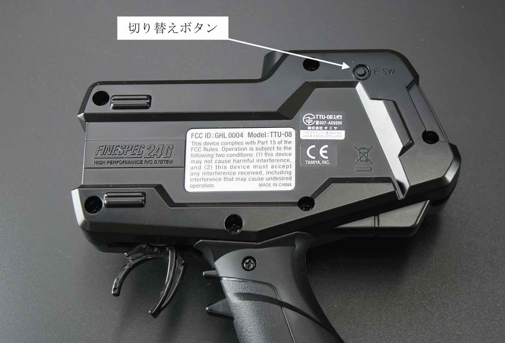

LEDが赤色のときは、JetsonNanoがRCカーを操縦するモードになります。（AIモード）

動作が確認できましたら、以上完成となります。
