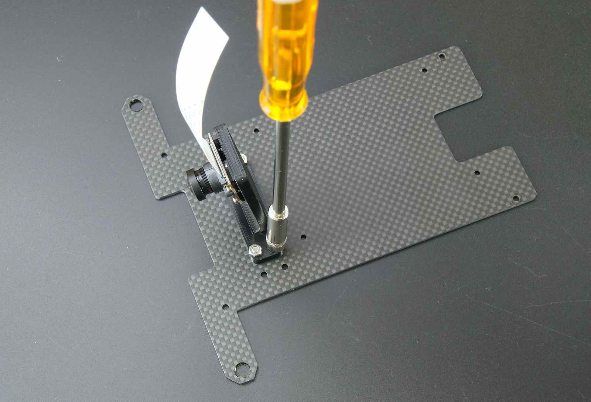
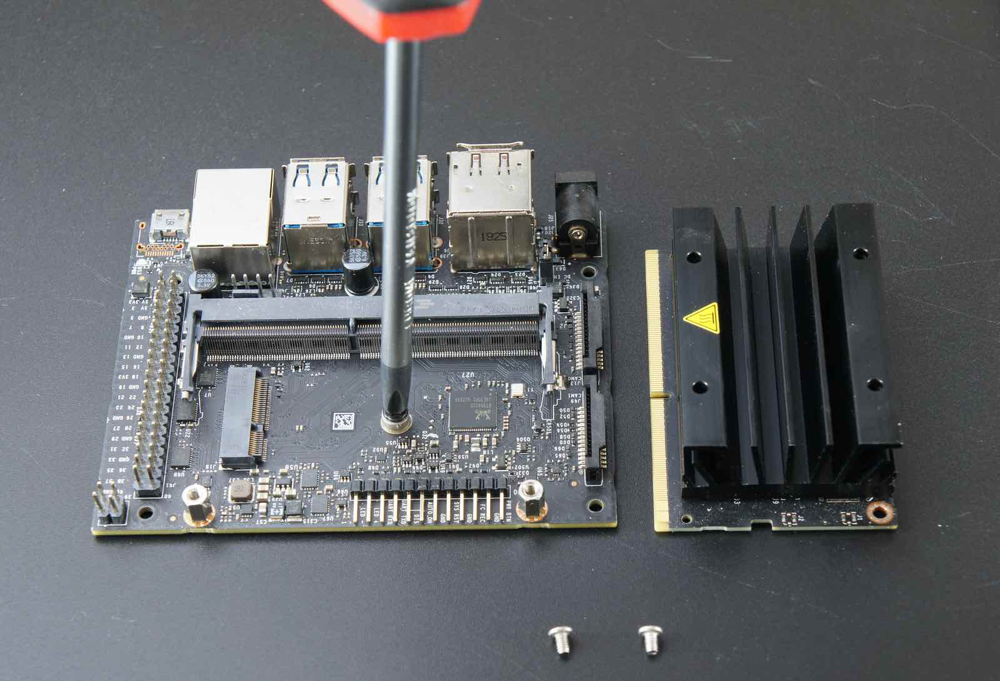
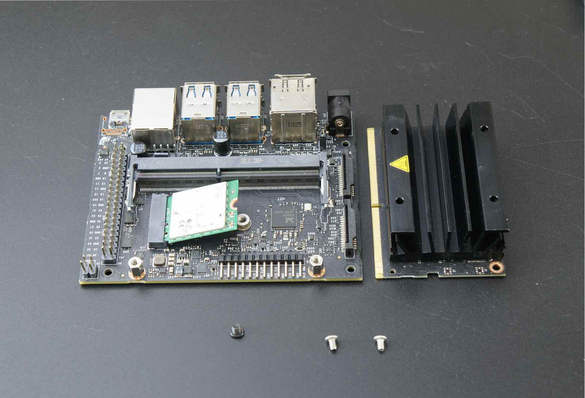
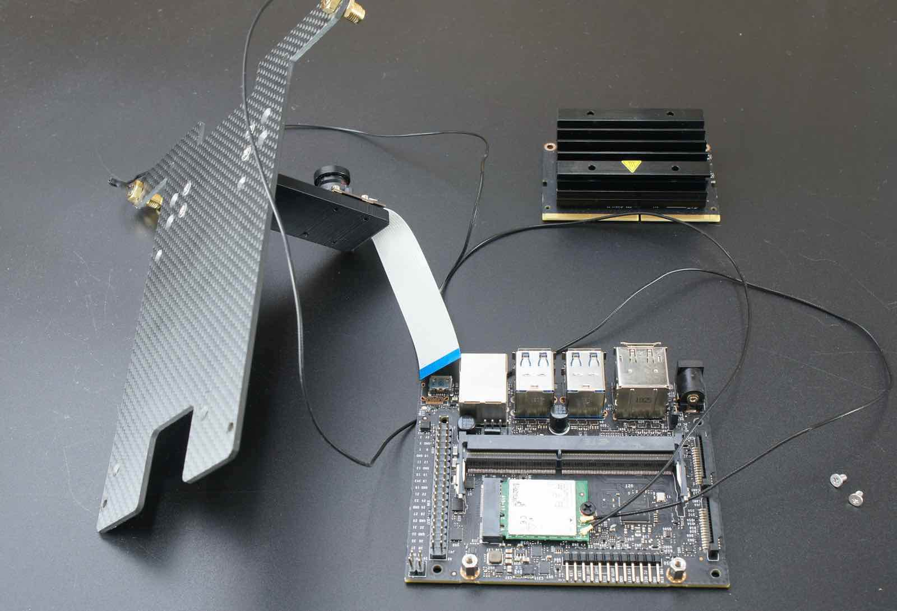
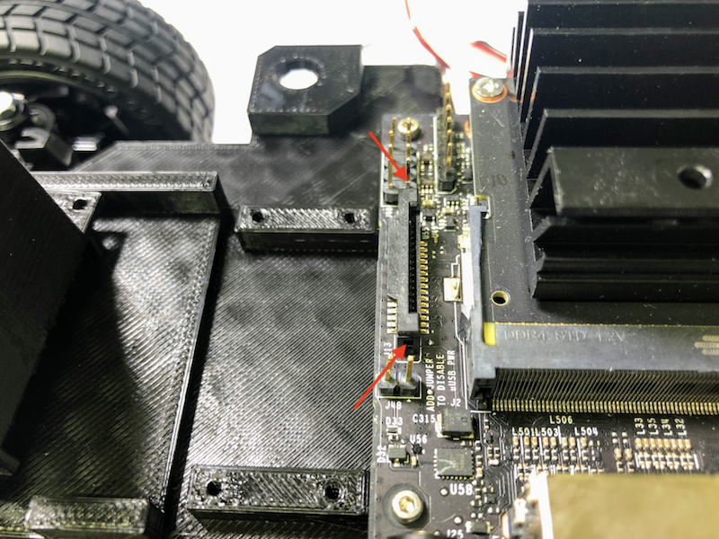
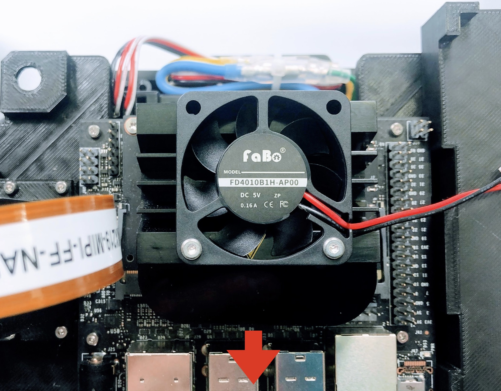

# JetRacerの組み立て(Carbon Edition)

TT02をベースにJetRacerを組み立てます。

<h2>
注意：本テキストは、編集中でございます。組み立てには、しばらくお待ちください。
２０２１年１月１６日完成予定です。
</h2>

### カメラモジュールの取り付け

|写真|部品または工具|個数|
|:--|:--|:--:|
|{: style="height:210px;width:200px"}|CAM026 IMX219-160°|1|
|{: style="height:210px;width:200px"}|拡張ボディカーボンアッパーパネル|1|
|{: style="height:210px;width:200px"}|拡張ボディカーボンロワーパネル|1|
|{: style="height:210px;width:200px"}|拡張ボディカーボンエディション用カメラマウント・・・1 拡張ボディカーボンエディション用LEDマウント・・・・1 皿ねじM3*15・・・・6 ナット M3・・・・6 六角穴付きボルトタッピングねじM2.5・・・・6|1|
|{: style="height:210px;width:200px"}|六角レンチ 1.5|1|

カメラマウントにカメラモジュール取り付けます。

Cameraを、M2x6のスクリューネジ 4本を六角レンチを用いて取り付けます。

カメラモジュール取り付け完了

### LED基板を取り付けます。

LEDマウントにLEDマウント基板を取り付けます。

LED基板取り付け方向

LEDマウントの平な方が確認できると思います。

付属の六角レンチよりタッピングねじを２箇所取り付けます。

LED基板取り付け完了

### シャーシの組み立て（上側）

以下の部品を用意します。
拡張ボディアッパーパネル　１枚、拡張ボディアッパーパネルロワーパネル　１枚

M3*15の皿ねじ　６個　、M3ナット 6個

### LEDマウント取り付けとパネル結合

カーボンロワーパネルにLEDマウントを皿ねじとナットで締め取り付けます。

ネジの方向は、窪みがある方向から皿ねじを通します。

下記の矢印のところに、ねじを２箇所取り付けます。

LEDマウント取り付け完了

# カメラマウントとアッパーパネルを結合

皿ねじM3*15を付属のナットドライバで４箇所を取り付けます。

ナットドライバーにてカメラマウントを取り付けます。

カメラモジュールの取り付けは完了です。

### Wifiアンテナ,Wifiモジュールの取り付け

Wifiモジュールセットからアンテナを取り出し、カーボンアッパーパネル左右に取り付けます。

ケーブルを付属のスパナで取り付けます。

# Wifiモジュールの取り付け

Jetson開発者ボード,DCファン、Wifiモジュール、ファン取り付けツール、ファン取り付けねじ

Jetson開発者ボードの２つのねじを付属の精密ドライバで２箇所はずします。
 ※ねじの山かけに注意します。

Jetson開発者ボードからJetsonNanoを取り外します。JetsonNanoは、２箇所のつめで固定されているので、両側のつめを外側に指で軽く押します。

JetsonNanoが斜めに上がります。

JetsonNanoをはずすと、ねじとスロットが確認できます。

ドライバでねじを取り除きます。

Wifiモジュールをスロットに刺します。

黒いねじでモジュールを取り付けます。

２本のWifiアンテナケーブルとWifiモジュールを繋ぎます。

Wifiアンテナ端子とWifiモジュール端子を接続します。

JetsonNanoを開発ボードへ差し込み、ねじで取り付けます。

### CPUFANの取り付け

DCファンをヒートシンクの上に載せます。

FAN取り付けツールを用意します。

ナットをFAN取り付けツールに写真のように載せます。

# RCカーと結合

矢印の箇所のネジ4本を取り外します。

モーターカバーのネジ4本を取り外し、モーターカバーを取り外します。

バッテリーを装着します。

## Jetson Nanoの取り付け

### Wifiモジュールを取り付け

Jetson Nanoのねじを外します。

Jetsonモジュールを取り外します。

Wifiモジュール基板とWifiアンテナ線を２本接続します。

Wifiモジュール基板を取り付けます。

Jetsonモジュールをふたたび取り付け、元に戻します。

Jetson Nanoを、M2x6のスクリューネジ 4本を用いて取り付けます。

Jetson Nanoのカメラ端子のコネクターを両サイドをつまみ持ち上げます。

Rev B01のカメラ端子が2つあるモデルでは、CAM0の方に差し込みます。

カメラのケーブルを指し、真ん中を指で押し、固定します。

## Jumper Pinの設置

Rev A02(カメラ端子が1つのモデル)を使用する場合は、J48に緑のJumper Pinを差し込みます。これにより、USB端子からの電源供給に変わり、DCジャックから電源供給が可能になります。
Rev B01(カメラ端子が2つのモデル)は、Jumper Pinが標準でついているので、J48に差し込むことで、DCジャックからの電源供給が可能になっています。

## CPU Fanの取り付け

M2.5 x 24ネジとM2.5ナット、ネジ取り付けジグを用いてCPU Fanを取り付けます。

M2.5ナットを載せて、CPU ヒートシンクの一層目の穴に入れ込みます。

M2.5x24ネジで固定します。

反対側も固定します。

Fanの電源コネクターをJetson Nanoに接続します。

## Wifiルーターの固定

Wifiを固定用の両面テープを貼り付け、固定します。

## バッテリーの固定

バッテリーを固定用の両面テープを貼り付け、固定します。

## Controller Boardの装着

コントローラーボードの取り付け完了

## RCカー信号の配線

RCカーの信号入力ケーブルを確認します。スピードコントローラから繋がっているケーブル、サーボモータに繋がっているケーブル

THをスロットル、STをサーボに繋ぎます。

RCカー受信機出力している３つの信号をコントローラボードへ繋ぎます。

３ピンケーブルを各ピンにそれぞれ繋ぎます。

コントローラボード１、２、３へ接続できましたら、RCとの信号配線は完了です。

## ルーターとの配線

## 完成

LED基板とコントローラボードを配線します。

Wifiアンテナを回してたてます。

Wifiアンテナ

Jetson Nanoに電源を投入します。バッテリーを切断しておき、RCカーの電源は、急発進や暴走の原因となりますので、絶対に電源はオフにします。確認できたら、DCジャックをDCプラグに繋ぎます。

Jetson Nanoの緑色の各LEDが発光します。おめでとうございます。完成になります。

