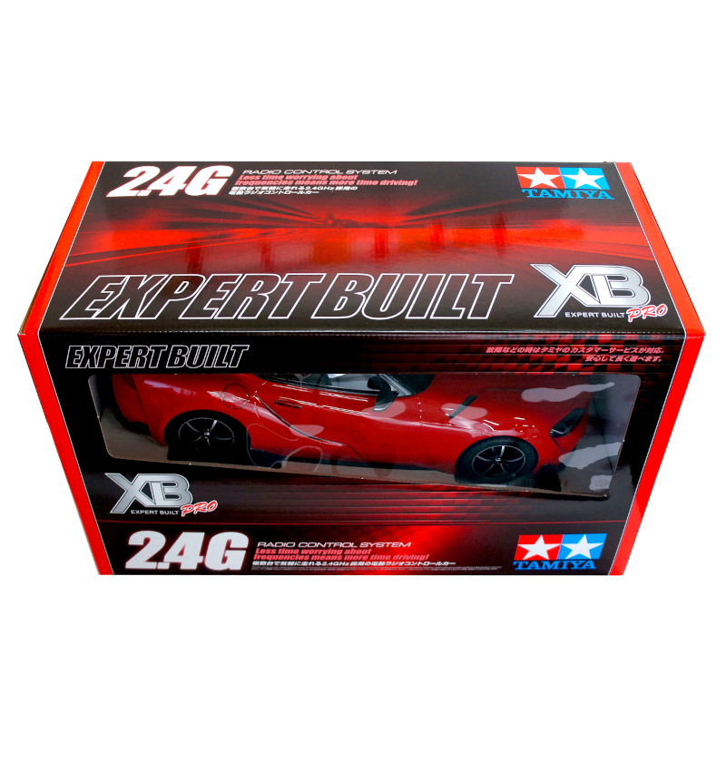
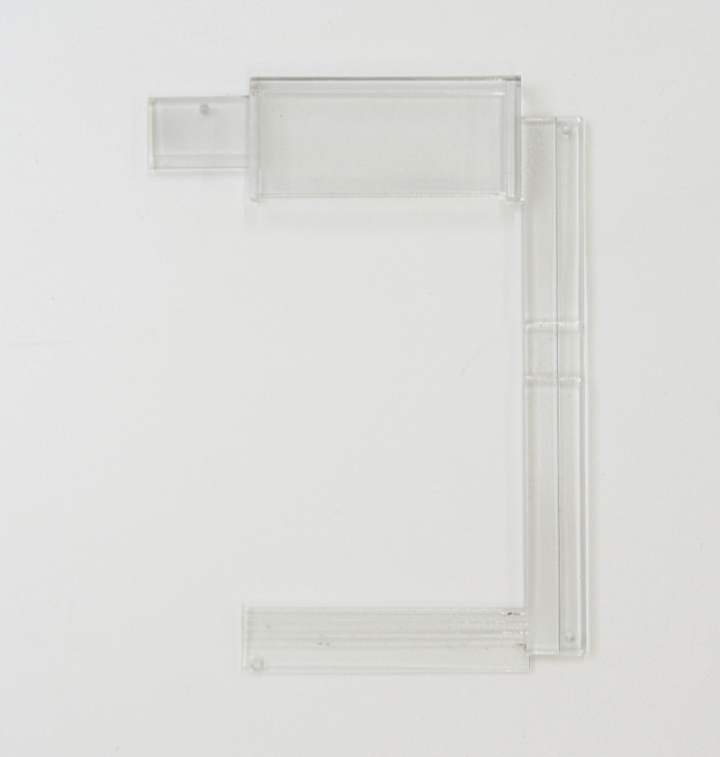
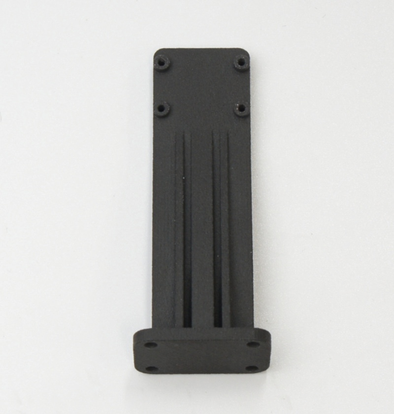
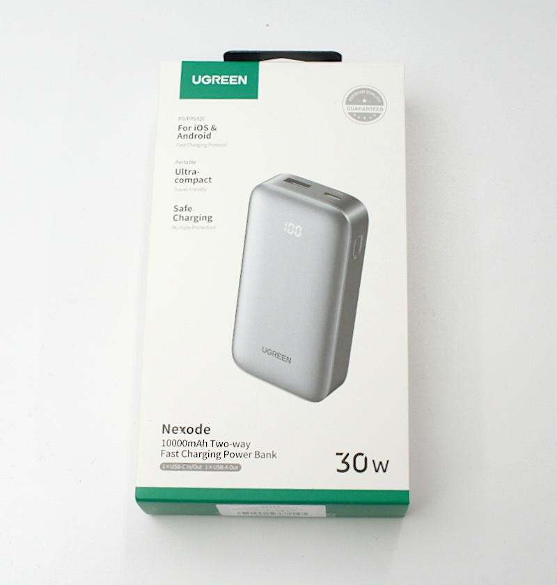
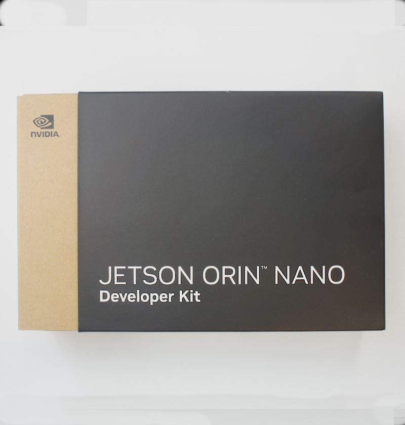
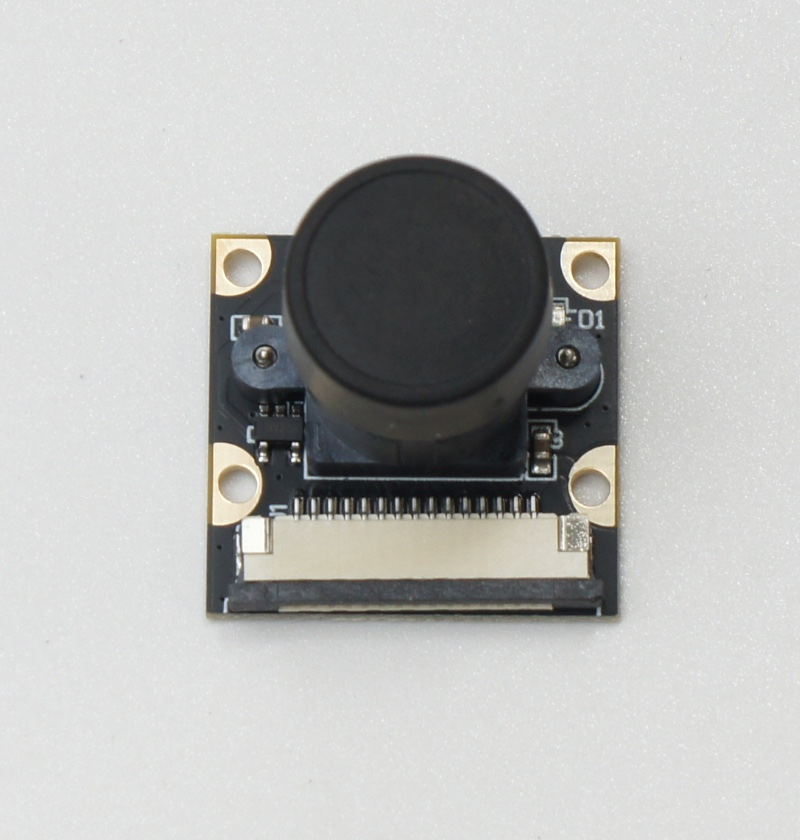
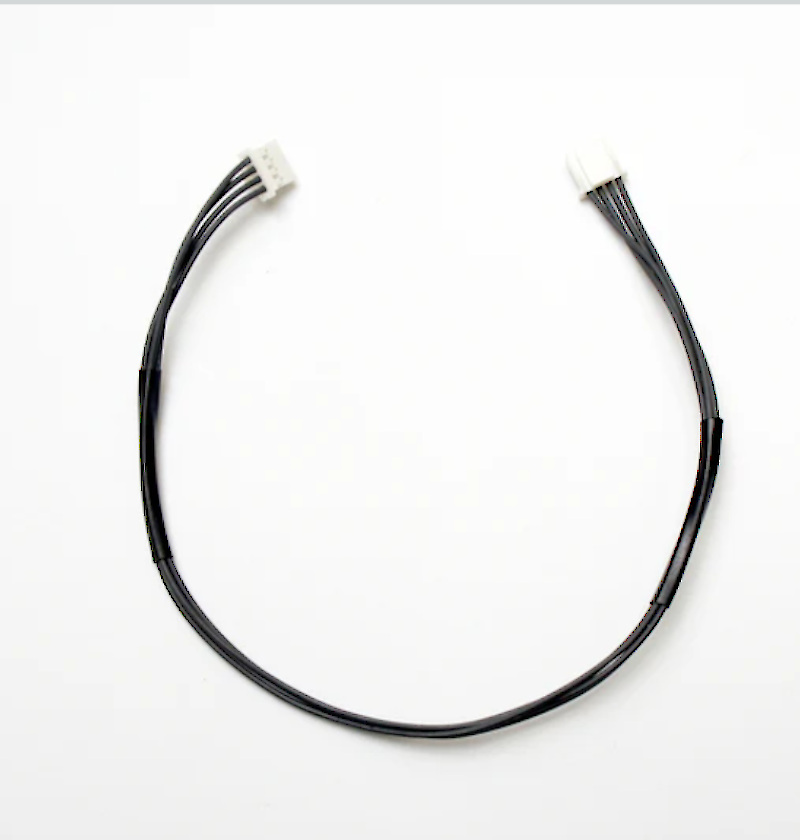
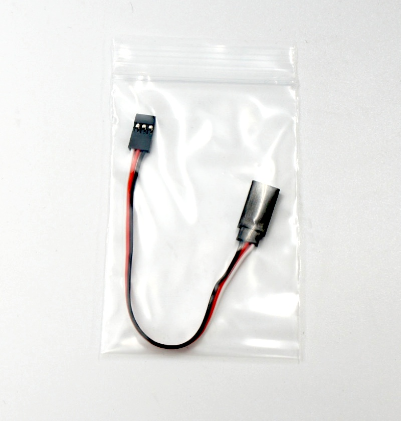
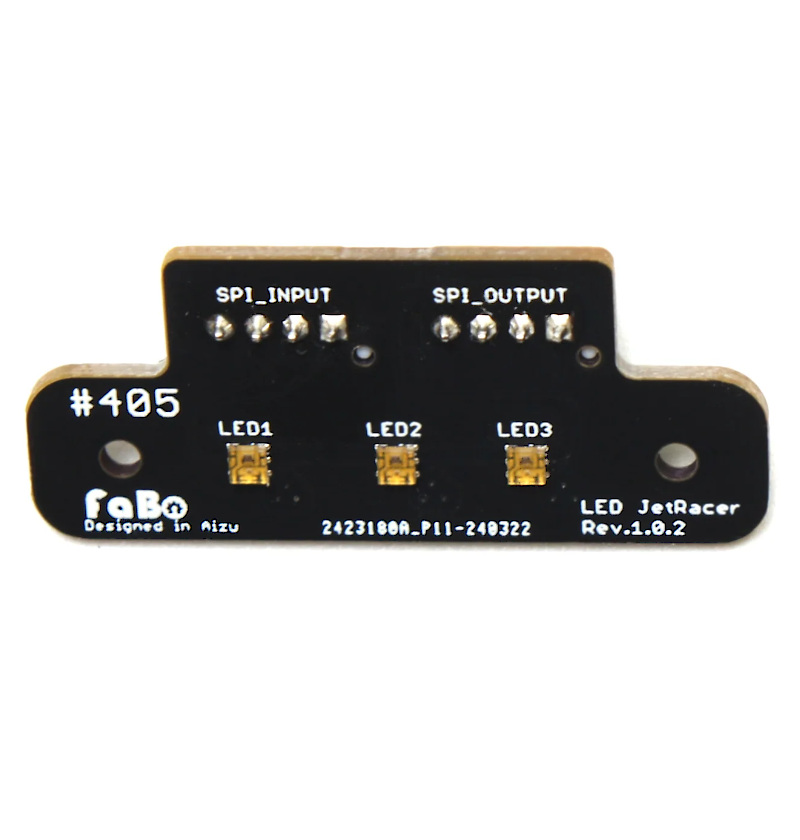
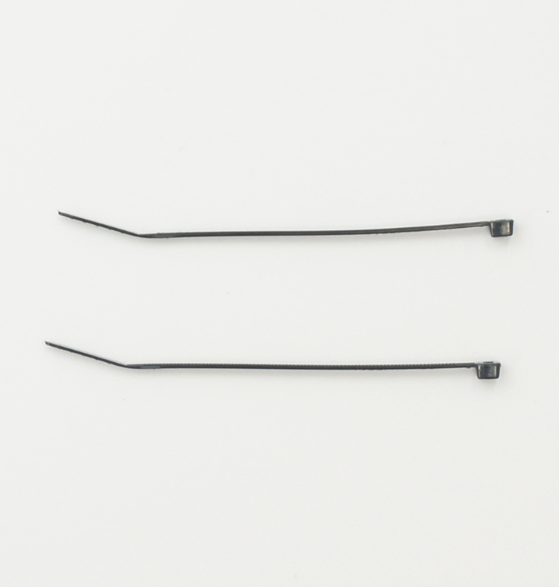

# JetRacer Kit Basic Edition JR2025シリーズ 部品リスト（BOM）

## 対象モデル

|コード番号|名称|TAMIYA TT-02 XBシリーズ（完成モデル）|
|:--|:--|:--:|
|JR2025-B|FaBo JetRacer Kit Basic Edition|◯|
|JR2025-B-NV|FaBo JetRacer Kit Basic Edition 車体なし|X|

## FaBo JetRacer Kit Basic Editionの内容物

|コード番号|写真|部品|個数|JR2025-B|JR2025-B-NV|
|:--:|:--:|:--:|:--:|:--:|:--:|
|B001||電動RCカー TAMIYA　1/10RC TT-02 XBシリーズ（完成モデル） ※車種は選べません。 ※モーター、受信機、送信機、サーボ、バッテリー含む|１台|◯|X|
|P002||バックマウント ※３Dプリント|１個|◯|◯|
|P003||Jetsonマウント ※３Dプリント|１個|◯|◯|
|P004||Jetson固定 ※３Dプリント|１個|◯|◯|
|FA203||カメラマウント ※３Dプリント|１個|◯|◯|
|C001||ベース ※カーボンファイバー製|１個|◯|◯|
|J001||Jetson電源 モバイルバッテリー　10000mAh Two-way Fast Charging Power Bank UGREEN PB502 25185|１台|◯|◯|
|J002||Jetson Orin Nano 8GB 開発者キット　または、Jetson Orin Nano super 8GB 開発者キット　|１台|◯|◯|
|J003||SDカード128GB(SanDisk) SDカードケース |１個|◯|◯|
|J004||USB Type-C トリガーケーブルDC 2.5mm<->USB-typeC PD 12V|１個|◯|◯|
|J007|| CSIケーブル(３０cm)  22Pin->15pin|１本|◯|◯|
|J008||CSIカメラ　IMX219 |１個|◯|◯|
|J009/JRAC-4PPA24||SPI-LEDケーブル 24cm|１本|◯|◯|
|J011||PWMケーブル　延長|１本|◯|◯|
|JRB-CB3||JetRacer コントローラーボード Rev3.0.8 B|１個|◯|◯|
|JRB-FCL3|| JetRacer LED Board|１個|◯|◯|
|SC001||皿ねじ M3x12|４本|◯|◯|
|SC002||皿ねじ M3x10|４本|◯|◯|
|SC003||なべねじ　M3x10|４本|◯|◯|
|SC004||M3ナット|１２個|◯|◯|
|SC005||タッピングM2x6 (六角)|１０個|◯|◯|
|ac001||黒バンド（マジックテープ）|１本|◯|◯|
|ac002||結束バンド|２本|◯|◯|

※プラスドライバー、ナットドライバー(5.5mm)、ナットドライバー(5mm)、六角棒レンチ、カッターナイフ、ニッパーが必要となります。お客様でご準備お願いいたします。整備や組み立てにはRC用のドライバーセットをお勧めします。 ※モバイルバッテリーの充電にはUSBタイプＣのケーブルと充電器が必要でございます。お客様でご準備ください。 ※開封後はすぐ欠品がないかご確認お願いいたします。もし欠品がございましたら、<a href="https://www.fabo.io/p/blog-page.html">こちら</a>までご連絡ください。
<a href="https://www.fabo.io/p/blog-page.html">https://www.fabo.io/p/blog-page.html</a>

