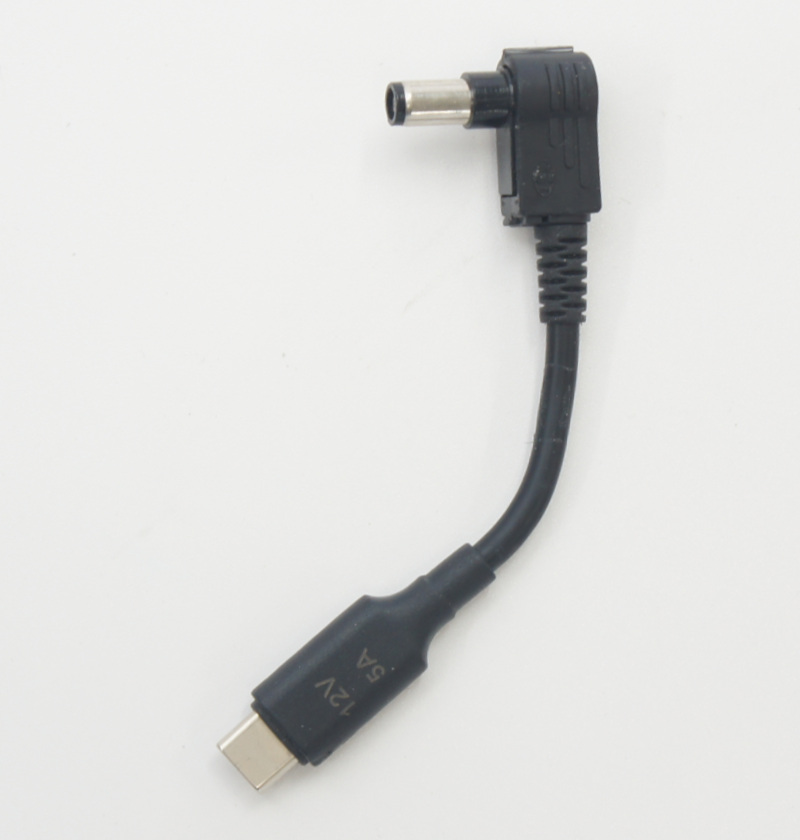

# JetRacer Kit Basic Edition JR2025シリーズ 部品リスト（BOM）

## 対象モデル

|コード番号|名称|TAMIYA TT-02 XBシリーズ（完成モデル）|
|:--|:--|:--:|
|JR2025-B|FaBo JetRacer Kit Basic Edition|◯|
|JR2025-B-NV|FaBo JetRacer Kit Basic Edition 車体なし|X|

## FaBo JetRacer Kit Basic Editionの内容物

|コード番号|写真|部品|個数|JR2025-B|JR2025-B-NV|
|:--:|:--:|:--|:--:|:--:|:--:|
|B001||電動RCカー TAMIYA　1/10RC TT-02 XBシリーズ（完成モデル） ※車種は選べません。 ※モーター、受信機、送信機、サーボ、バッテリー(ニッカド)、充電器含む|1台|◯|X|
|FA202||カメラマウント ※ベーシック版 ※３Dプリント|1個|◯|◯|
|P002b||バックマウント LEDマウント付 ※３Dプリント|1個|◯|◯|
|P003b||Jetsonマウント 底面センサー取り付けなしタイプ ※３Dプリント|1個|◯|◯|
|P004b||Jetson固定 透明 ※３Dプリント|1個|◯|◯|
|C001b||ベース 受信機台付 ※カーボンファイバー製|1枚|◯|◯|
|J001||Jetson電源 モバイルバッテリー　10000mAh Two-way Fast Charging Power Bank UGREEN PB502 25185|1台|◯|◯|
|J002||Jetson Orin Nano Super 8GB 開発者キット  ※箱の側面にあるラベルに商品名記載。|1台|◯|◯|
|J003||SDカード128GB(SanDisk) SDカードケース|1個|◯|◯|
|J004||USB Type-C トリガーケーブルDC 2.5mm<->USB-typeC PD 12V 5A|1個|◯|◯|
|J005||USB Type-C 延長ケーブル（L字）|1個|◯|◯|
|J007-L30|| CSIケーブル(30cm) HBV-Raspberry-300FPC 22Pin<->15pin|1本|◯|◯|
|J008-1CAM||CSIカメラ　IMX219|1個|◯|◯|
|J009S-ED,JRAC-4PPA235||SPI-LEDケーブル  長さ 23.5cm|1本|◯|◯|
|JRB-CB3||JetRacer コントローラーボード Rev3.0.8 B|1個|◯|◯|
|JRB-FCL3|| JetRacer LED Board  Rev1.0.2|1個|◯|◯|
|SC001b-BE||皿ねじ M3x14 4本 + 1本（予備）,ナイロン緩み防止付ナット M3 4個 + 1個（予備）,ロックナット(ステンレス) M3 1個 + 1個（予備）|1セット|◯|◯|
|SC002b||皿ねじ M3x10 4本 + 1本（予備） ナイロン緩み防止付ナット M3 4個 + 1個（予備）|1セット|◯|◯|
|SC003b-BE||なべ M3x12 4本 + 1個（予備） ナイロン緩み防止付ナット M3 4個 + 1個（予備）|1セット|◯|◯|
|SC005-10||タッピングビス M2X6(六角) 10個+ 1個（予備）|1セット|◯|◯|
|ac001||黒バンド（マジックテープ）|1本|◯|◯|
|ac002||結束バンド|2本|◯|◯|
|ac003-BE||両面テープ20mm|3枚|◯|◯|

プラスドライバー、ナットドライバー(5.5mm)、ナットドライバー(5mm)、スパナ（5.5mm）六角棒レンチ、カッターナイフ、ニッパーが必要となります。お客様でご準備お願いいたします。整備や組み立てにはRC用のドライバーセットをお勧めします。 予期しない暴走を防止するため、使用には作業台をご用意ください。 ※モバイルバッテリーの充電にはUSBタイプＣのケーブルと充電器が必要でございます。お客様でご準備ください。 送信機（プロポ）の単３アルカリ乾電池は付属しておりません。※開封後はすぐ欠品がないかご確認お願いいたします。もし欠品がございましたら、<a href="https://www.fabo.io/p/blog-page.html">こちら</a>までご連絡ください。
<a href="https://www.fabo.io/p/blog-page.html">https://www.fabo.io/p/blog-page.html</a>

