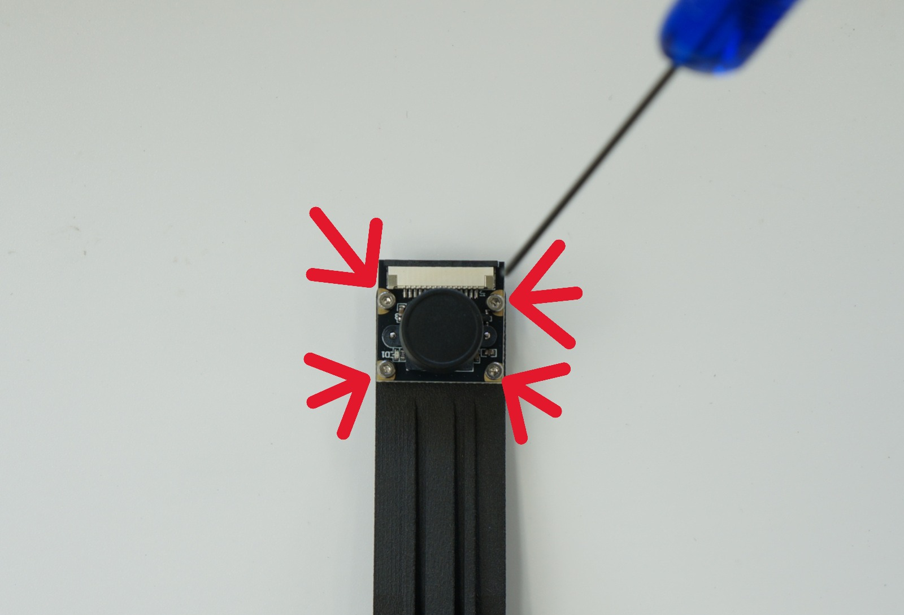

# JetRacer Kit Basic Edition JR2025シリーズ 組立て手順

## 対象モデル

|コード番号|名称|TAMIYA TT-02 XBシリーズ（完成モデル）|
|:--|:--|:--:|
|JR2025-B|FaBo JetRacer Kit Basic Edition|◯|
|JR2025-B-NV|FaBo JetRacer Kit Basic Edition 車体なし|X|

## RCカーのコンポーネント(本キットの場合)

タミヤ TT-02 エキスパートビルドのご使用の場合（通常版）

TT-02 XBは完成品ですのでRCは組み立て不要です。箱から取り出し、真っ直ぐ走るかを確認します。

詳しくはRCカーの取扱説明書ご覧ください。

送信機（プロポ）で前進、後退、停止を確認。ステアリング調整、スロットル調整し、RCカーとして初期動作を確認します。

動作確認できたら、RCカーの電源、プロポ電源ともに電源OFFにしてRCカーバッテリーを一旦取り外します。

モーターのカバーを取り外します。

タッピングビスを計４本外します。

ねじを４本は後で使用します。

ケーブルを切らないように注意し、結束バンドを切ります。

２つのコネクタを外します。受信機(TRU-08)も裏面のシール剥がして取り外します。バッテリーホルダーも取り除きます。

## 組立て

※組み立て車両はTamiya TT-02 エキスパートビルドを使用しております。

