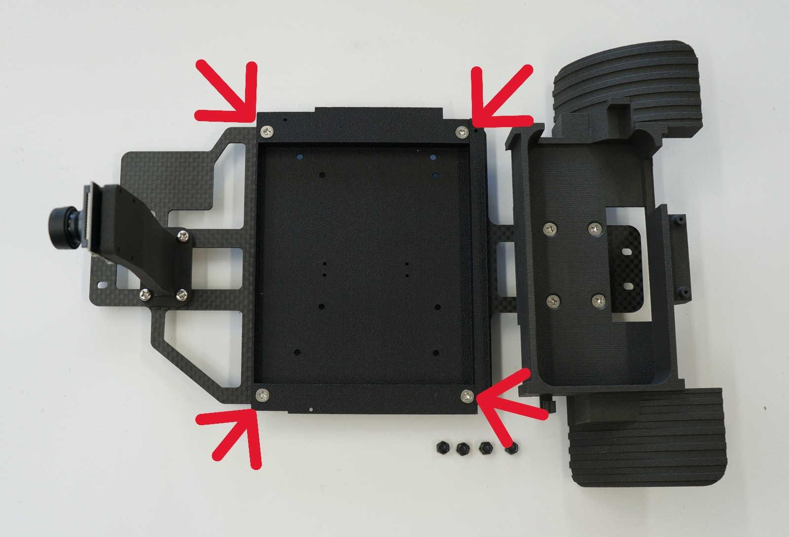
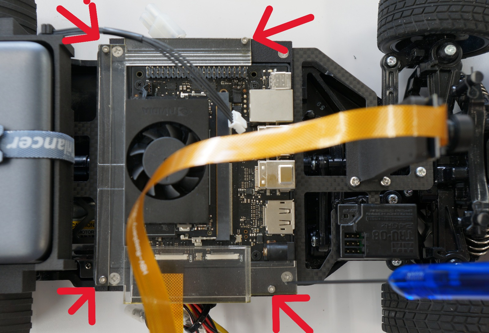
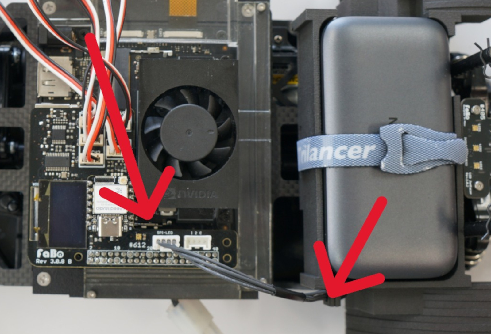
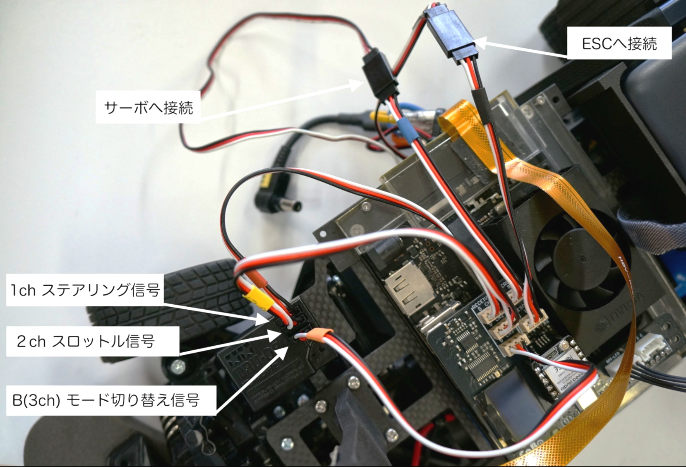

# JetRacer Kit Basic Edition JR2025シリーズ 組立て手順

## 対象モデル

|コード番号|名称|TAMIYA TT-02 XBシリーズ（完成モデル）|
|:--|:--|:--:|
|JR2025-B|FaBo JetRacer Kit Basic Edition|◯|
|JR2025-B-NV|FaBo JetRacer Kit Basic Edition 車体なし|X|

## RCカーのコンポーネント

タミヤ TT-02 エキスパートビルドのご使用の場合（通常版）

TT-02 XBは完成品ですのでRCは組み立て不要です。箱から取り出し、真っ直ぐ走るかを確認します。動作確認を行ってください。

詳しくはRCカーの取扱説明書ご覧ください。

送信機（プロポ）で前進、後退、停止を確認。ステアリング調整、スロットル調整し、RCカーとして初期動作を確認します。

動作確認できたら、RCカーの電源、プロポ電源ともに電源OFFにしてRCカーバッテリーを一旦取り外します。

モーターのカバーを取り外します。

タッピングビスを計４本外します。取り外したビスは後で使用します。

ねじを４本は後で使用します。

ケーブルを切らないように注意し、結束バンドを切ります。

受信機にある２つのコネクタを外します。バッテリーホルダーも取り除きます。

サーボの上にある両面テープで固定している受信機(TRU-08)を車体から一旦取り外します。

## JetRacerの組立て

※組み立て車両はTamiya TT-02 エキスパートビルドを使用しております。

六角ドライバーでタッピングビスでCSIカメラを固定します。

ビスを４か所取り付けます。

先ほど取り付けたカメラマウントとベース（カーボンプレート）バックマウント、なべねじM3XM3X12,ロック付きナット（黒） 各４個、皿ねじM３X14　４本,ロック付きナット（黒）　４本、ロック付きナット（ステンレス）を用意します。

カメラマウントをベース（カーボンプレート）の取り付けます。なべねじM3X12　４本とロック付きナット　４本を使用します。

ナットドライバーとプラスドライバーで締め付けます。

バックマウントをカーボンパネルに取り付けます。皿ネジM3 X 14で使います。

３箇所はロック付きナット（黒）、他１箇所だけロック付きステンレスナットを使用します。

同じく、ナットドライバーとプラスドライバーで締め付けを行います。

次にjetsonベース（３Dプリント）、皿ネジM3 X 10を４本、ロック付きナット（黒）4個使用します。

Jetsonベースを取り付けします。

M3 X 10の皿ねじを使います。

ロック付きナットを４箇所取り付けます。

ナットをプラスドライバーとスパナ5.5mmを使い取り付けます。

LEDボードとタッピングビス2個を用意します。

ナットドライバーで締め付けます。

前章で外したRCカーのタッピングビス４本を使い、＋ドライバーでRCカーと結合します。

LEDボードのSPI_INPUT側にLEDケーブルを接続します。LEDケーブルを挟まないようにプレートと車体の間をとおし、これまで組み立てたプレートを車体に載せねじ位置をなるべく中央になるように合わせます。

＋ドライバにてタッピングビスで４か所固定します。

Jetson Orin Nano SuperのSDカードスロットにSDカードを端子が上の状態で挿入します。（FaBoキットはインストール済み）

SDカードを挿入したら、Jetson車体にJetson Orin Nano Superを載せます。

マジックバンドを通します。

モバイルバッテリーを載せ、さきほど取り付けたマジックバンドでモバイルバッテリーを固定します。

Jetson Orin Nano開発者ボードを車体に載せます。

CSIカメラケーブルを接続します。黒い部分を引き※、CSIケーブルを挿します。幅が狭い方（２２ピン）がJetson側になります。（下接点）

※コネクタは、とても弱い部分なので引きすぎないように注意して優しく引きます。破損にご注意ください。

ケーブルを奥まで挿したら、cam0の黒い部分をコネクタ方向へ押して固定し接続します。

同様な方法でCSIケーブルをCSIカメラにも接続します。CSIカメラケーブルは１５ピンで幅が広いほうになります。（下接点）　

黒い部分を引き上げます。

CSIケーブルを挿入し、黒い部分を下方向を押して取り付けます。

Jetson固定（透明パーツ）とタッピングビスM2X6 4本を用意します。

タッピングビスでJetson固定を固定します。

マジックテープをバックマウントにある横穴にとおして、モバイルバッテリーを設置してマジックテープで固定します。

コントローラー基板を用意します。

ズレて挿入しないように確認してコントローラー基板を取り付ける。

コントローラーボードをJetson Orin Nano SuperにあるGPIO 40ピンヘッダーに取り付けます。

ズレて挿入しないように確実に接続します。

SPI-LEDのケーブルをバックマウントのフックに掛けて、コントロール基板のSPI-LEDポートと接続します。

取り外した受信機を取り付けます。両面テープを写真のように張ります。

各ケーブルを接続します。

受信機を載せて受信機を貼り付けます。フロントタイヤが当たらないことを確認します。

トリガーケーブルとUSBケーブルを接続します。

USBプラグの方をモバイルバッテリーのOUT1に接続、トリガーケーブルをJetson Orin NanoのDCジャックに接続します。Jetson Orin Nano Superに電源が入ります。起動して、しばらくするとOLEDディスプレイに文字が表示されるようになります。

作業台の上に置き、RCカーのニッカドバッテリーをRCカーに接続します。

以下のように接続。

バッテリーをタブに収めます。

CSIケーブル離脱防止のため、シールを貼ります。

カメラマウントにもCSIケーブル離脱防止のためのシールを貼ります。

ケーブルを結束バンドで束ねます。はみ出たところは、ニッパでカットします。

カット後

カメラのレンズキャップを外して完成となります。もしピントがずれてぼやける場合はレンズを回して調整してください。

RCカーのスイッチ電源がONになるとコントローラーボードにあるLED（オレンジ色に光ります）が点灯します。

思わぬ暴走を防ぐため、必ず作業台の上で作業をお願いいたします。

内部の破損を防ぐために走行時にはボディにカメラが露出するように穴を開けてボディを被せて走行させてください。

カッターナイフでボディに適切な穴を開けます。ボディ形状によりカメラ位置は変ります。

ボディを車体に取り付けてボディピンを４個取り付けてボディを固定し完成となります。
