# JetRacer Carbon Edition 組み立て

|コード番号|
|:--|
|コード番号：JR1-S-C|

TT-02をベースにJetRacer Kitを組み立てます。

### カメラモジュール、LEDボードの取り付け

|写真|部品または工具|個数|
|:--|:--|:--:|
|{: style="height:210px;width:200px"}|CAM026 IMX219-160°|1個|
|{: style="height:210px;width:200px"}|拡張ボディカーボンアッパーパネル|1枚|
|{: style="height:210px;width:200px"}|拡張ボディカーボンロワーパネル|1枚|
|{: style="height:210px;width:200px"}|拡張ボディカーボンエディション用カメラマウント・・・1 拡張ボディカーボンエディション用LEDマウント・・・・1 皿ねじM3x12(M3x15)・・・・6 ナット M3・・・・6 六角穴付きボルトセルフタッピングねじM2x6・・・・6|1袋|
|{: style="height:210px;width:200px"}|Color LEDボード|１枚|
|{: style="height:210px;width:200px"}|六角棒レンチ 1.5|1本|
|{: style="height:210px;width:200px"}|プラスドライバー +2×100|１本|
|{: style="height:210px;width:200px"}|ナットドライバー ５．５|１本|

カメラマウントにカメラモジュール取り付けます。

カメラを、M2x6のタッピングネジ 4本を六角棒レンチを用いて取り付けます。

六角棒レンチで４箇所ネジ止めします。

カメラモジュール取り付け完了

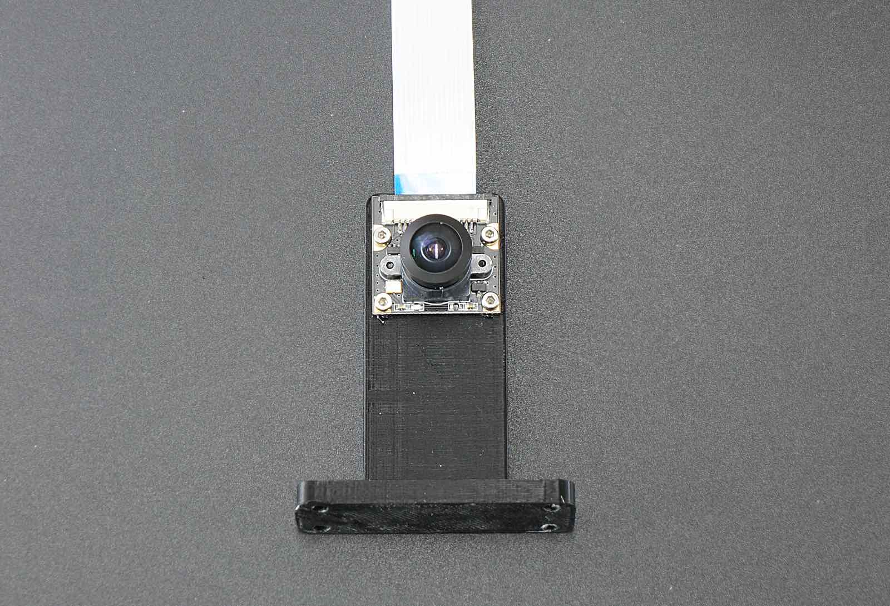

LEDマウントにLEDボードを取り付けます。

LEDマウントを２箇所ネジ止めします。

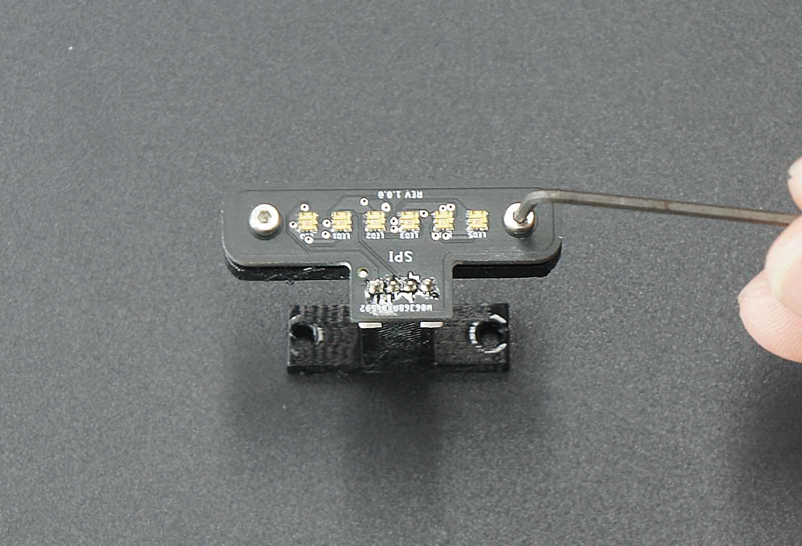

LEDボード取り付け向き　横から見た場合

六角棒レンチでタッピングネジを２箇所取り付けます。

LEDボード取り付け完了

### パネルの組み立て

アッパーパネルにカメラマウントを取り付けます。

アッパーパネル、皿ネジM3x12(M3x15)　6個　、M3ナット 6個

組み立て済みカメラマウント　を用意します。

アッパーパネルにカメラマウントを皿ネジとナットで締め取り付けます。

ネジの方向は、窪みがある方向から皿ネジを通します。

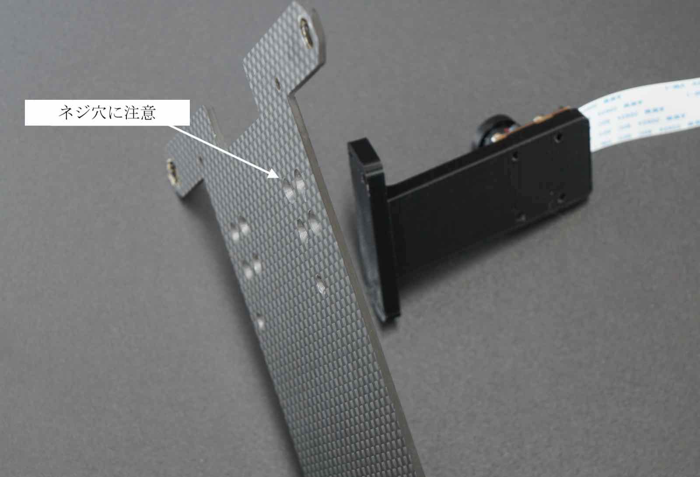

下記の矢印のところに、ネジを4箇所取り付けます。

ナットドライバーにて締め付けます。

カメラモジュールの取り付けは完了です。

ロアーパネルにLEDマウントを取り付けます。

ロワーパネル、皿ネジM3x12(M3x15)　2個、M3ナット 2個

組み立て済みLEDマウント　を用意します。

ロワーパネルにLEDマウントを皿ネジとナットで締め取り付けます。

ネジの方向は、窪みがある方向から皿ネジを通します。

下記の矢印のところに、ネジを２箇所取り付けます。

ナットドライバーにて締め付けます。

LEDマウント取り付け完了

アッパーパネルとロアーパネルを結合する為スペーサーを取り付けます。

|写真|部品または工具|個数|
|:--|:--|:--:|
|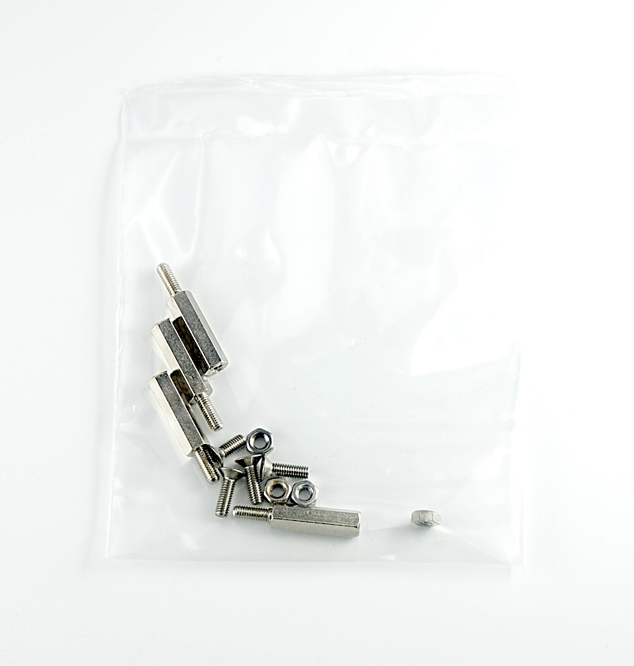{: style="height:210px;width:200px"}|六角スペーサーM3x18・・・・4 皿ネジM3x15(またはM3x10）・・・・4 ナットM3・・・・4|１袋|

ロアーパネル、皿ネジM3×10　4個、スペーサーM3×18　4個を用意します。

ネジの方向は、窪みがある方向から皿ネジを通して4箇所締めます。

### Wi-Fiアンテナの取り付け

|写真|部品または工具|個数|
|:--|:--|:--:|
|{: style="height:210px;width:200px"}|Intel Dual Bandwireless-AC 8265 Desktop Kit|１個|

Wi-Fiモジュールセットからアンテナを取り出し、アッパーパネル左右に取り付けます。

ケーブルを付属のスパナで取り付けます。

### Wi-Fiモジュールの取り付け

Jetson開発者キット、DCファン、Wi-Fiモジュール、CPUファン取り付けジグ、ファン固定ネジを用意します。

Jetson開発者キットの２つのネジを付属の精密ドライバーで２箇所はずします。
 ※ネジの山かけに注意します。

Jetson開発者キットからJetson Nanoを取り外します。Jetson Nanoは、２箇所のつめで固定されているので、両側のつめを外側に指で軽く押します。

Jetson Nanoが斜めに上がります。

Jetson Nanoをはずすと、ネジとスロットが確認できます。

ドライバーでネジを取り除きます。

Wi-Fiモジュールをスロットに刺します。

黒いネジでモジュールを取り付けます。

２本のWi-FiアンテナケーブルとWi-Fiモジュールを繋ぎます。

Wi-Fiアンテナ端子とWi-Fiモジュール端子を接続します。

Jetson Nanoを開発者キットへ差し込み、ネジで取り付けます。

### CPUファンの取り付け

|写真|部品または工具|個数|
|:--|:--|:--:|
|{: style="height:210px;width:200px"}|Jetson開発者キット|１台|
|{: style="height:210px;width:200px"}|DCファン FD401B1H-AP00 DC5V,0.16A|１個|
|{: style="height:210px;width:200px"}|CPUファン取り付けジグ|１個|
|{: style="height:210px;width:200px"}|ファン固定ネジ  M2.5×14・・・・4 ナットM2.5・・・・5(予備１)|１袋|
|{: style="height:210px;width:200px"}|精密ドライバーセット　ED−20|１セット|

DCファンをヒートシンクの上に載せます。

CPUファン取り付けジグを用意します。

ナットをCPUファン取り付けジグに写真のように載せます。

CPUファン取り付けジグをヒートシンクのフィンの間に刺して、ネジをCPUファンに刺します。

六角レンチでネジを締めます。

反対側も同じようにCPUファン取り付けジグを刺して、ネジをCPUファンに刺します。

同じように六角レンチで２箇所締めます。

ネジの締め付けが終わったら、CPUファン取り付けジグを取ります。

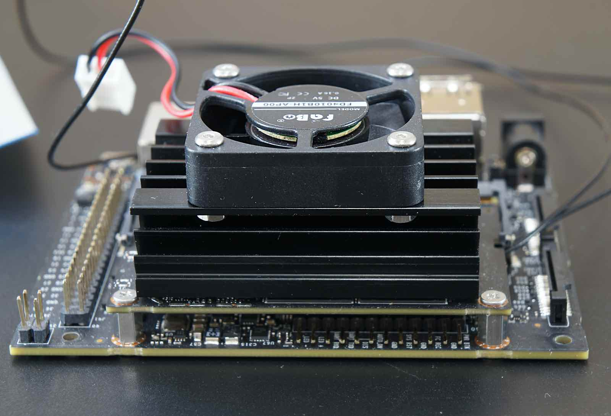

### CPUファンコネクタの接続

CPUファンのコネクタをJetson開発者キットにあるコネクタに刺します。

以下の写真のようにコネクタを刺します。

CPUファン取り付けは完了です。

### Jetson開発者キットとパネルとの結合

|写真|部品または工具|個数|
|:--|:--|:--:|
|{: style="height:210px;width:200px"}| 樹脂六角スペーサー（白色）M3x10・・・・4 皿ネジM2.6×5・・・・4 なべネジM2.6×5・・・・4|１袋|

樹脂スペーサー、ネジを用意します。

皿ネジM2.5を４箇所刺して、　

スペーサーで取り付けます。

### RCカーと結合

|写真|部品または工具|個数|
|:--|:--|:--:|
|{: style="height:210px;width:200px"}|RCカー本体　TT-02 XBプロ エキスパートビルド ※完成品  ※車種はお選びいただくことはできません。|１セット|
|{: style="height:210px;width:200px"}| Wi-Fiルーター WMR-433W2 ※ボディカラーはお選びいただくことはできません。 ※写真はホワイトです。|１個|
|{: style="height:210px;width:200px"}|Wi-Fiルーター用 USBケーブル 標準A-マイクロB（A 右向き、B左向き）0.25m|１個|
|{: style="height:210px;width:200px"}|モバイルバッテリー　（BI-B3） ※新パッケージの場合| １個|
|{: style="height:210px;width:200px"}|両面テープ|３枚|
|{: style="height:210px;width:200px"}|精密ドライバー　P柄|１本|

矢印の箇所のネジ4本を取り外します。

モーターカバーのネジ4本を取り外し、モーターカバーを取り外します。

バッテリーを装着します。

ボディとロワーパネルを用意します。

ロワーパネルをTT-02車体に載せます。

ドライバーでRCカーからはずしたネジで４箇所締めます。

アッパーパネル、Jetson開発者キット、両面テープ３枚、無線LANルーター、モバイルバッテリーを用意します。

モバイルバッテリーに２枚の両面テープを貼ります。

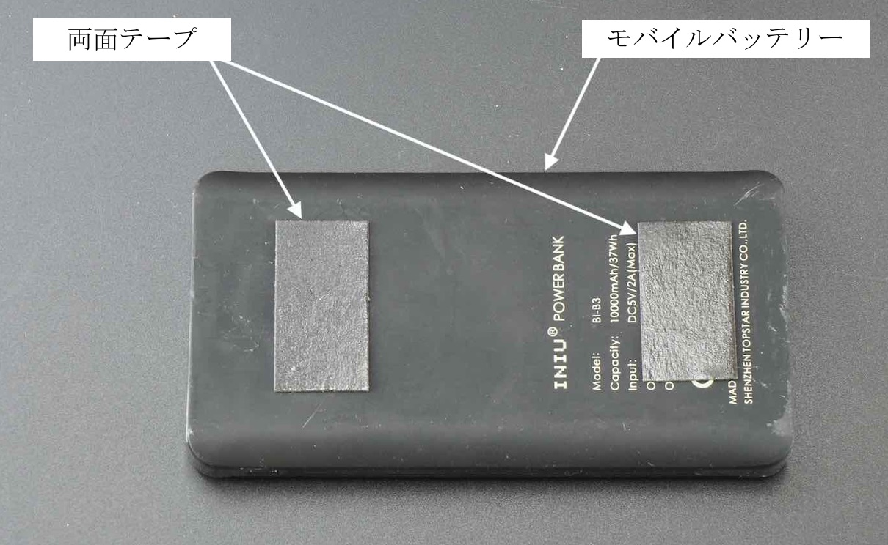

無線LANルーターに両面テープを貼ります。

無線LANルーターとモバイルバッテリーをアッパーパネルに貼り付け、ルーターの電源ケーブルを下記の写真のように接続します。

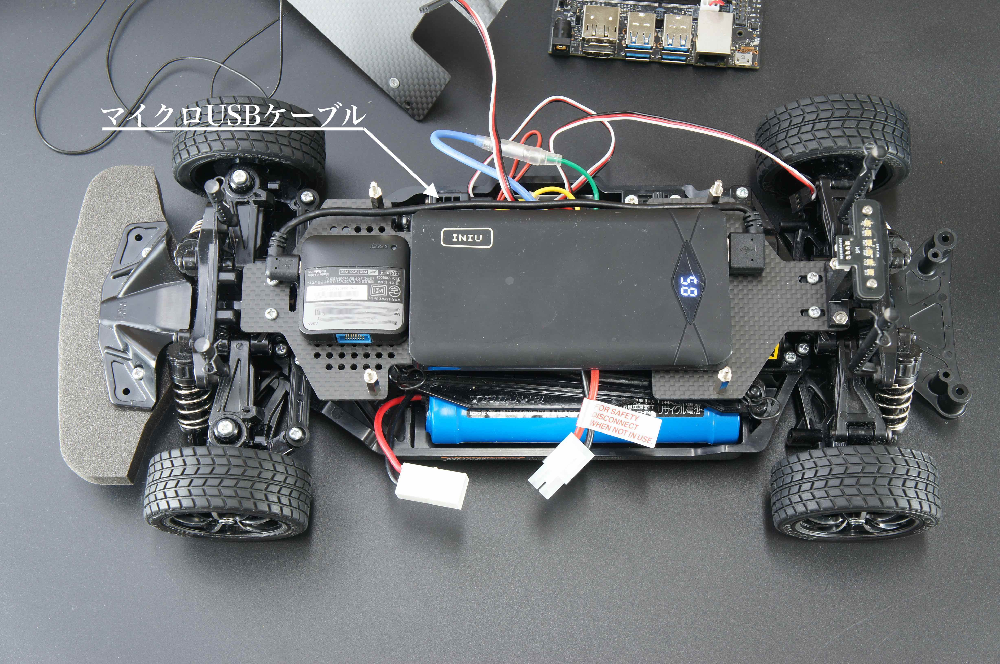

接続すると無線LANルーターが起動しますので、モバイルバッテリーのボタンをダブルクリックして電源を切ります。

ダブルクリックすると電源がきれて、数値が表示されなくなります。

車体にアッパーパネルを載せて、ナットを４箇所をしめます。

ナットドライバーで固定します。

### Jetson開発者キットの取り付け

ビスを用意して、Jetson開発者キットをスペーサーの上の載せます。

Jetson開発者キットをドライバーで４箇所固定します。

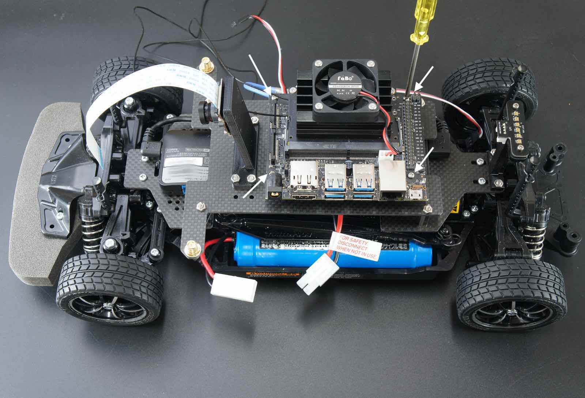

Jetson開発者キット取り付け完了です。

### カメラケーブル接続

Jetson Nano B01 開発者キットには、CAM0,CAM1の２つのカメラポートがありますが、CAM0にカメラケーブルを接続します。

Jetson開発者キットのカメラ端子のコネクタ両サイドのロックを持ち上げます。

カメラケーブルを刺します。

コネクタのロック真ん中を指で押し、固定します。

### Wi-Fiアンテナケーブルを結束

|写真|部品または工具|個数|
|:--|:--|:--:|
|{: style="height:210px;width:200px"}|結束バンド|１枚|

Wi-Fiアンテナケーブルを結束バンドで束ねます。

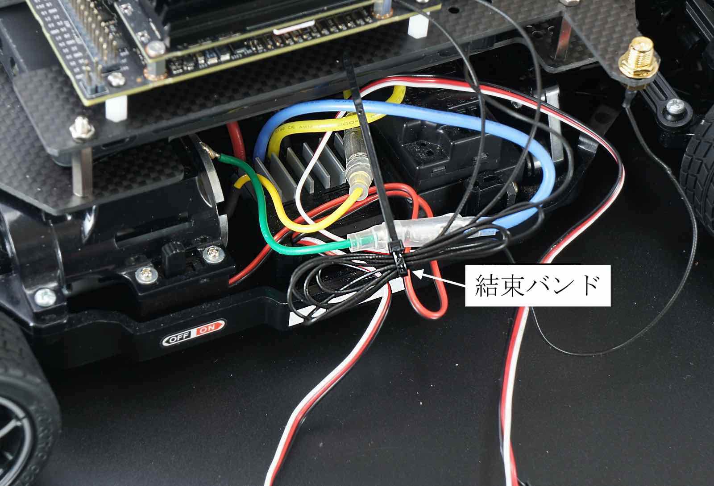

束ねたケーブルはJetson開発者キットの下に入れます。

### Jumperピンの設定

DCジャックからJetson開発者キットへ給電しますので、下の写真のように、Jumperピンをオープンからショートにします。

### コントローラーボードの装着

|写真|部品または工具|個数|
|:--|:--|:--:|
|{: style="height:210px;width:200px"}|FaBo #612 コントローラーボード|１枚|

コントローラーボードの取り付け完了

### RCカー信号の配線

|写真|部品または工具|個数|
|:--|:--|:--:|
|{: style="height:210px;width:200px"}|RCケーブル３ピン　メスプラグ  3本|１セット|

RCカーの信号入力、スピードコントローラーから繋がっているケーブル、サーボモーターに繋がっているケーブルを確認します。

コントローラーボードのTHをスピードコントローラー、スピードコントローラーのSTをサーボに繋ぎます。

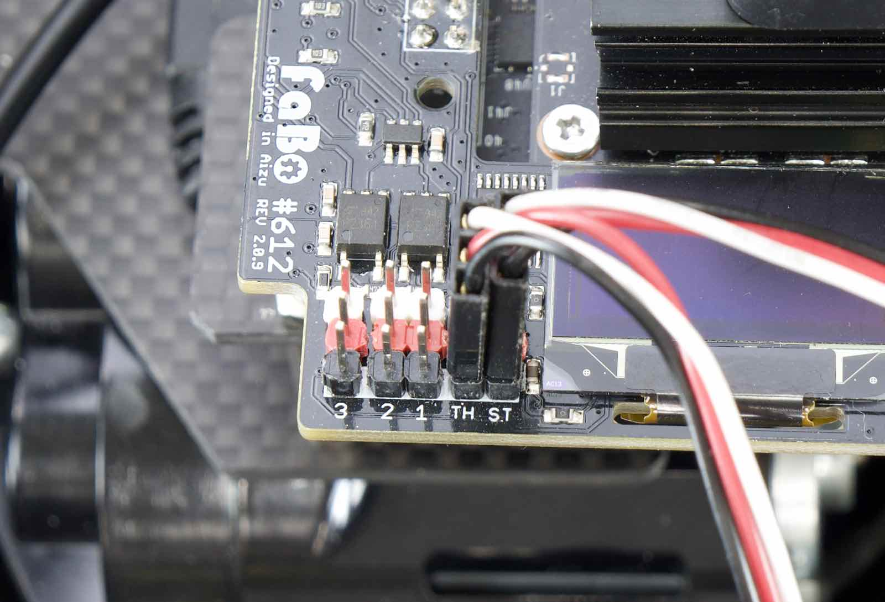

RCカー受信機出力している３つの信号をコントローラーボードへ繋ぎます。

RCカー受信機からは、１〜３チャンネルの信号が出力されます。

３pinケーブルを受信機に各ピンそれぞれ繋ぎます。

＃６１２コントローラーボードの１、２、３へ接続できましたら、RCとの信号配線は完了です。

### ルーターとの配線

|写真|部品または工具|個数|
|:--|:--|:--:|
|{: style="height:210px;width:200px"}|LANケーブル 0.15m|１本|

無線LANルーターとJetson開発者キットをLANケーブルで繋ぎます。

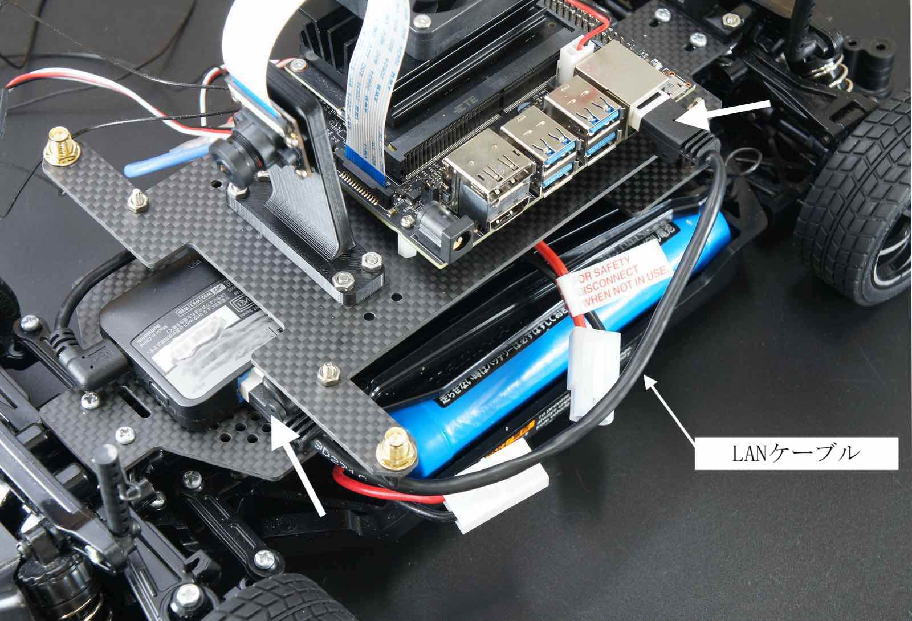

### LEDボード

|写真|部品または工具|個数|
|:--|:--|:--:|
|{: style="height:210px;width:200px"}|FaBo 4pinケーブル 0.15m|１本|

LEDボードとコントローラーボードを配線します。

### Wi-Fiアンテナ

Wi-Fiアンテナを回してたてます。

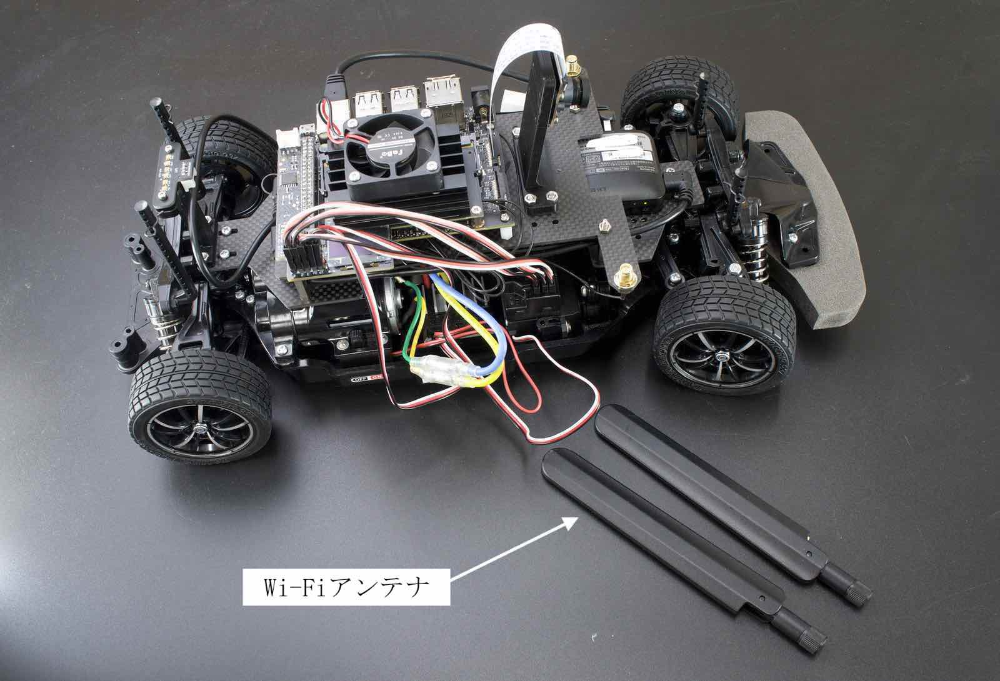

Wi-Fiアンテナ取り付け完了。

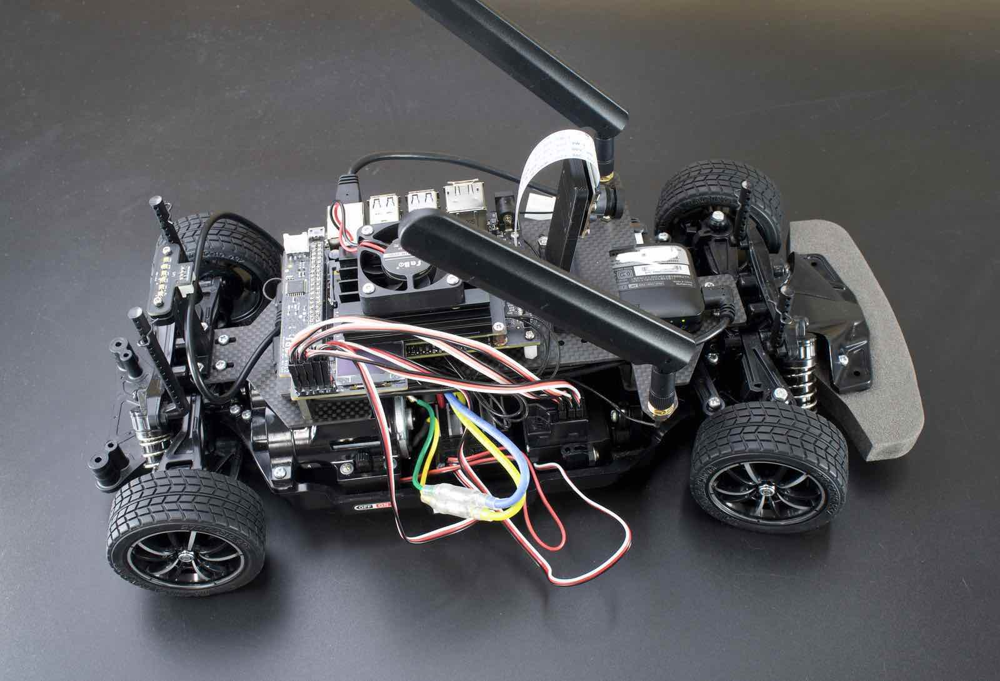

### SDカード挿入

|写真|部品または工具|個数|
|:--|:--|:--:|
|{: style="height:210px;width:200px"}|マイクロSDカード(32GB),SDカードケース サムスンEVO|１個|

Jetson NanoにSDカードをSDカードの端子がこちらから見えるように挿入します。

Jetson開発者キットに電源を投入します。バッテリーを切断しておき、RCカーの電源は、急発進や暴走の原因となりますので、絶対に電源はオフにします。確認できたら、DCジャックをDCプラグに繋ぎます。

### 電源投入

|写真|部品または工具|個数|
|:--|:--|:--:|
|{: style="height:210px;width:200px"}|単三アルカリ乾電池（プロポに使用） ※写真と異なる場合がございます。|4本|

モバイルバッテリーの電源をONします。

おおよそのバッテリー残量が表示される。

Jetson開発者キットの各LED（緑）が発光します。

コントローラーボードのOLEDにIPアドレス、メモリ使用率など表示されます。

コネクタを接続し、RCカーの電源を繋ぎます。

RCカーのスイッチをスライドさせ、RCカーに電源を投入します。

TT-02のプロポに単三電池４本入れます。

プロポの電源をONします。プロポの赤色ランプが点灯します。

LEDが緑色のときは、通常のRCカーとして操作モードになります。（RCカーモード）

プロポの裏側のボタンを押すとモードが切り替えられます。

LEDが赤色のときは、JetsonがRCカーを操縦するモードになります。（AIモード）

動作が確認できましたら、以上JetRacerKitの組み立ては完了となります。

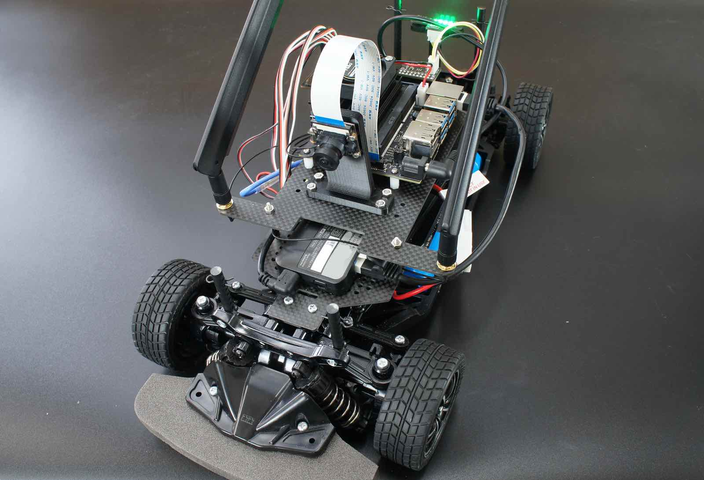
