# 組み立て

対象モデル

|コード番号|
|:--|
|コード番号：JR1-S-C-B|

TT02をベースにJetRacer Kitを組み立てます。

### カメラモジュール,LEDマウントの取り付け

|写真|部品または工具|個数|
|:--|:--|:--:|
|{: style="height:210px;width:200px"}|CAM026 IMX219-160°|1個|
|{: style="height:210px;width:200px"}|拡張ボディアッパーパネル 材質：アルミニウム|１枚|
|{: style="height:210px;width:200px"}|拡張ボディカーボンロワーパネル|1枚|
|{: style="height:210px;width:200px"}|拡張ボディカーボンエディション用カメラマウント・・・1 拡張ボディカーボンエディション用LEDマウント・・・・1 皿ねじM3\*12・・・・4 皿ねじM3\*10・・・・2 ナット M3・・・・6 六角穴付きボルトセルフタッピングねじM2.0\*5・・・・6|1袋|
|{: style="height:210px;width:200px"}|Color LEDボード|１枚|
|{: style="height:210px;width:200px"}|六角棒レンチ 1.5|1個|
|{: style="height:210px;width:200px"}|プラスドライバー +2×100|１本|
|{: style="height:210px;width:200px"}|ナットドライバー ５．５|１本|

カメラマウントにカメラモジュール取り付けます。

Cameraを、M2x6のスクリューネジ 4本を六角レンチを用いて取り付けます。

六角棒レンチにより４箇所ねじ止めします。

カメラモジュール取り付け完了

### LEDボードを取り付けます。

LEDマウントにLEDボードを取り付けます。

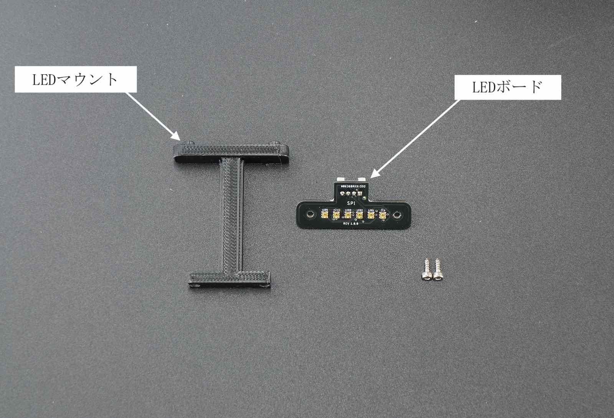

LEDマウントを２箇所ねじ止めします。

LEDボード取り付け向き　横から見た場合

付属の六角レンチよりタッピングねじを２箇所取り付けます。

LEDボード取り付け完了

### シャーシの組み立て（上側）

|写真|部品または工具|個数|
|:--|:--|:--:|
|{: style="height:210px;width:200px"}|樹脂六角ボルト（黒色）M3\*18・・・・4 皿ねじM3\*10・・・・4 ナット M3・・・・4|１袋|

以下の部品を用意します。
拡張ボディアッパーパネル　１枚、拡張ボディアッパーパネルロワーパネル　１枚

M3\*12の皿ねじ　4個　、M3ナット 6個

カメラマウントとアッパーパネルを結合します。アッパーパネルには皿もみがあります。皿ねじと合う面に皿ねじを刺します。

皿ねじM3\*12を付属のナットドライバで４箇所を取り付けます。

ナットドライバーにてカメラマウントを取り付けます。

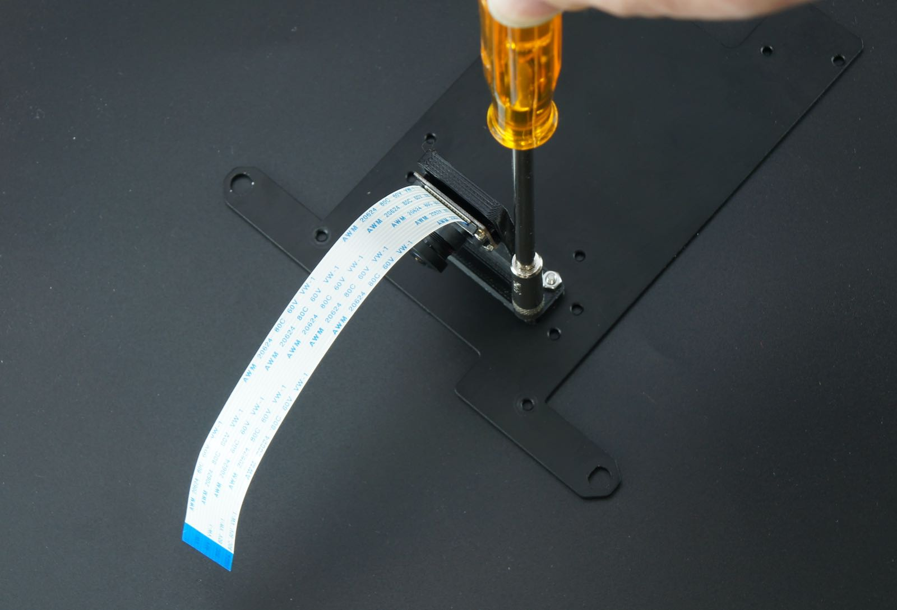

カメラモジュールの取り付けは完了です。

### シャーシの組み立て（下側）

カーボンロワーパネルにLEDマウントを皿ねじとナットで締め取り付けます。

ネジの方向は、窪みがある方向から皿ねじを通します。

下記の矢印のところに、ねじを２箇所取り付けます。

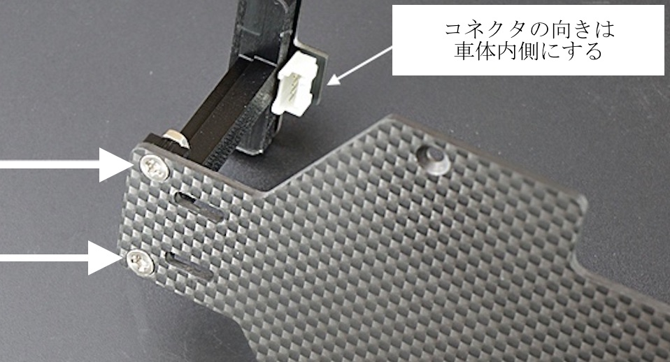

ナットドライバーにて締め付けします。

LEDマウント取り付け完了

皿ねじ　M3×10 4個 , 樹脂六角スペーサ（黒）　M3×18　４個を用意します。

ねじを締めます。

４箇所締めます。

### Wifiアンテナ,Wifiモジュールの取り付け

|写真|部品または工具|個数|
|:--|:--|:--:|
|{: style="height:210px;width:200px"}|Intel Dual Bandwireless-AC 8265 Desktop Kit|１個|

Wifiモジュールセットから金具からスパナでアンテナを取り出し、アッパーパネルの左右に取り付けます。

ケーブルを付属のスパナで取り付けます。

### Wifiモジュールの取り付け

|写真|部品または工具|個数|
|:--|:--|:--:|
|{: style="height:210px;width:200px"}|Jetson Nano 開発者キットB-01|１枚|
|{: style="height:210px;width:200px"}|DCファン FD401B1H-AP00 DC5V,0.16A|１個|
|{: style="height:210px;width:200px"}|FAN取り付け用アクリル|１個|
|{: style="height:210px;width:200px"}|ファンねじ  M2.5×14・・・・4 ナットM2.5・・・・5(ヨビ１)|１袋|
|{: style="height:210px;width:200px"}|精密ドライバセット　ED−２０|１セット|

Jetson開発者ボード,DCファン、Wifiモジュール、ファン取り付けツール、ファン取り付けねじ

Jetson開発者ボードの２つのねじを付属の精密ドライバで２箇所はずします。
 ※ねじの山かけに注意します。

Jetson開発者ボードからJetsonNanoを取り外します。JetsonNanoは、２箇所のつめで固定されているので、両側のつめを外側に指で軽く押します。

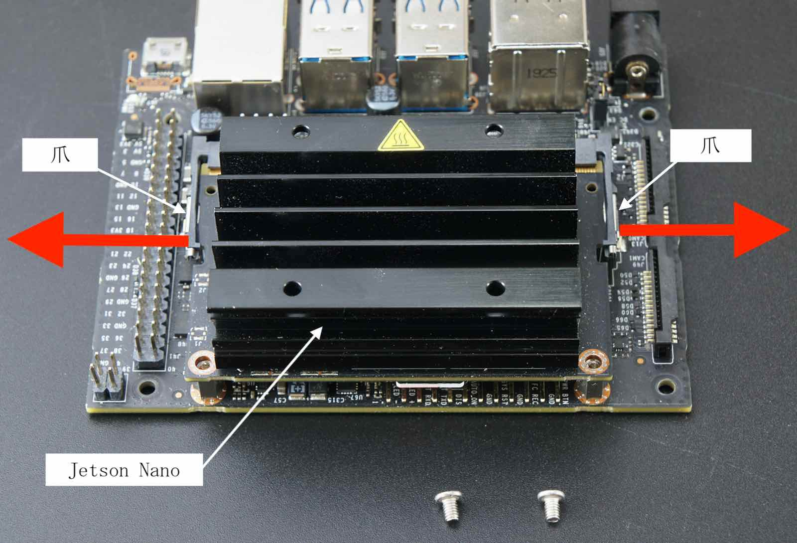

JetsonNanoが斜めに上がります。

JetsonNanoをはずすと、ねじとスロットが確認できます。

ドライバでねじを取り除きます。

Wifiモジュールをスロットに刺します。

黒いねじでモジュールを取り付けます。

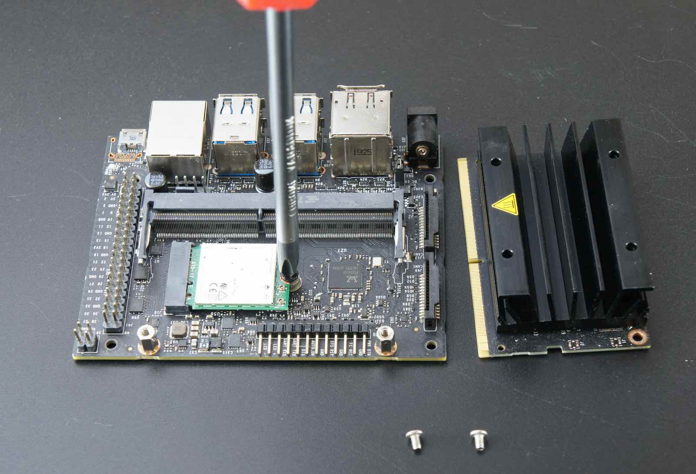

２本のWifiアンテナケーブルとWifiモジュールを繋ぎます。

Wifiアンテナ端子とWifiモジュール端子を接続します。

JetsonNanoを開発ボードへ差し込み、ねじで取り付けます。

### CPUFANの取り付け

DCファンをヒートシンクの上に載せます。

FAN取り付けツールを用意します。

ナットをFAN取り付けツールに写真のように載せます。

FAN取り付けツールをヒートシンクのフィンの間に刺して、ファン取り付けねじをCPUFANに刺します。

六角レンチでねじを締めます。

反対側も同じようにFAN取り付けジグを刺してねじをCPUFANに刺します。

同じように六角棒レンチで２箇所締めます。

ねじの締め付けが終わったら、ファン取り付けツールを取ります。

### CPUFANコネクタの接続

CPUFANのコネクタをJetsonNano開発者ボードにあるコネクタに刺します。

以下の写真のようにコネクタを刺します。

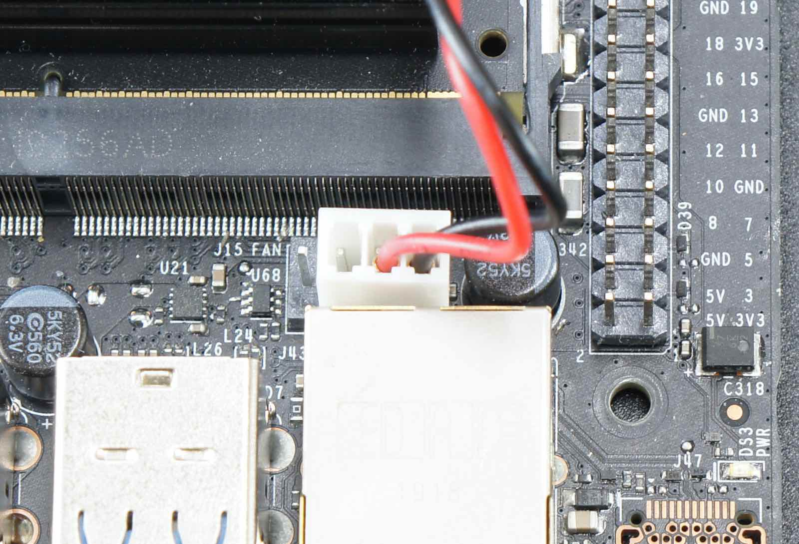

CPUFAN取り付けは完了です。

### JetsonNanoとパネルとの結合

|写真|部品または工具|個数|
|:--|:--|:--:|
|{: style="height:210px;width:200px"}| 六角スペーサー（樹脂　両メネジ白10ミリ）・・・・4 皿ネジM2.6×5・・・・4 なべねじM2.6×5・・・・4|１袋|

樹脂スペーサ、ねじを用意します。

皿ねじM2.5を４箇所刺して、　

スペーサを回転させ、取り付けます。

JetsonNanoのスペーサー取り付け終了になります。

### RCカーと結合

|写真|部品または工具|個数|
|:--|:--|:--:|
|{: style="height:210px;width:200px"}|RCカー本体　TT02 XBプロ エキスパートビルド ※完成品  ※車種はお選びいただくことはできません。|１枚|
|{: style="height:210px;width:200px"}| Wifiルーター WMR-433W2 ※ボディカラーはお選びいただくことはできません。 ※写真はホワイトです。|１個|
|{: style="height:210px;width:200px"}|Wifiルータ用 USB Cable 標準A-マイクロB（A 右向き、B左向き）0.25m|１個|
|{: style="height:210px;width:200px"}|モバイルバッテリー　（BI-B3） ※新パッケージの場合| １個|
|{: style="height:210px;width:200px"}|両面テープ|３枚|
|{: style="height:210px;width:200px"}|精密ドライバー　P柄|１本|

矢印の箇所のネジ4本を取り外します。

モーターカバーのネジ4本を取り外し、モーターカバーを取り外します。

バッテリーを装着します。

ボディーとロワーパネルを用意します。

ロワーパネルをTT-02車体に載せます。

ドライバーでRCカーからはずしたねじで４箇所締めます。

アッパーパネルとJetsonNano、両面テープ３枚、無線LANルータ、モバイルバッテリーを用意します。

モバイルバッテリーに２枚の両面テープを貼ります。

無線LANルーターに両面テープを貼ります。

無線LANルーターとモバイルバッテリーをアッパーパネルに貼り付け、ルーターの電源ケーブルを下記の写真のように接続します。

接続すると無線LANルーターが起動しますので、モバイルバッテリーのボタンをダブルクリックして電源を切ります。

ダブルクリックすると電源がきれて、数値が表示されなくなります。

車体にアッパーパネルを載せて、ナットを４箇所をしめます。

ナットドライバーで固定します。

### Jetson Nanoの取り付け

ビスを用意して、JetsonNanoをスペーサーの上の載せます。

JetsonNanoをドライバーで４箇所固定します。

JetsonNano取り付け完了です。

### カメラケーブル接続

Jetson Nano B01 開発者キットには、CAM0,CAM1の２つのカメラポートがありますが、CAM0にカメラケーブルを接続します。

Jetson Nanoのカメラ端子のコネクタ両サイドのロックを持ち上げます。

カメラケーブルを刺します。

コネクタのロック真ん中を指で押し、固定します。

### Wifiアンテナケーブルを結束

|写真|部品または工具|個数|
|:--|:--|:--:|
|{: style="height:210px;width:200px"}|結束バンド|１枚|

Wifiアンテナケーブルを結束バンドで束ねます。

束ねたケーブルはJetsonNano基板の下に入れます。

### ジャンパーピンの設定

DCジャックからJetsonNanoへ給電しますので、下の写真のように、ジャンパーピンをオープンからショートにします。

### コントローラーボードの装着

|写真|部品または工具|個数|
|:--|:--|:--:|
|{: style="height:210px;width:200px"}|FaBo #612 コントローラーボード|１枚|

コントローラーボードの取り付け完了

### RCカー信号の配線

|写真|部品または工具|個数|
|:--|:--|:--:|
|{: style="height:210px;width:200px"}|RCケーブル３ピン　メスプラグ  3本|１セット|

RCカーの信号入力ケーブルを確認します。スピードコントローラから繋がっているケーブル、サーボモータに繋がっているケーブル

コントローラボードのTHをスピードコントローラ、スピードコントローラのSTをサーボに繋ぎます。

RCカー受信機出力している３つの信号をコントローラボードへ繋ぎます。

RCカー受信機からは、１〜３チャンネルの信号が出力されます。

３ピンケーブルを受信機に各ピンそれぞれ繋ぎます。

＃６１２コントローラボードの１、２、３へ接続できましたら、RCとの信号配線は完了です。

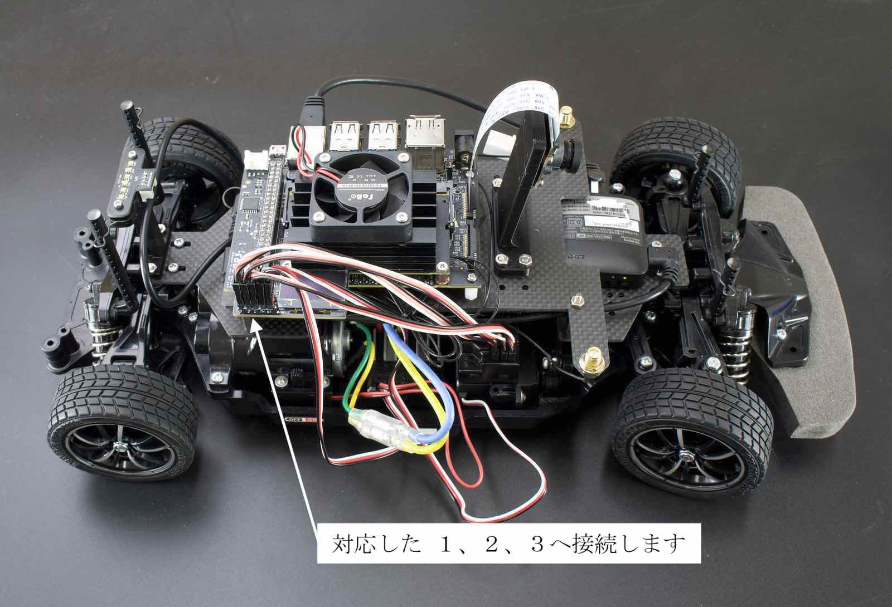

### ルーターとの配線

|写真|部品または工具|個数|
|:--|:--|:--:|
|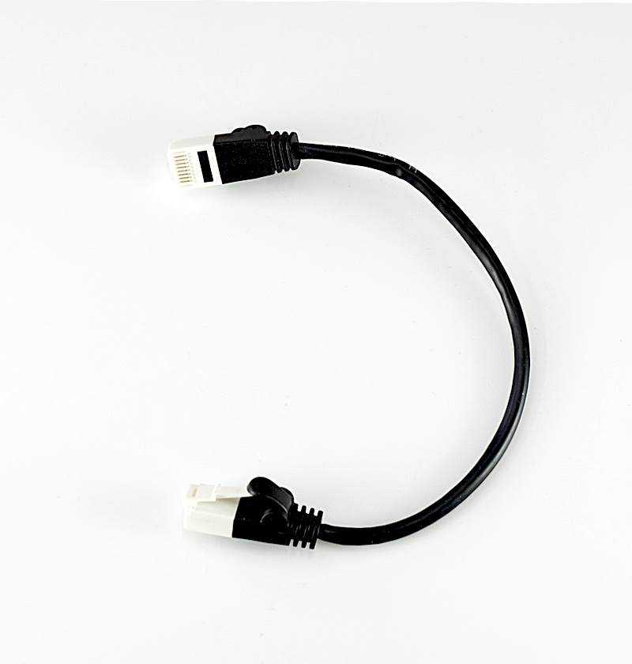{: style="height:210px;width:200px"}|LANケーブル 0.15m|１本|

無線LANルーターとJetsonNano開発ボードをLANケーブルで繋ぎます。

### LEDボード

|写真|部品または工具|個数|
|:--|:--|:--:|
|{: style="height:210px;width:200px"}|FaBo 4pinケーブル 0.15m|１本|

LEDボードとコントローラボードを配線します。

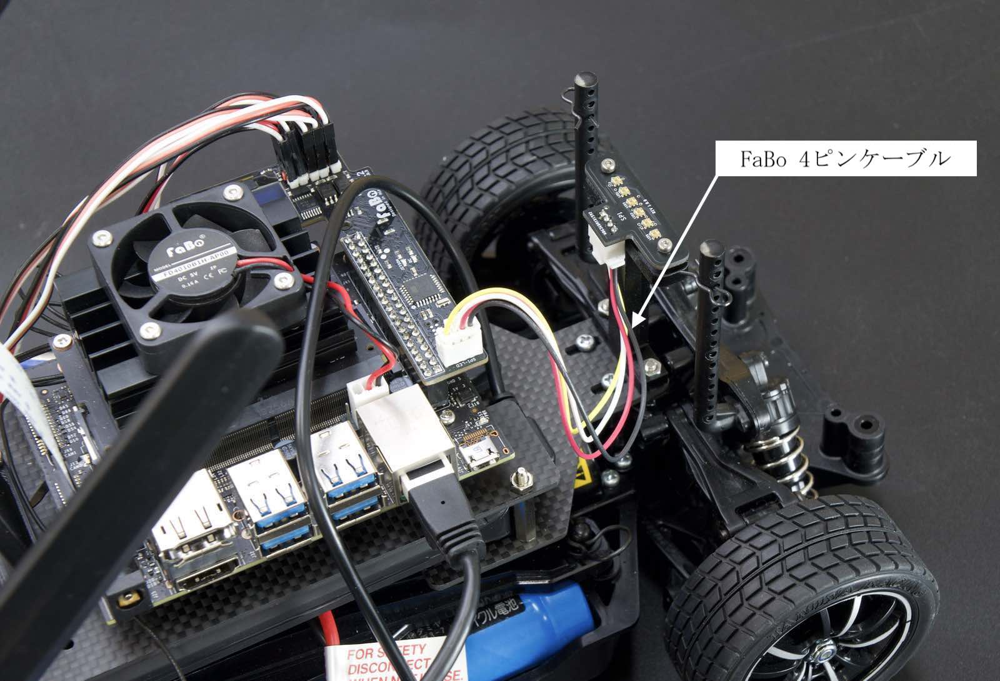

### Wifiアンテナ

Wifiアンテナを回してたてます。

Wifiアンテナ取り付け完了。

### SDカード挿入

|写真|部品または工具|個数|
|:--|:--|:--:|
|{: style="height:210px;width:200px"}|マイクロSD Card(32GB),SDカードケース サムスンEVO|１個|

JetsonNanoにSDカードをSDカードの端子がこちらから見えるように挿入します。

Jetson Nanoに電源を投入します。バッテリーを切断しておき、RCカーの電源は、急発進や暴走の原因となりますので、絶対に電源はオフにします。確認できたら、DCジャックをDCプラグに繋ぎます。

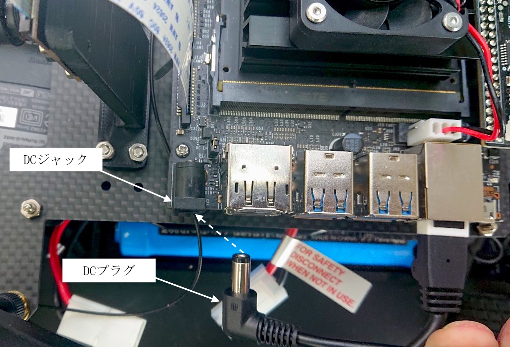

### 電源投入

|写真|部品または工具|個数|
|:--|:--|:--:|
|{: style="height:210px;width:200px"}|単三アルカリ乾電池　4本 （プロポに使用） ※写真と異なる場合がございます。|１枚|

モバイルバッテリーの電源をONします。

おおよそのバッテリー残量が表示される。

Jetson Nanoの緑色の各LEDが発光します。

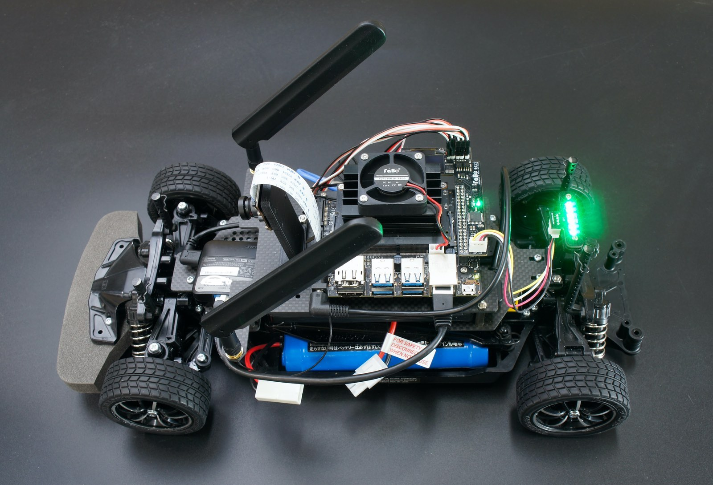

コントローラーボードのOLEDにIPアドレス、メモリ使用率など表示されます。

ハーネスを接続し、RCカーの電源を繋ぎます。

※電源投入時は、特にRCカーの暴走に注意してください。

RCカーのスイッチをスライドさせ、RCカーに電源を投入します。

※電源投入時は、特にRCカーの暴走に注意してください。

TT-02のプロポに単三電池４本入れます。

プロポの電源をONします。プロポの赤色ランプが点灯します。

LEDが緑色のときは、通常のRCカーとして操作モードになります。（RCカーモード）

プロポの裏側のボタンを押すとモードが切り替えられます。

LEDが赤色のときは、JetsonNanoがRCカーを操縦するモードになります。（AIモード）

動作が確認できましたら、以上JetRacerKitの組み立ては完了となります。
カメラにレンズキャップがついている場合は取り外します。
お疲れ様でした。

