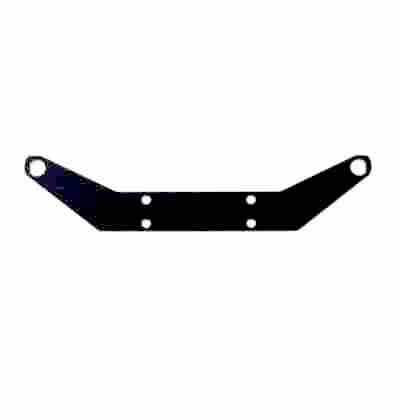
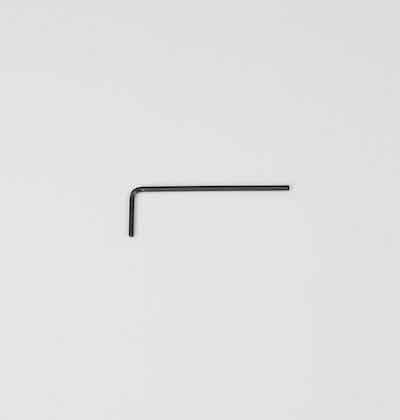
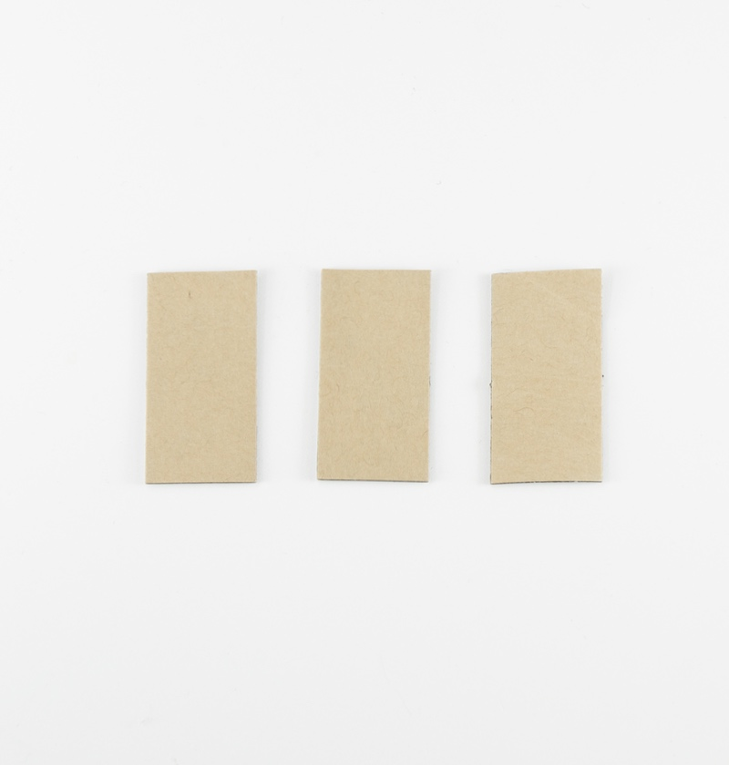
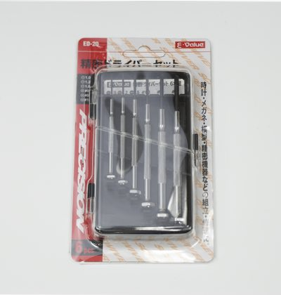
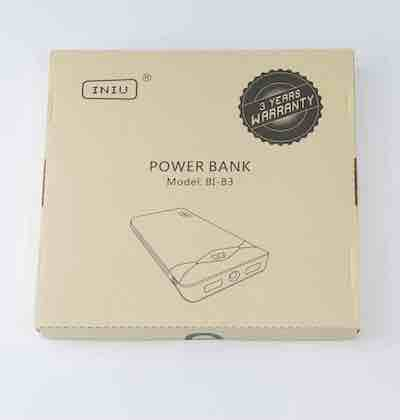

# JetRacer Kit Carbon Edition ４GBモデル BOMリスト

JetRacer Kit GRスープラボディ装着車

|コード番号|
|:--|
|コード番号：JR1-S-C-C|
|コード番号：JR1-NV-C-C|

※車体レスモデルは、RCカー本体　TT-02 XBプロはありません。

##JetRacer Carbon Edition JR1-S-C-C 内容物

|写真|部品|個数|
|:--|:--|:--|
|{: .bom_listsize}|RCカー本体　タミヤ　TT-02 XBプロ エキスパートビルド ※完成品  ※タミヤ　1/10RC XB トヨタ　GR スープラ または、1/10RC XB トヨタがズーレーシングWRT / ヤリス　WRCのいずれかになります。 車種は選べません。|１セット|
|{: .bom_listsize}|Jetson Nano 開発者キットB-01|１台|
|{: .bom_listsize}|CAM026 IMX219-160° ケーブル 150mm|１個|
|{: .bom_listsize}|拡張ボディ カーボンアッパーパネル|１枚|
|{: .bom_listsize}|拡張ボディ カーボンロワーパネル|１枚|
|{: .bom_listsize} {: .bom_listsize}|Wi-Fi支持パーツ 材質:FR-4 Rev4（上）またはRev5（下）|１枚|
|{: .bom_listsize}|拡張ボディ カーボンエディション用カメラマウント・・・1 拡張ボディ カーボンエディション用LEDマウント・・・・1 ※２０２１年６月出荷以前の場合  皿ネジM3×15・・・・4 皿ネジM3×10・・・・2 ナット M3・・・・6 六角穴付きボルトセルフタッピングネジM2×5・・・・6|１袋|
|{: .bom_listsize}|拡張ボディ カーボンエディション用LEDマウント（Rev２） ※２０２１年７月出荷以降のものはこちらになります。 ボディ取り付け対応品|１個|
|{: .bom_listsize}|樹脂六角スペーサー（黒色）M3×18・・・・4 皿ネジM3×10・・・・4 ナット M3・・・・4|１袋|
|{: .bom_listsize}| 樹脂六角スペーサー(白色または黒)M2.6×10・・・・4 皿ネジM2.6×5・・・・4 なべネジM2.6×5・・・・4|１袋|
|{: .bom_listsize}|FaBo #612 コントローラーボード|１枚|
|{: .bom_listsize}|Color LEDボード|１枚|
|{: .bom_listsize}| Wi-Fiルーター WMR-433W2 ※ボディカラーはお選びいただくことはできません。|１個|
|{: .bom_listsize}|Intel Dual Bandwireless-AC 8265 Desktop Kit|１個|
|{: .bom_listsize}|電源用USBケーブル 標準A-DCプラグ（A右向き、DC 2.1mm) 0.2m|１本|
|{: .bom_listsize}|Wi-Fiルーター用 USBケーブル 標準A-マイクロB（A 右向き、B左向き）0.25m|１本|
||転送用USBケーブル 3m 　標準A-マイクロB|１本|
|{: .bom_listsize}|RCケーブル3ピン　メスプラグ  3本|１セット|
|{: .bom_listsize}|FaBo 4ピンケーブル 0.15m|１本|
|{: .bom_listsize}|LANケーブル 0.15m|１本|
|{: .bom_listsize}|マイクロSDカード(64GB),SDカードケース サンディスク エクストリームプロ ２０２１年７月出荷分より|１個|
|{: .bom_listsize}|マイクロSDカード(32GB),SDカードケース サムスン EVO ２０２１年６月出荷までのもの|１個|
|{: .bom_listsize}|DCファン FD401B1H-AP00 DC5V,0.16A|１個|
|{: .bom_listsize}|CPUファン取り付けジグ|１個|
|{: .bom_listsize}|ファン固定ネジ  M2.5×14・・・・4 ナットM2.5・・・・5(予備１)|１袋|
|{: .bom_listsize}|六角棒レンチ 1.5|１本|
|{: .bom_listsize}|両面テープ|３枚|
|{: .bom_listsize}|プラスドライバー +2×100|１本|
|{: .bom_listsize}|精密ドライバー　P柄|１本|
|{: .bom_listsize}|ナットドライバー 5.5|１本|
|{: .bom_listsize}|精密ドライバーセット　ED−20|１セット|
|{: .bom_listsize}|Jumperピン|１個|
|{: .bom_listsize}|スパナ  ８平スパナ|１本|
|{: .bom_listsize}|結束バンド|１本|
|{: .bom_listsize}|モバイルバッテリー　（BI-B3） ※新パッケージの場合|１個|
|{: .bom_listsize}|モバイルバッテリー　（BI-B3） ※旧パッケージの場合|１個|
|{: .bom_listsize}|単三アルカリ乾電池（プロポに使用） ※写真と異なる場合がございます。|4本|

※開封後はすぐ欠品がないかご確認お願いいたします。もし欠品がございましたら、[こちら](https://www.fabo.io/contact/)までご連絡ください。
