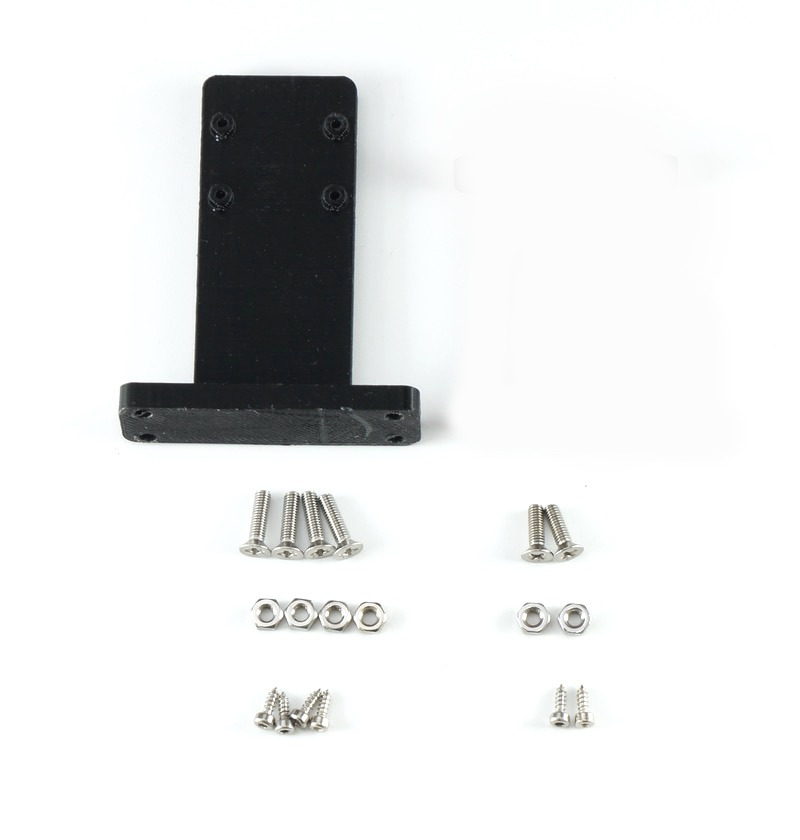
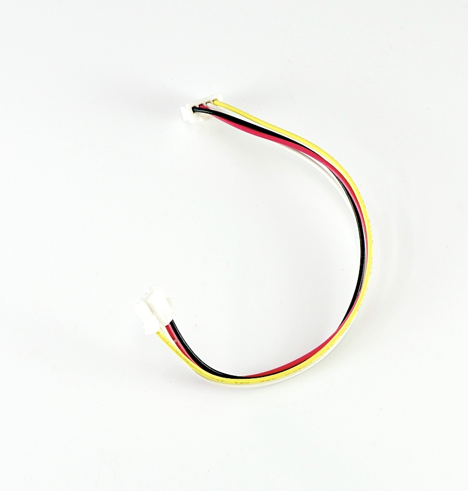

# JetRacer Kit Carbon Edition ４GBモデル BOMリスト

JetRacer Kit GRスープラボディ装着車

|コード番号|
|:--|
|コード番号：JR1-S-C-D|
|コード番号：JR1-B-C-D|
|コード番号：JR1-NV-C-D|

※車体レスモデルは、RCカー本体　TT-02 XBプロはありません。

##JetRacer Carbon Edition JR1-S-C-D 内容物

|写真|部品|個数|
|:--|:--|:--|
|{: .bom_listsiJetracerTypeD_OLED_REV020001.JPGze}|RCカー本体　タミヤ　TT-02 XBプロ エキスパートビルド ※完成品  ※タミヤ　1/10RC XB トヨタ　GR スープラ または、1/10RC XB トヨタガズーレーシングWRT/ヤリス　WRC 1/10RC XB NSX（TT-02シャーシ） タミヤ　1/10RC XB マツダ MAZDA3 (TT-02シャーシ) タミヤ　1/10RC XB フォード マスタング GT4 （TT-02シャーシ） のいずれかになります。  ※車種は選べません。 JR1-NV-C-D（車体レスモデル）　は、付属しません。|１セット|
|{: .bom_listsize}|Jetson Nano 開発者キットB-01  ※本体アップデートのため開封済みでございます。ご了承ください。 ※JR1-B-C-D（Jetson Nanoなしモデル）は付属しません。|１台|
|{: .bom_listsize}|CAM026 IMX219-160° ケーブル 150mm  ※ケーブルのお色は白または黒になります。|１個|
|{: .bom_listsize}{: .bom_listsize}|拡張ボディ カーボンアッパーパネル  ※上下いずれかになります。※車体レスモデルはセット  (上)通常パネル <!-- コード：００８ --> (下)NSX専用パネル <!-- コード：００９ -->|１枚|
|{: .bom_listsize}|拡張ボディ カーボンロワーパネル|１枚|
|{: .bom_listsize}|Wi-Fi支持パーツ 材質:FR-4 Rev6|１枚|
|{: .bom_listsize}|拡張ボディ カーボンエディション用カメラマウント・・・1  皿ネジM3×15・・・・4 皿ネジM3×10・・・・2 ナット M3・・・・6 六角穴付きボルトセルフタッピングネジM2×5・・・・6|１袋|
|{: .bom_listsize}|拡張ボディ カーボンエディション用LEDマウント（Rev3）　Wi-Fiルータマウント付き|１個|
|{: .bom_listsize}|樹脂六角スペーサー（黒色）M3×18・・・・4 皿ネジM3×10・・・・4 ナット M3・・・・4|１袋|
|{: .bom_listsize}| 樹脂六角スペーサー(白色または黒)M2.6×10・・・・4 皿ネジM2.6×5・・・・4 なべネジM2.6×5・・・・4|１袋|
|{: .bom_listsize}|FaBo #612 コントローラーボード  Rev2.0.17|１枚|
|{: .bom_listsize}|FaBo #405 Color LEDボード （OLED付）|１枚|
|{: .bom_listsize}|Intel Dual Bandwireless-AC 8265 Desktop Kit|１個|
|{: .bom_listsize}|電源用USBケーブル 標準A-DCプラグ（A左向き、DC 2.1mm) 0.2m|１本|
||転送用USBケーブル 3m 　標準A-マイクロB|１本|
|{: .bom_listsize}|RCケーブル3ピン　メスプラグ  3本|１セット|
|{: .bom_listsize}|FaBo 4ピンケーブル|２本|
|{: .bom_listsize}|マイクロSDカード(64GB),SDカードケース サンディスク エクストリームプロ|１個|
|{: .bom_listsize}|DCファン FD401B1H-AP00 DC5V,0.16A|１個|
|{: .bom_listsize}|CPUファン取り付けジグ|１個|
|{: .bom_listsize} {: .bom_listsize}|ファン固定ネジ  M2.5×14・・・・4 ナットM2.5・・・・5(予備１)  ※上（六角タイプ）または下（なべねじタイプ）の写真のものになります。|１袋|
|{: .bom_listsize}|六角棒レンチ 1.5|１本|
|{: .bom_listsize}|両面テープ|２枚|
|{: .bom_listsize}|プラスドライバー +2×100|１本|
|{: .bom_listsize}|精密ドライバー　P柄|１本|
|{: .bom_listsize}|ナットドライバー 5.5|１本|
|{: .bom_listsize}|精密ドライバーセット　ED−20|１セット|
|{: .bom_listsize}|Jumperピン  ※予備用|１個|
|{: .bom_listsize}|スパナ  ８平スパナ|１本|
|{: .bom_listsize}|結束バンド|４本|
|{: .bom_listsize}|モバイルバッテリー  モバイルバッテリーはこちらまたは、下記のモバイルバッテリーとなります。  モバイルチャージャー10000 オーム電機 SMP-JV53W/05-1196　 定格入力 DC5V/2.0A(Type-C/miro-B) 定格出力 DC5V/2.4V(Type-A*2ポート） 定格容量 DC5V/6300mAh 繰り返し充電回数 約500回 充電ケーブル micro-B 約15cm ※充電にはType-Cのケーブルを使用します。本キットには付属しませんのでお客様でご準備願います。 ※くわしい取り扱いに関しては取扱説明書をご覧ください。|１個|
|{: .bom_listsize}|単三アルカリ乾電池（プロポに使用） ※写真と異なる場合がございます。|4本|

Wi-Fiセット（オプション設定）

|写真|部品|個数|
|:--|:--|:--|
|{: .bom_listsize}| Wi-Fiルーター WMR-433W2 ※ボディカラーはお選びいただくことはできません。|１個|
|{: .bom_listsize}|LANケーブル 0.15m|１本|
|{: .bom_listsize}|Wi-Fiルーター用 USBケーブル 標準A-マイクロB（A 右向き、B左向き）0.25m|１本|
|{: .bom_listsize}|両面テープ|１枚|

※カッターナイフ、ニッパ等が必要となります。お客様でご準備お願いいたします。

※モバイルバッテリーの充電にはUSBタイプＣのケーブルと充電器が必要でございます。お客様でご準備ください。

※開封後はすぐ欠品がないかご確認お願いいたします。もし欠品がございましたら、[こちら](https://www.fabo.io/contact/)までご連絡ください。
