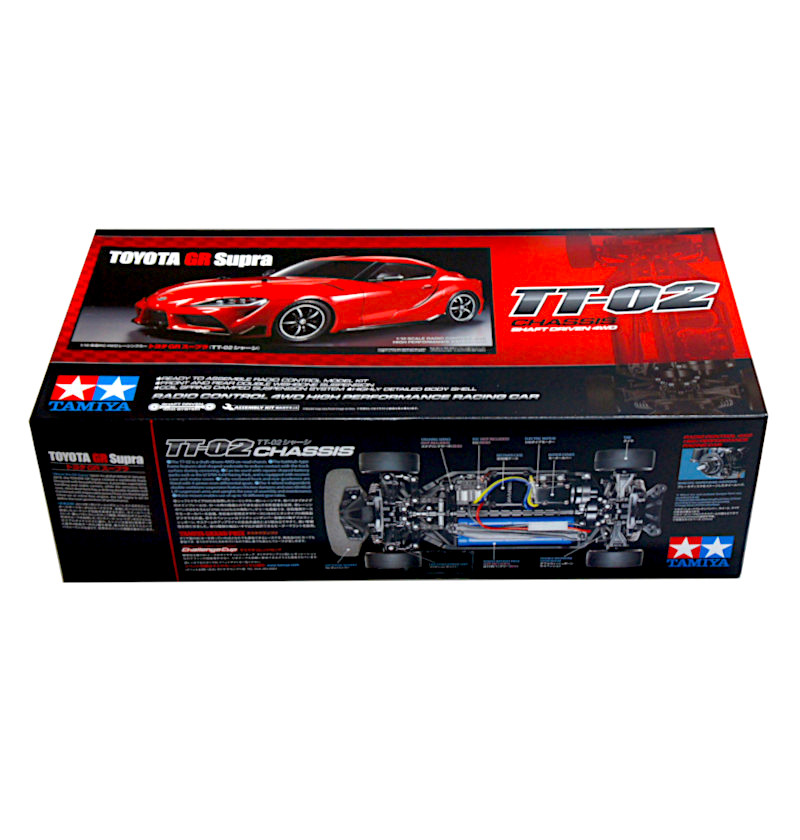
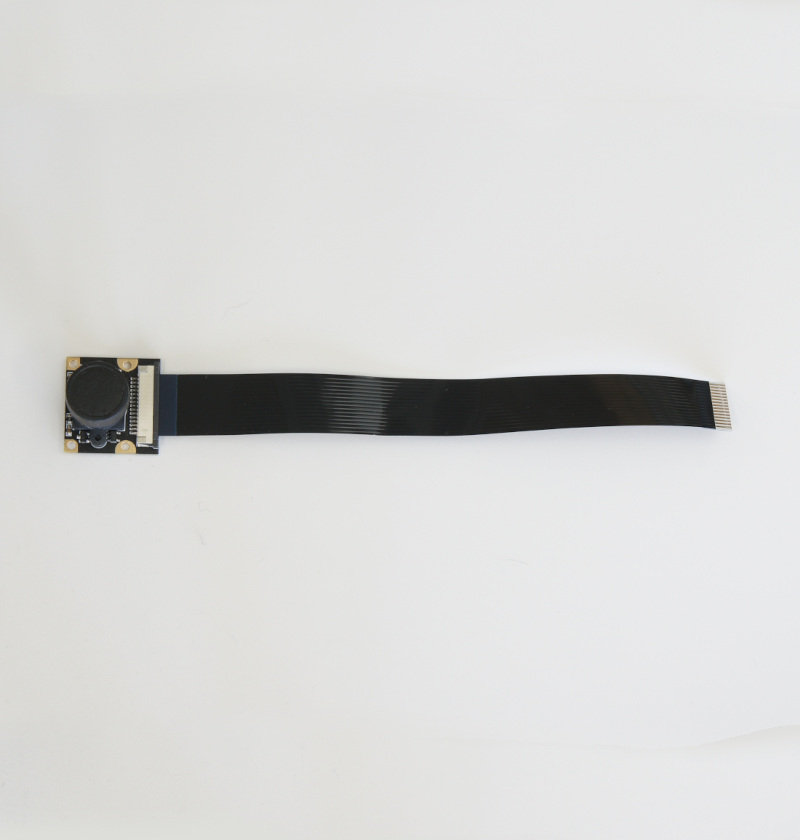
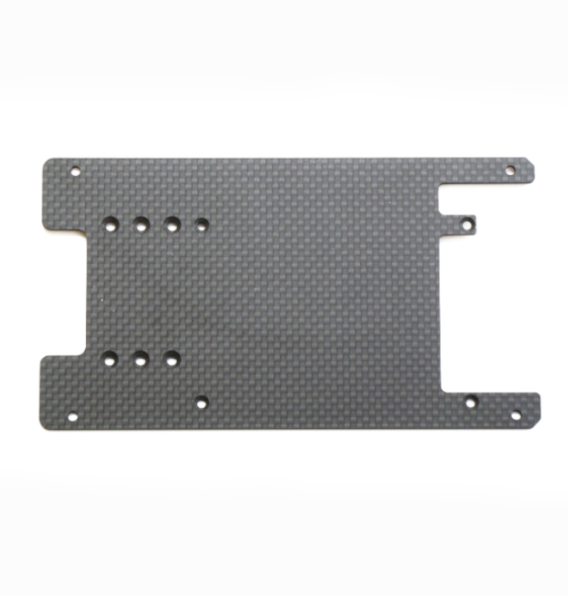
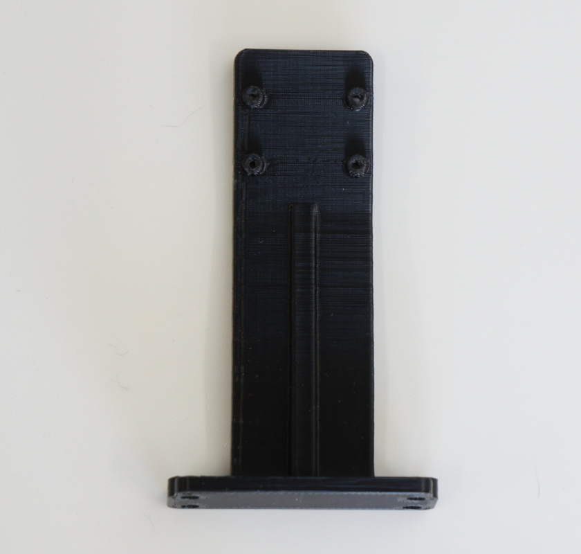
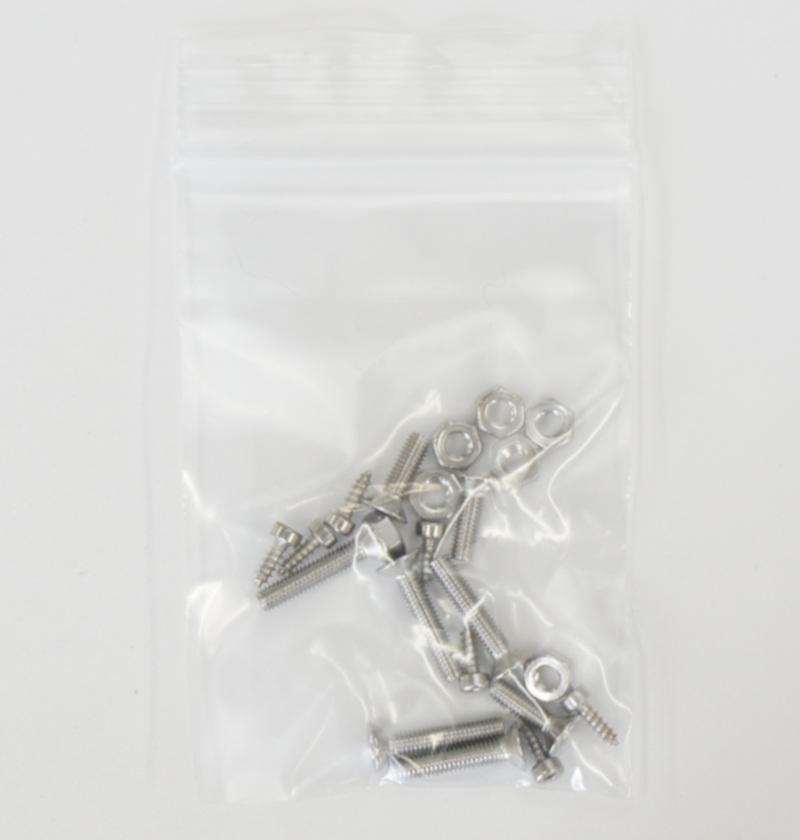
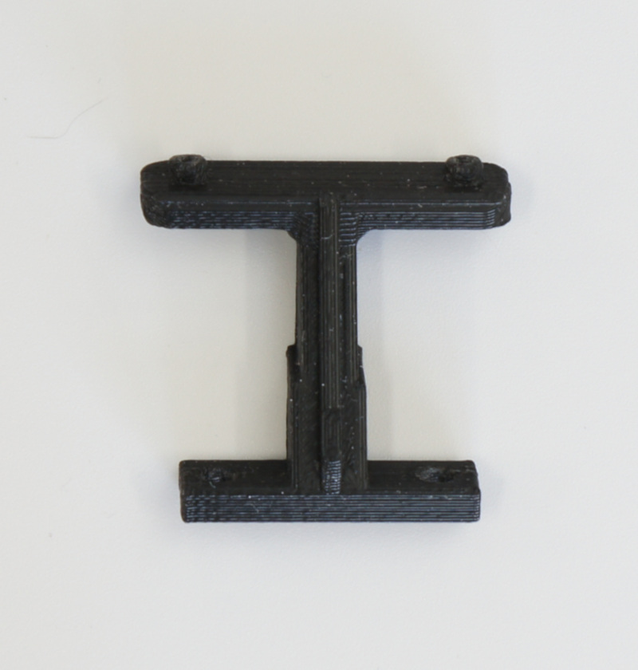
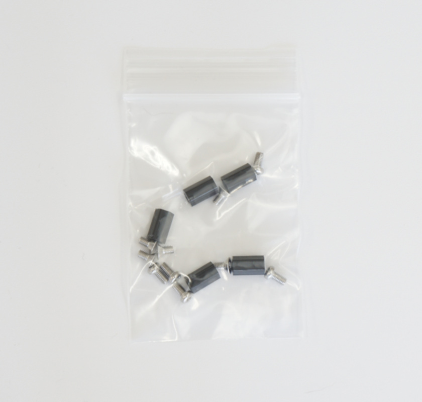
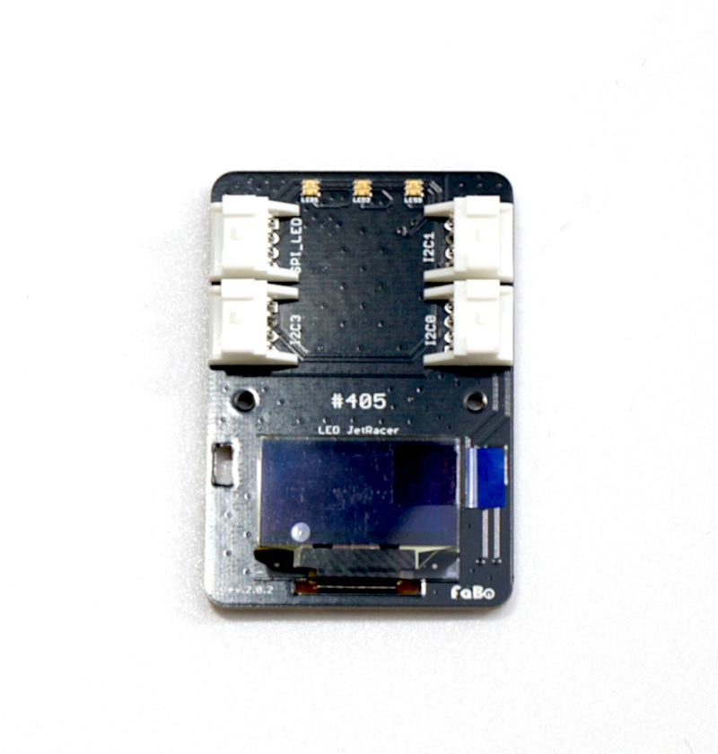
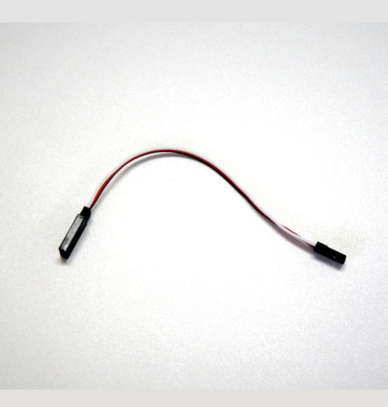
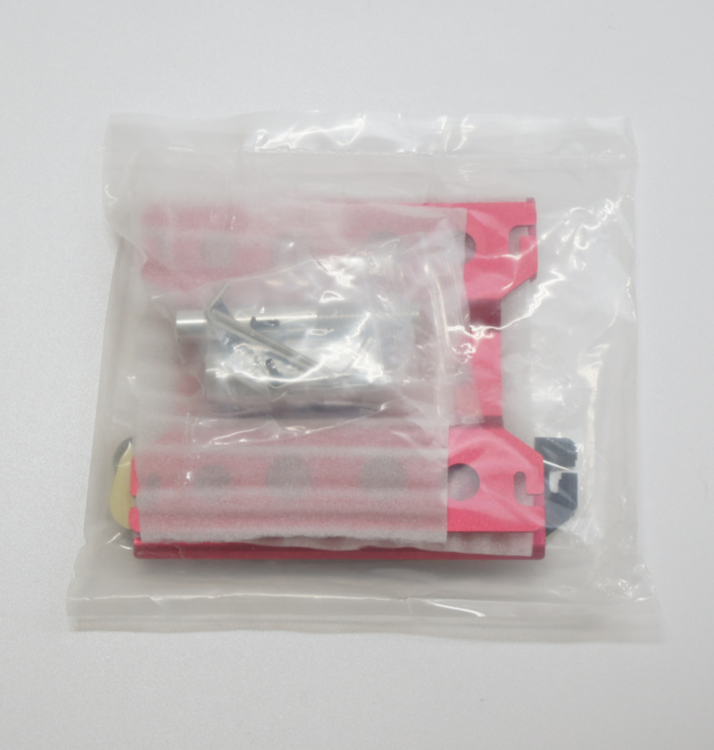

# JetRacer Kit Carbon Edition  Eシリーズ 部品リスト（BOM）

完成例：JetRacer Kit GRスープラボディ装着車

【対象モデル】

|コード番号|
|:--|
|JR1-S-C-E|
|JR1-B-C-E|
|JR1-NV-C-E|
|JR1-BU-C-E|

※JetsonNanoなしモデル（JR1-B-C-E）はJetson Nano開発者キットは付属しません。 ※車体レスモデル（JR1-NV-C-E）は、RCカー本体　TT-02 XBプロは付属しません。 ※組み立てキットモデル（JR1-BU-C-E）は、RCカーの組み立てが必要です。

##JetRacer Carbon Edition JR1-S-C-E 内容物

|写真|部品|個数|
|:--|:--|:--|
|{: .bom_listsiJetracerTypeD_OLED_REV020001.JPGze}|RCカー本体　タミヤ　TT-02 XBプロ エキスパートビルド ※完成品  ※タミヤ　1/10RC XB トヨタ　GRスープラ (TT-02シャーシ)  レッド タミヤ　1/10RC XB トヨタ GR 86 (TT-02シャーシ) ホワイト タミヤ　1/10RC XB トヨタ GR 86 (TT-02シャーシ) レッド タミヤ　1/10RC XB トヨタガズーレーシングWRT/ヤリス　WRC（TT-02シャーシ） タミヤ　1/10RC XB NSX（TT-02シャーシ） タミヤ　1/10RC XB マツダ MAZDA3 (TT-02シャーシ) タミヤ　1/10RC XB フォード マスタング GT4 （TT-02シャーシ） のいずれかになります。  ※車種は選べません。 JR1-NV-C-E（車体レスモデル）　は、付属しません。 ※写真はGRスープラの場合|１セット|
|{: .bom_listsiJetracerTypeD_OLED_REV020001.JPGze}|RCカー本体(BUモデル　組み立てキットの場合)　タミヤ　TT-02 シャーシ 組み立てキット ※組み立て、塗装必要 タミヤ　1/10RC トヨタ　GRスープラ (TT-02シャーシ)  タミヤ　1/10RC トヨタ GR 86 (TT-02シャーシ)※塗装済み タミヤ 1/10RC トヨタガズーレーシングWRT/ヤリス　WRC（TT-02シャーシ） タミヤ 1/10RC NSX（TT-02シャーシ） タミヤ　1/10RC マツダ MAZDA3 (TT-02シャーシ) タミヤ　1/10RC フォード マスタング GT4 （TT-02シャーシ） のいずれかになります。  ※車種は選べません。 ※JR1-NV-C-E（車体レスモデル）　は、付属しません。 ※RCカーの組み立てが必要です。 ※塗料、接着剤は含まれておりません。 ※写真はGRスープラの場合|１セット|
|{: .bom_listsize}|※組み立てキットのみに付属  タミヤ　ファインスペック２．４G　電動RCドライブセット  送信機 スピードコントローラ 受信機 サーボ ７．２Ｖバッテリー バッテリー充電器  45053 ※日本国内専用 送信機用単三アルカリ電池推奨|１セット|
|{: .bom_listsize}|Jetson Nano 開発者キットB-01  ※本体アップデートのため開封済みでございます。ご了承ください。 ※JR1-B-C-E（Jetson Nanoなしモデル）は付属しません。|１台|
|{: .bom_listsize}|CAM026 IMX219-160° ケーブル 150mm |１個|
|{: .bom_listsize}{: .bom_listsize}|拡張ボディ カーボンアッパーパネル  ※上下いずれかになります。 ※車体レスモデル(JR1-NV-C-E)はセット  (上)通常パネル <!-- コード：００８ --> (下)NSX専用パネル <!-- コード：００９ -->|１枚|
|{: .bom_listsize}|拡張ボディ カーボンロワーパネル|１枚|
|{: .bom_listsize}|Wi-Fi支持パーツ 材質:FR-4 Rev6|１個|
|{: .bom_listsize}|拡張ボディ カーボンエディション用カメラマウント|１個|
|{: .bom_listsize}|皿ネジM3×15・・・・4 皿ネジM3×10・・・・2 ナット M3・・・・6 六角穴付きボルトセルフタッピングネジM2×5・・・・6  |１袋|
|{: .bom_listsize}|拡張ボディ カーボンエディション用LEDマウント（Rev4）|１個|
|{: .bom_listsize}|樹脂六角スペーサー（黒色）M3×18・・・・4 皿ネジM3×10・・・・4 ナット M3・・・・4|１袋|
|{: .bom_listsize}| 樹脂六角スペーサー(白色または黒)M2.6×10・・・・4 皿ネジM2.6×5・・・・4 なべネジM2.6×5・・・・4|１袋|
|{: .bom_listsize}|FaBo #612 コントローラーボード  Rev2.0.23|１枚|
|{: .bom_listsize}|FaBo #405 Color LEDボード （OLED付）  0.96インチ青色OLED表示 I2C端子3個、LED用SPI入力端子1個|１枚|
|{: .bom_listsize}|Intel Dual Bandwireless-AC 8265 Desktop Kit|１個|
|{: .bom_listsize}|電源用USBケーブル 標準A-DCプラグ（A左向き、DC 2.1mm) 0.2m|１本|
||転送用USBケーブル 3m 　標準A-マイクロB|１本|
|{: .bom_listsize}|RCケーブル3ピン　オスプラグ　３本  ※GND：茶色 ツメなし|１セット|
|{: .bom_listsize}|FaBo 4ピンケーブル  長さ 10cm|２本|
|{: .bom_listsize}|マイクロSDカード(64GB),SDカードケース サンディスク エクストリームプロ　  ※Version1.0.0|１個|
|{: .bom_listsize}|DCファン FD401B1H-AP00 DC5V,0.16A|１個|
|{: .bom_listsize}|CPUファン取り付けジグ  ※色が異なる場合がございます。|１個|
|{: .bom_listsize} {: .bom_listsize}|ファン固定ネジ  M2.5×14・・・・4 ナットM2.5・・・・5(予備１)  ※上（六角タイプ）または下（なべねじタイプ）の写真のものになります。|１袋|
|{: .bom_listsize}|六角棒レンチ 1.5|１本|
|{: .bom_listsize}|両面テープ|２枚|
|{: .bom_listsize}|プラスドライバー +2×100|１本|
|{: .bom_listsize}|精密ドライバー　P柄|１本|
|{: .bom_listsize}|ナットドライバー 5.5|１本|
|{: .bom_listsize}|精密ドライバーセット　ED−20|１セット|
|{: .bom_listsize}|Jumperピン  ※予備用|１個|
|{: .bom_listsize}|スパナ  ８平スパナ|１本|
|{: .bom_listsize}|結束バンド|６本|
|{: .bom_listsize}|モバイルバッテリー  モバイルチャージャー10000 オーム電機 SMP-JV53W/05-1196　 定格入力 DC5V/2.0A(Type-C/miro-B) 定格出力 DC5V/2.4V(Type-A*2ポート） 定格容量 DC5V/6300mAh 繰り返し充電回数 約500回 充電ケーブル micro-B 約15cm ※充電にはType-Cのケーブルを使用します。本キットには付属しませんのでお客様でご準備願います。 ※くわしい取り扱いに関しては取扱説明書をご覧ください。|１個|
|{: .bom_listsize}|単三アルカリ乾電池（プロポに使用） ※写真と異なる場合がございます。|4本|
|{: .bom_listsize}|延長ケーブル１３０mm |１本|
|{: .bom_listsize}|作業台 |１台|

※カッターナイフ、ニッパー等が必要となります。お客様でご準備お願いいたします。 ※モバイルバッテリーの充電にはUSBタイプＣのケーブルと充電器が必要でございます。お客様でご準備ください。 ※開封後はすぐ欠品がないかご確認お願いいたします。もし欠品がございましたら、<a href="https://www.fabo.io/p/blog-page.html">こちら</a>までご連絡ください。
<a href="https://www.fabo.io/p/blog-page.html">https://www.fabo.io/p/blog-page.html</a>

