# JetRacerの組み立て(新型)

TT-02をベースにJetRacerを組み立てます。

## 拡張ボディシャーシの組み立て

プラスチックのパーツを組み立てます。

バッテリーマウントを、M2x6のタッピングネジ 2本を用いて取り付けます。
 

Wi-Fiルーターマウントを、M2x6のタッピングネジ 2本を用いて取り付けます。

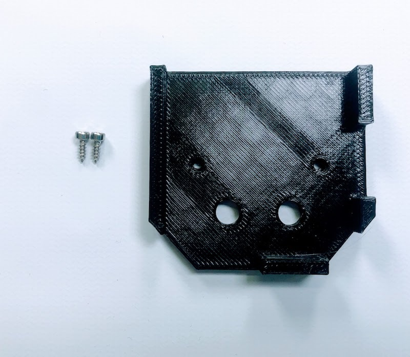

## ボディシャーシの取り付け

拡張ボディシャーシをRCカーに取り付けます。

矢印の箇所のネジ4本を取り外します。

モーターカバーのネジ4本を取り外し、モーターカバーを取り外します。

バッテリーを装着します。

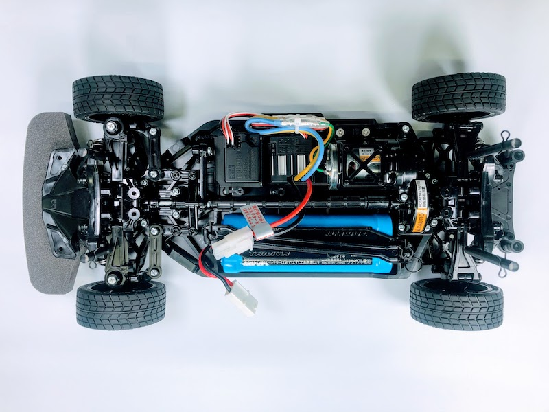

最初に取り外したネジ4本を用いて再び固定します。

## Jetson Nanoの取り付け

Jetson Nanoを、M2x6のタッピングネジ 4本を用いて取り付けます。

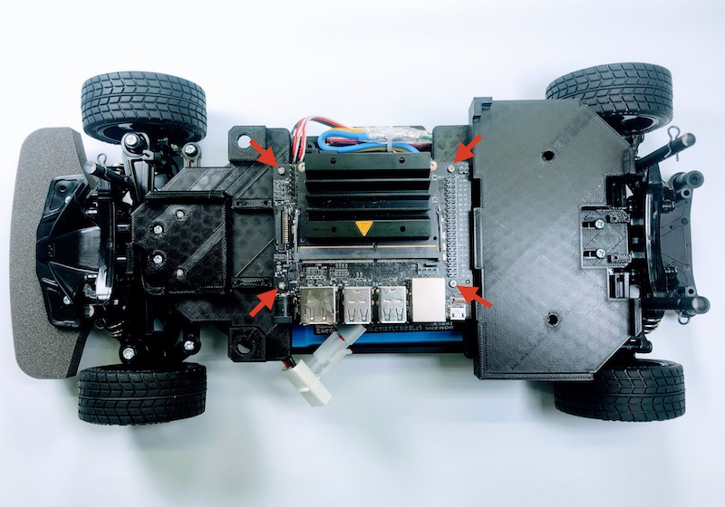

## カメラの取り付け

カメラを、M2x6のタッピングネジ 4本を用いて取り付けます。

Jetson Nanoのカメラ端子コネクターを両サイドをつまみ持ち上げます。

Rev B01のカメラ端子が2つあるモデルでは、CAM0の方に差し込みます。

カメラのケーブルを指し、真ん中を指で押し、固定します。

カメラマウントを、M2x6のタッピングネジ 4本を用いて取り付けます。

## Jumperピンの設置

Rev A02(カメラ端子が1つのモデル)を使用する場合は、J48に緑のJumperピンを差し込みます。これにより、USB端子からの電源供給に変わり、DCジャックから電源供給が可能になります。
Rev B01(カメラ端子が2つのモデル)は、Jumperピンが標準でついているので、J48に差し込むことで、DCジャックからの電源供給が可能になっています。

## LEDの取り付け

LEDの取り付けをおこないます。

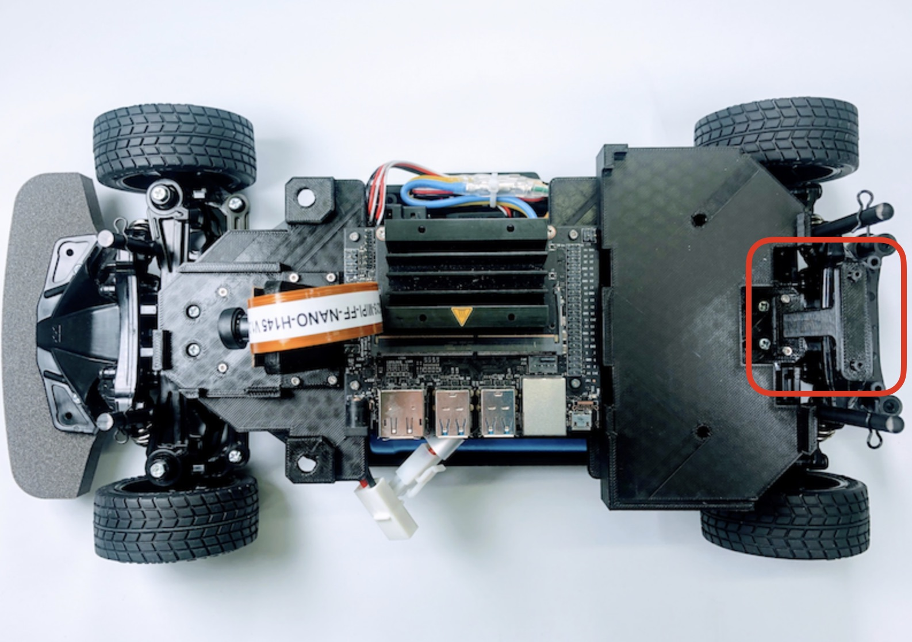

LEDマウントを、M2x6のタッピングネジ 2本を用いて取り付けます。

Color LEDボードを、M2x6のタッピングネジ 2本を用いて取り付けます。 方向に注意してください。

## CPU ファンの取り付け

4本のM2.5x14ネジとM2.5ナットでCPU ファン取り付けジグを用いて取り付けます。

M2.5ナットを載せて、CPU ヒートシンクの一層目の穴に入れ込みます。

M2.5x14ネジで固定します。

反対側も固定します。

ファンの電源コネクターをJetson Nanoに接続します。

## Wi-Fiルーターの固定

固定用の両面テープを貼り付け、固定します。

## コントローラーボードの装着

## バッテリーの固定

固定用の両面テープを貼り付け、固定します。

# JetRacerの配線(新型)

## LANケーブル

LANケーブルを接続します。

## Wi-Fiルーター用のUSBケーブル

Wi-FiルーターにUSBケーブルを接続します。

モバイルバッテリーの電源が入る場合は、スイッチ部分をダブルクリックしてOffにしておきます。

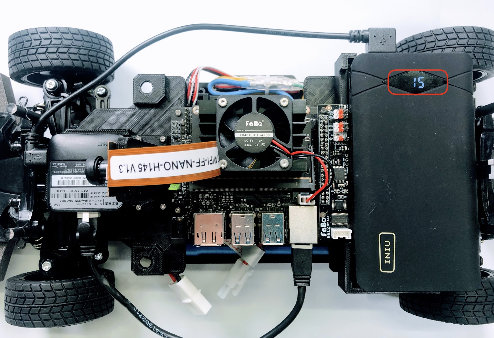

## LEDケーブル

LEDケーブルを接続します。

## Jetson Nanoの電源

Jetson Nanoの電源ケーブルを接続します。

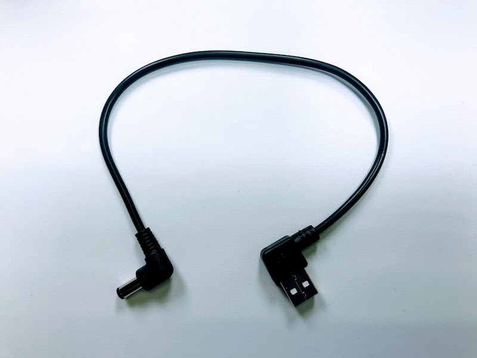

## PWMの配線

PWMの配線をおこないます。

ch1の配線をおこないます。

ch2の配線をおこないます。

chB(ch3)の配線をおこないます。

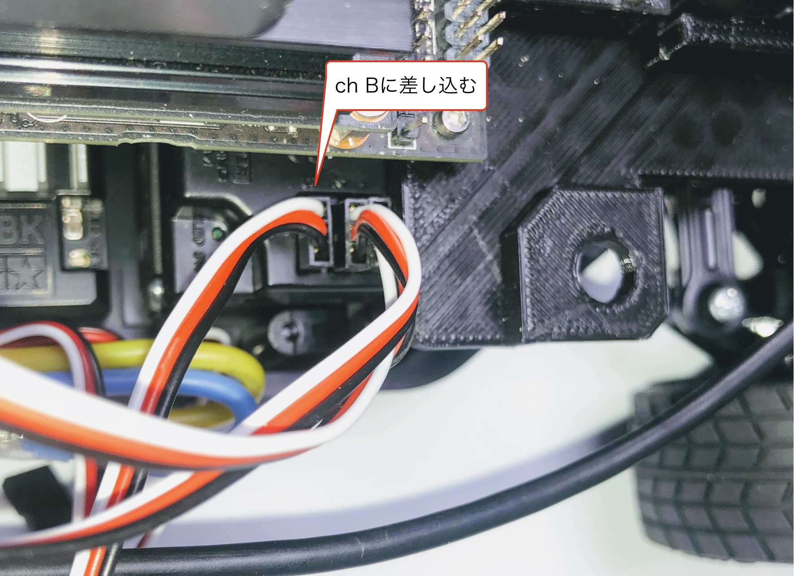

RCカーとの接続をおこないます。

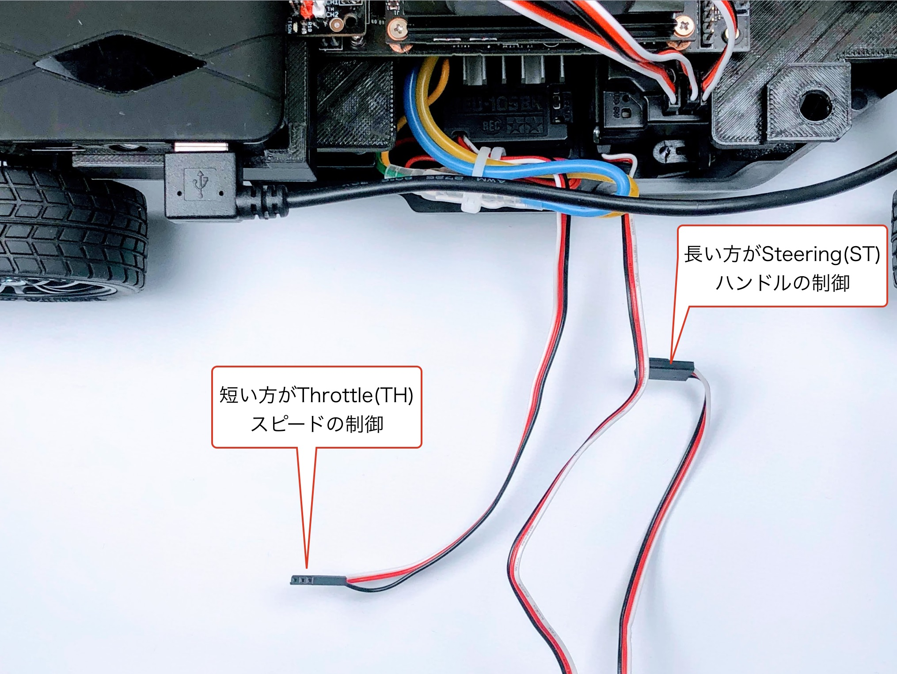

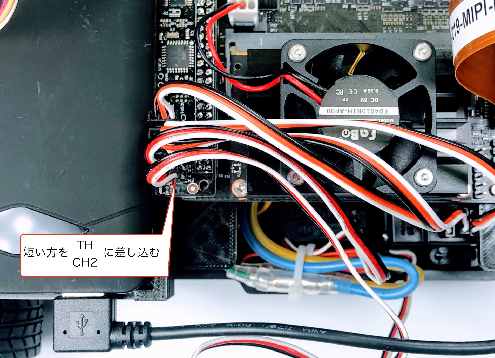

## RCカー本体のバッテリー接続

!!!warining "バッテリーの扱い"
	走行時以外は、バッテリーケーブルを必ず取り外してください。

## プロポに乾電池を挿入

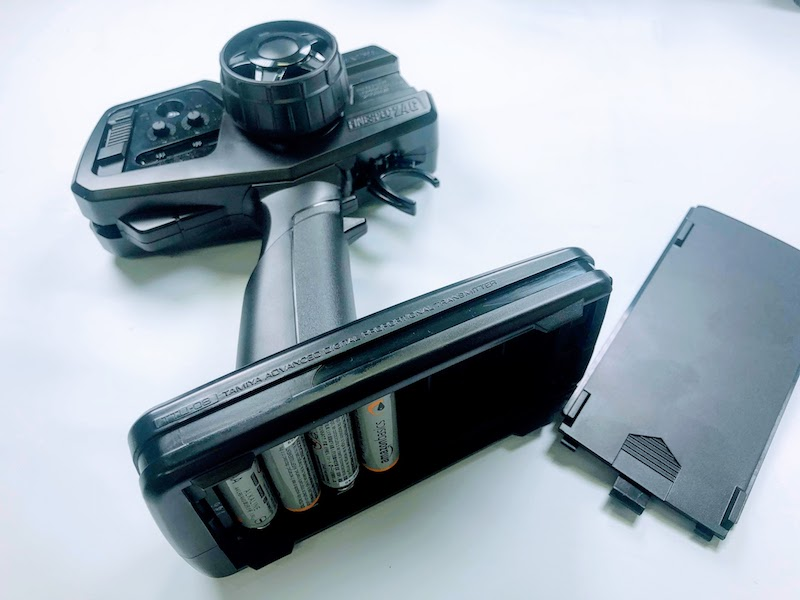

## Jetson Nanoの電源をOn

Jetson Nanoの電源をOnにします。

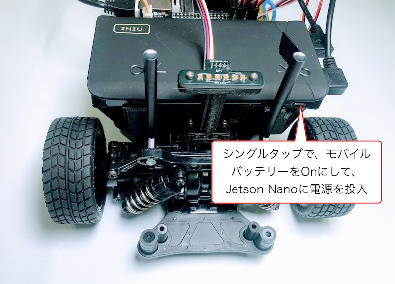

LEDが緑色に点灯します。

Jetson Nanoの電源がOnになったかは、Jetson Nanoの基板のLEDで確認します。タイミングや電力不足で、Jetson NanoのLEDが光らない場合もありますので、必ずLEDが点灯しているか確認します。

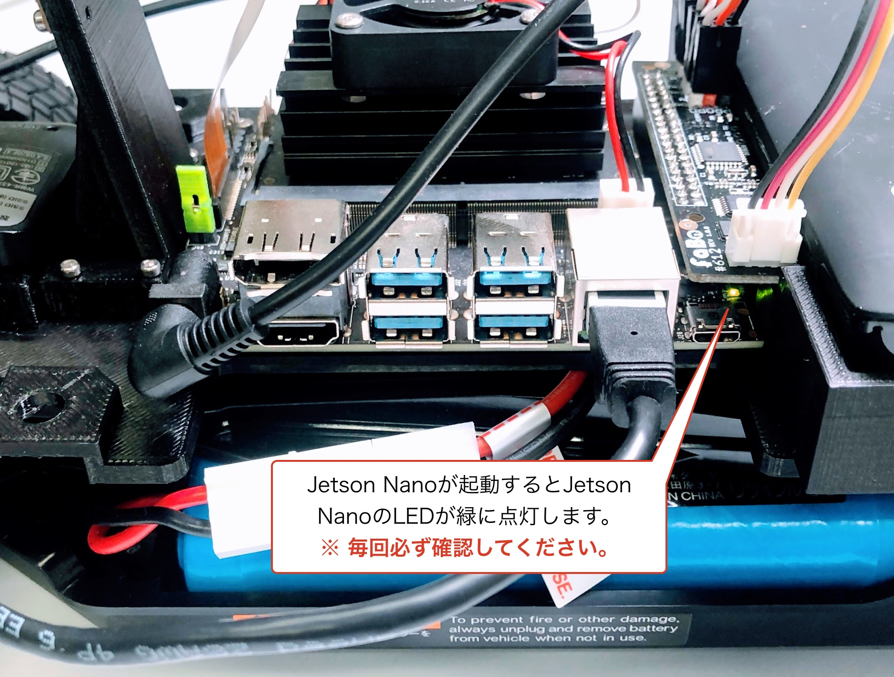

## プロポの電源をOn

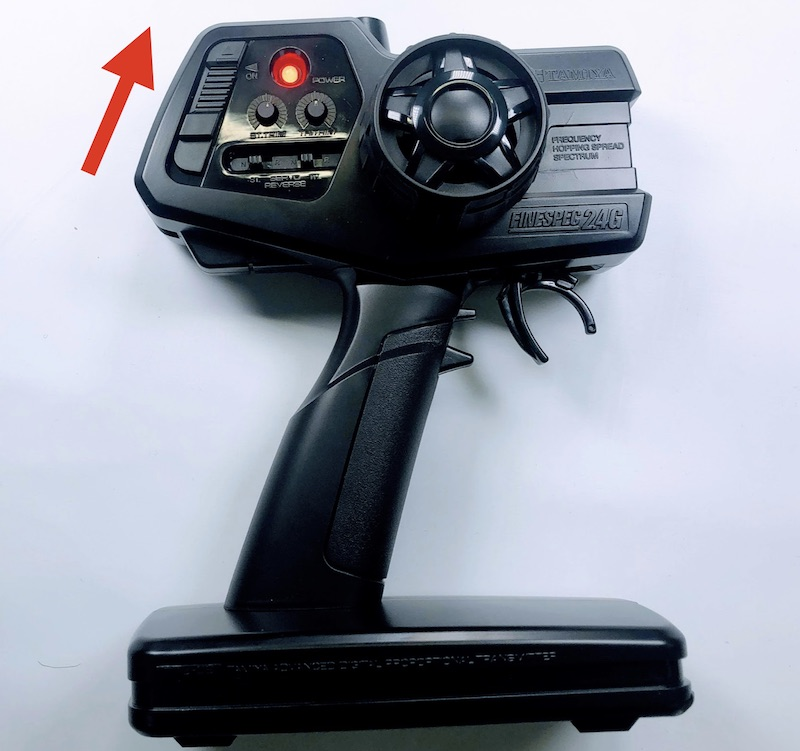

## RCカーの電源をOn

## 動作確認

最後に、RCカーモードとAIモードの切り替えの確認をおこないます。

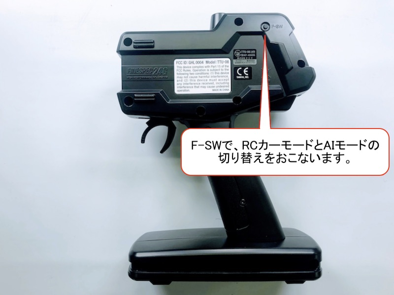

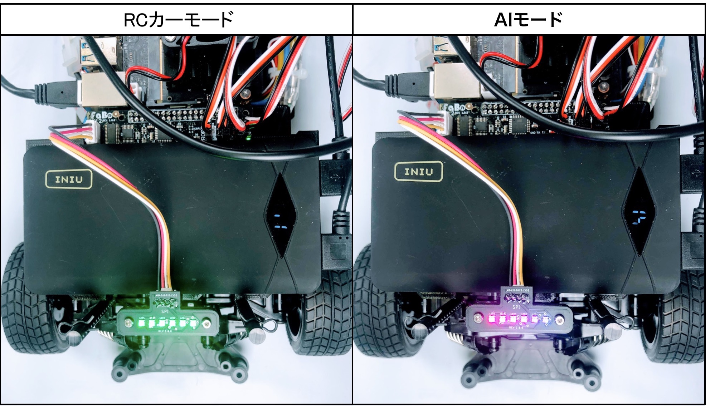

