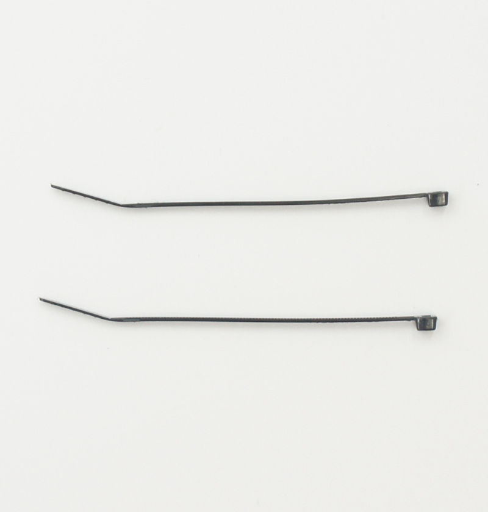

# JetRacer Kit Race Edition JR2025シリーズ 部品リスト（BOM）

## 対象モデル

|コード番号|名称|TAMIYA TT-02 XB|
|:--|:--|:--:|
|JR2025-R|FaBo JetRacer Kit Race Edition|◯|
|JR2025-R-NV|FaBo JetRacer Kit Race Edition 車体なし|X|

## FaBo JetRacer Kit Race Editionの内容物

|コード番号|写真|部品|個数|JR2025-R|JR2025-R-NV|
|:--:|:--:|:--:|:--:|:--:|:--:|
|B001||電動RCカー TAMIYA　1/10RC TT-02 XBシリーズ（完成モデル） ※車種は選べません。 ※モーター、受信機、送信機、サーボ、バッテリー含む|１台|◯|X|
|P001||フロントマウント ※３Dプリント|１個|◯|◯|
|P002||バックマウント ※３Dプリント|１個|◯|◯|
|P003||Jetsonマウント ※３Dプリント|１個|◯|◯|
|P004||Jetson固定 ※３Dプリント|１個|◯|◯|
|P006||CSIケーブルホルダー ※３Dプリント|２個|◯|◯|
|P007||Cameraマウント ※３Dプリント|１個|◯|◯|
|P008||LEDカバー ※３Dプリント|１個|◯|◯|
|P009||カメラ固定ベース ※３Dプリント|１個|◯|◯|
|C001||ベース ※カーボンファイバー製|１枚|◯|◯|
|C002|| カメラ※カーボンファイバー製|２枚|◯|◯|
|C003||カメラ固定(TT-02 XB用） ※カーボンファイバー製|２枚|◯|◯|
|C004||カメラ固定(TT-02 SRX用） ※カーボンファイバー製|２枚|◯|◯|
|J001||Jetson電源 モバイルバッテリー　10000mAh Two-way Fast Charging Power Bank UGREEN PB502 25185|１台|◯|◯|
|J002||Jetson Orin Nano 8GB 開発者キット　または、Jetson Orin Nano super 8GB 開発者キット　|１台|◯|◯|
|J003||SDカード128GB(SanDisk) SDカードケース |１個|◯|◯|
|J004||USB Type-C トリガーケーブルDC 2.5mm<->USB-typeC PD 12V|１個|◯|◯|
|J005||USB Type-C 延長ケーブル（L字）|１個|◯|◯|
|J006||USB Type-C 延長ケーブル(ストレート)|１個|◯|◯|
|J007|| CSIケーブル(50cm)  22Pin->15pin|２本|◯|◯|
|J008||CSIカメラ　IMX219 |２個|◯|◯|
|J009,JRAC-4PPA28||SPI-LEDケーブル  長さ 左 28cm,右 26cm|２本|◯|◯|
|J011||PWMケーブル　延長|１本|◯|◯|
|JRB-CB3||JetRacer コントローラーボード Rev3.0.8 B|１個|◯|◯|
|JRB-FCL3|| JetRacer LED Board|１個|◯|◯|
|SC001||皿ねじ M3x12・・・４本,M3ナット・・・４個|１セット|◯|◯|
|SC002||皿ねじ M3x10・・・４本,M3ナット・・・４個|１セット|◯|◯|
|SC003-1||なべ　M3x10・・・４本,M3ナット・・・４個|１セット|◯|◯|
|SC003-2||なべ　M3x10・・・２本,M3ナット・・・２個|１セット|◯|◯|
|SC005||タッピングビス　M2x6(六角)・・・１８個|１セット|◯|◯|
|SC006,SC007||六角丸ビスM3X10・・・２４本,タッピングビス　M3x10・・・６本|１セット|◯|◯|
|ac001||黒バンド（マジックテープ）|１本|◯|◯|
|ac002||結束バンド|２本|◯|◯|
|ac003||両面テープ２０mm|１枚|◯|◯|

※3mmビス穴タップ(M3×0.5)、プラスドライバー、ナットドライバー(5.5mm)、ナットドライバー(5mm)、六角棒レンチ、カッターナイフ、ニッパーが必要となります。お客様でご準備お願いいたします。整備や組み立てにはRC用のドライバーセットをお勧めします。 ※モバイルバッテリーの充電にはUSBタイプＣのケーブルと充電器が必要でございます。お客様でご準備ください。 ※開封後はすぐ欠品がないかご確認お願いいたします。もし欠品がございましたら、<a href="https://www.fabo.io/p/blog-page.html">こちら</a>までご連絡ください。
<a href="https://www.fabo.io/p/blog-page.html">https://www.fabo.io/p/blog-page.html</a>

