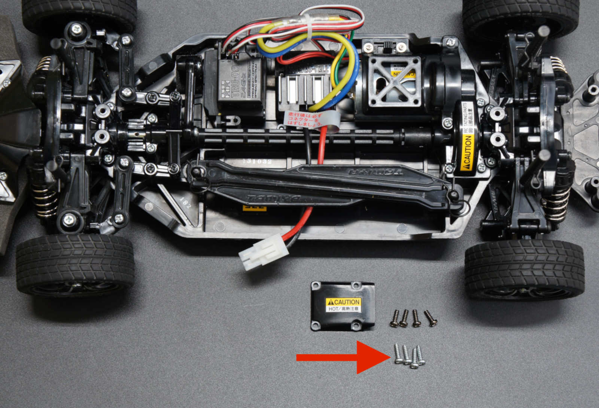
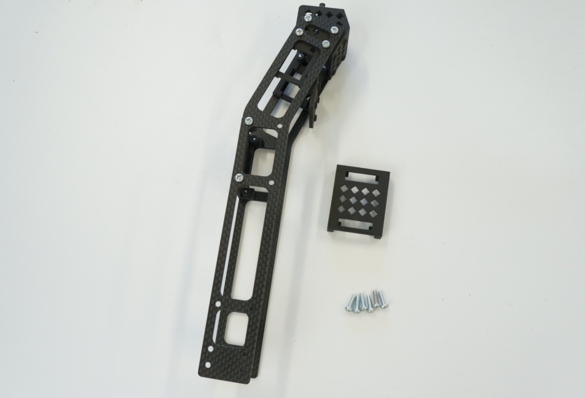

# JetRacer Kit Race Edition JR2025シリーズ 組立て手順

## 【対象モデル】

|コード番号|名称|TAMIYA TT-02 XB|
|:--|:--|:--:|
|JR2025-R|FaBo JetRacer Kit Race Edition|◯|
|JR2025-R-NV|FaBo JetRacer Kit Race Edition 車体なし|X|

## RCカーのコンポーネント(本キットの場合)

タミヤ TT-02 エキスパートビルドのご使用の場合（通常版）

TT-02 XBは完成品ですのでRCは組み立て不要です。箱から取り出し、真っ直ぐ走るかを確認します。

詳しくはRCカーの取扱説明書ご覧ください。

送信機（プロポ）で前進、後退、停止を確認。ステアリング調整、スロットル調整し、RCカーとして初期動作を確認します。

動作確認できたら、RCカーの電源、プロポ電源ともに電源OFFにしてRCカーバッテリーを一旦取り外します。

モーターのカバーを取り外します。

タッピングビスを計４本外します。

ねじを４本は後で使用します。

ケーブルを切らないように注意し、結束バンドを切ります。

２つのコネクタを外します。受信機(TRU-08)も裏面のシール剥がして取り外します。バッテリーホルダーも取り除きます。

受信機も一旦剥がして車体から取り除きます。

## FaBoレーシング　RCカーのコンポーネントのご紹介

タミヤ TT-02 SRXまたはタミヤ TT-02のご使用の場合、サーボ、ESC取り付けまたは交換例(FaBo 2024年度のレース用車体）

| | |
|:--|:--|
|ステアリングサーボ|SANWA PGS-CL Ⅱ|
|スピードコントローラー|HOBBYWING QuicRUN-WP-1060-Brushed BEC内蔵3A/6V(HW 30120201)|
|ブラシモーター|OP.779 GTチューンモーター（25T）|
|SRXの場合、フロントデフを変更|XV-02/TT-02 オイル封入式ギヤデフ (39T) ユニット|

※上のリスト部品は、本キットには付属しません。

## 組立て

※組み立て車両はTamiya TT-02 SRXを一部使用しております。

なべねじM3x10を４本、ロック付きナット（黒）M3でフロントマウントをカーボンベースに取り付けします。

ナットドライバーと＋ドライバーでねじを緩まないよう締めます。

皿ねじM3x10とロック付きナット（黒）M3それぞれ４個でJetsonベースを取り付けます。

モンキーレンチまたスパナ5.5と＋ドライバーを使用して締め付けます。

バックマウントを取り付けます。皿ねじM3x14 4本、皿ねじM3x15 3本、ロック付きナット（黒）M3 3本、ロック付きナット（銀）1本用意します。

青いマーカーは皿ねじM3x14とロック付きナット（銀）、赤いマーカーは皿ねじM3x15、ロック付きナット（黒）を使います。

ナットドライバ5.5mmと＋ドライバーで締めます。

カメラベースをリアパンパーに装着し、タッピングビス M3 X 10でねじを締めます。

+ドライバで締め付けます。

TT-02エキスパートビルドの装着されていたタッピングねじを使いRCカーに取り付けます。を使い車体とプレートを結合させます。

カメラマウントを組立て、取り付けます、タッピングビス M3 X 10　16本を使用します。

カメラマウントを装着します。タッピングビス M3 X 10で両側にカメラマウントとケーブルホルダー２個のうち１個を取り付けます。

タッピングビス M3 X 10を写真の箇所に取り付けします。片面６か所、合計１２か所（ねじ締めすぎに注意）

LEDボードをカメラマウント上部に取り付けします。

タッピングビスM2 x 6 2本で取り付けします。

タッピングビスM2 x 6　4本でLEDカバーを取り付けします。

2個のCSIカメラとCSIケーブルを取り付けます。

CSIカメラケーブルにCSIカメラを取り付け、以下のようにカメラを通します。

タッピングビスM2 x 6　4本でCSIカメラをカメラマウントに取り付けます。

同じよう2台目のCSIカメラをCSIカメラケーブルに取り付けます。

2台目のカメラカーブルは以下のようにCSIケーブルをケーブルホルダに通します。

CSIカメラをタッピングビスM2 x 6　4本で固定します。

残りのカメラホルダーを取り付けます。

カメラ部完成の様子。

LEDケーブル(4pin)をLEDボードのSPI_OUTPUT側に接続します。

LEDボードを取り付けます。LEDケーブル(4pin)をSPI＿INPUT側に接続し、カメラベースに取り付け、LEDボードを下のようにタッピングM2 x 6を使い固定取り付けします。

CSIカメラケーブルをバックマウントの中を貫通している穴に２つのカメラケーブルを通します。

、上部LEDボードとの接続は、SPI＿INPUT側に接続します。

マジックバンドもバックマウント内部に通します。LEDケーブル（4Pin)はバックマウント側面にあるフックに引っ掛けます。

カメラベースと固定します。

もう一方も、カメラベースと固定します。

カメラブレを防止するカメラ固定を取り付けます。

もう一方も、カメラブレを防止するカメラ固定を取り付けます。

モバイルバッテリーを装着します。

反対側も同じくカメラ固定パーツをRCカーのダンパープレートと取り付けます。（ねじ締めすぎに注意）

Jetson Orin Nano開発者キットを開封しマイクロSDカードをカードスロットへ挿入します。

Jetson Orin Nanoを取り付けます。マイクロSDカードをあらかじめJetson Orin NanoのSDカードスロットに挿入しておきます。マイクロSDカードはOSが入っていない場合は、ダウンロードセンターからSDカードイメージをダウンロードしSDカードにインストールしてください。

CAM0のケーブルは上側のカメラ、CAM1のケーブルは下側のカメラに接続してください。

Jetson Orin NanoをJetsonベースに載せ、CSIカメラケーブルをJetsonそれぞれCAM0,CAM1に接続します。FPCコネクタはとても壊れやすくやさしく取扱いご注意願います。（アクチュエーター引き出し時）

FPCコネクタの抑え部（黒い部分　アクチュエーター）は大変弱く、やさしく取り出し、ケーブルをコネクタに刺して再び戻してケーブルの接点と密着し取り付けます。

透明なカバーで取り付けます。

カバーを六角棒を使って、４箇所、ねじで取り付けます。

CSIカメラケーブルをバッテリーの下にして取り付けます。

両面テープを貼り付けます。

外しておいた受信機を取り付けます。

ずれて挿入しないように注意しながら、コントロール基板を取り付けます。

SPI-LEDのケーブルをコントロール基板のSPI-LEDコネクタと接続します。

基板にある文字　１ch、２ch、３chは、タミヤの受信機１、２、Bにそれぞれ繋ぎます。

Servoはステアリングサーボに、ESCはRCカーのESC(スピードコントローラーに繋ぎます。）

また、コネクタに爪がないタイプのお使いの方（サンワ製など）３本うち、上の写真に示すマークが信号線になりますので白線に繋いでください。XBは、サーボコネクタ、ESCのコネクタどちらも爪ありになります。

※極性を間違えないでください。（白線またはマークがあるもの：信号線、赤線：BEC電源、黒線：グラウンド）

USBケーブルを結束します。

ケーブルが路面に触れないようにケーブルは結束します。

L字のUSBケーブル（Tyep-C）をバッテリーと接続します。

トリガーゲーブルを接続します。

車体の電源がOFFになっていることを確認してバッテリーを繋ぎます。

安全を確認し車体を必ず作業台に乗せてから、ONします。

トリガーケーブルのDCプラグをJetson Orin NanoのDCジャックへ接続します。

プロポ（送信機）がオフまたは、RCのスイッチがオフの時は、LEDは青色が点灯します。

後方LED

送信機は、電源ONするときはステアリング、スロットルに触らずONしてください。

 必ず車体を作業台に乗せて、RCモード（手動操作）とAIモード（自動操作）の切り替えボタンがあります。送信機の裏側ボタン押すとカラーLEDが変わることを確認してください。

|カラーLEDの色|モード|
|:--|:--|
|青色|送信機から信号なし or 受信機から信号なし|
|緑色|手動モード|
|マゼンタ色|AIモード|

基本的な動作　プロポによる操作、信号切り替えが確認できた場合は、２つのカメラのレンズキャップを外してください。ピントがずれていた場合、お手数ですが調整願います。（別の章にて）
以上組み立ては完成です。

!!!Cation "破損を防ぐために大事なお知らせ"
	内部のパーツの破損を防ぐために、必ずRCカーのボディを装着して走行してください。

!!!Cation "ESCのキャリブレーション"
	ESCはメーカーによってESC起動から信号受信時に、中立をキャリブレーションする機器もございます。RCの電源を再起動する場合は、中立状態をESCに読み込ませてピーと音がなってから中立状態から変化させてください。詳しくはメーカーにお問い合わせください。（タミヤ製ESCなどTT-02 XBお使いの場合、中立は固定で調整不要です。）

編集日 2025-09-08