# JetRacer Kit Race Edition JR2025シリーズ 組立て手順

## 【対象モデル】

|コード番号|名称|TAMIYA TT-02 SRX|
|:--|:--|:--:|
|JR2025-R|FaBo JetRacer Kit Race Edition|◯|
|JR2025-R-NV|FaBo JetRacer Kit Race Edition 車体なし|X|

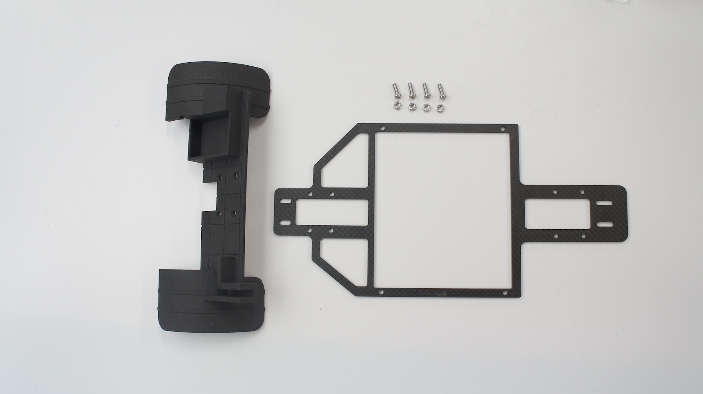

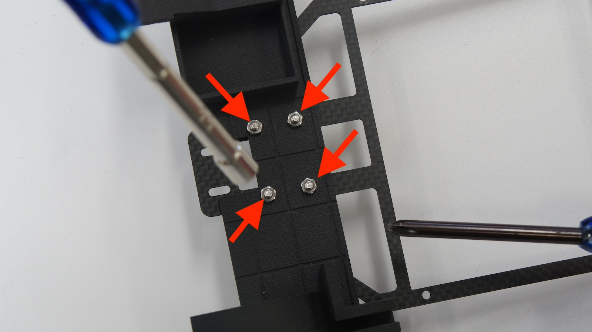

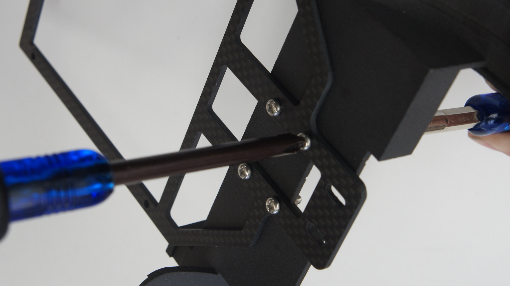

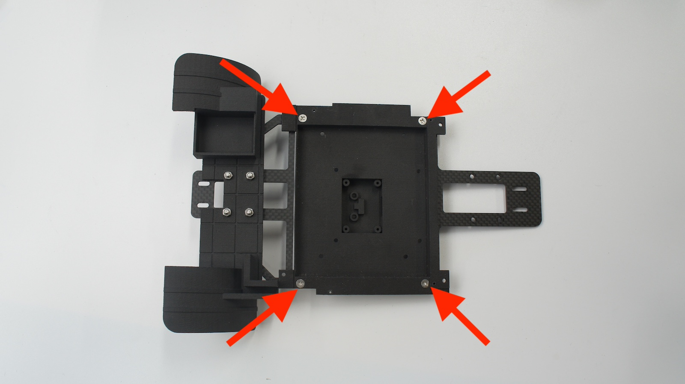

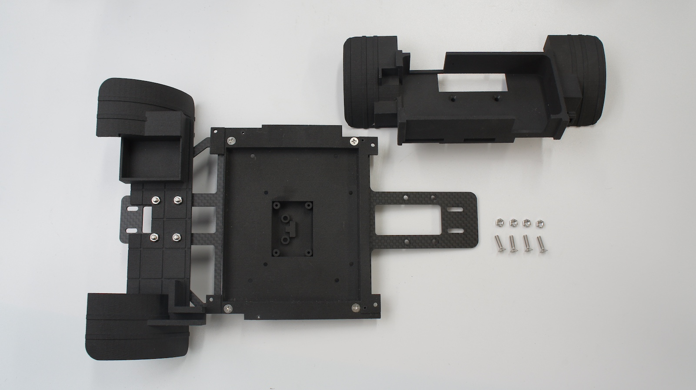

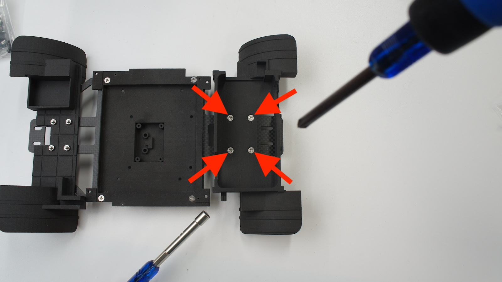

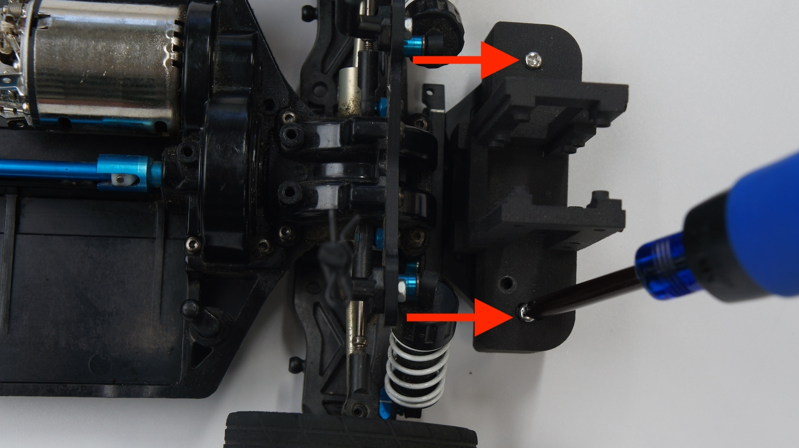

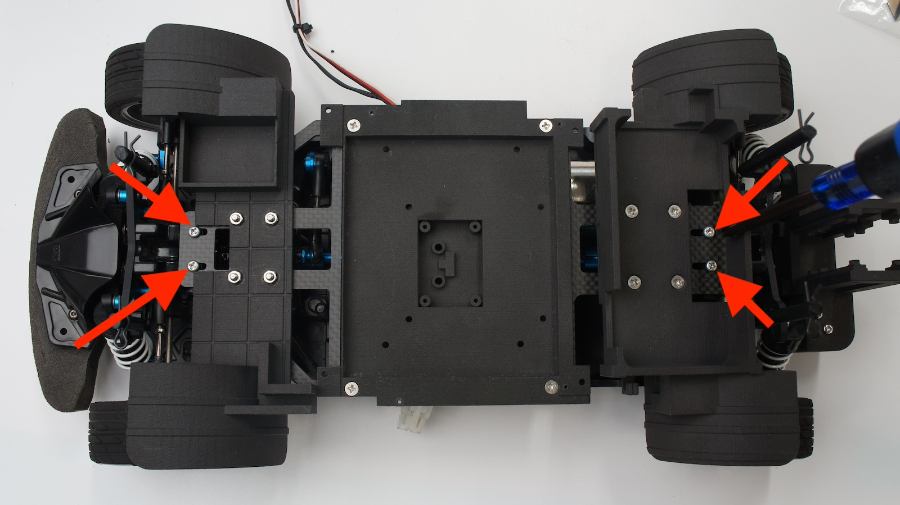

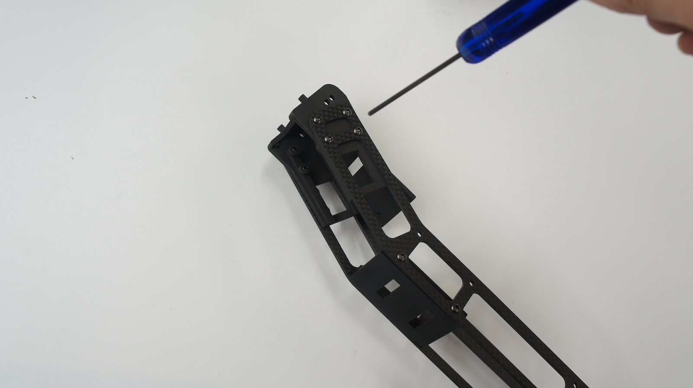

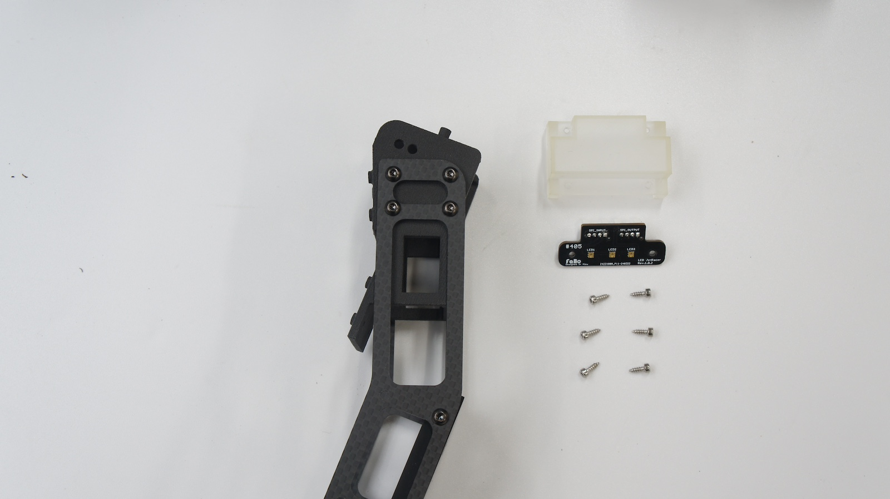

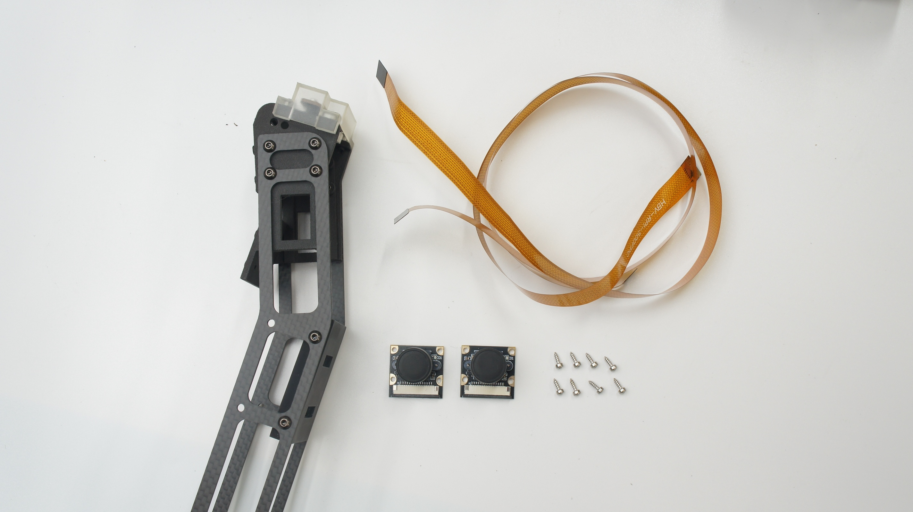

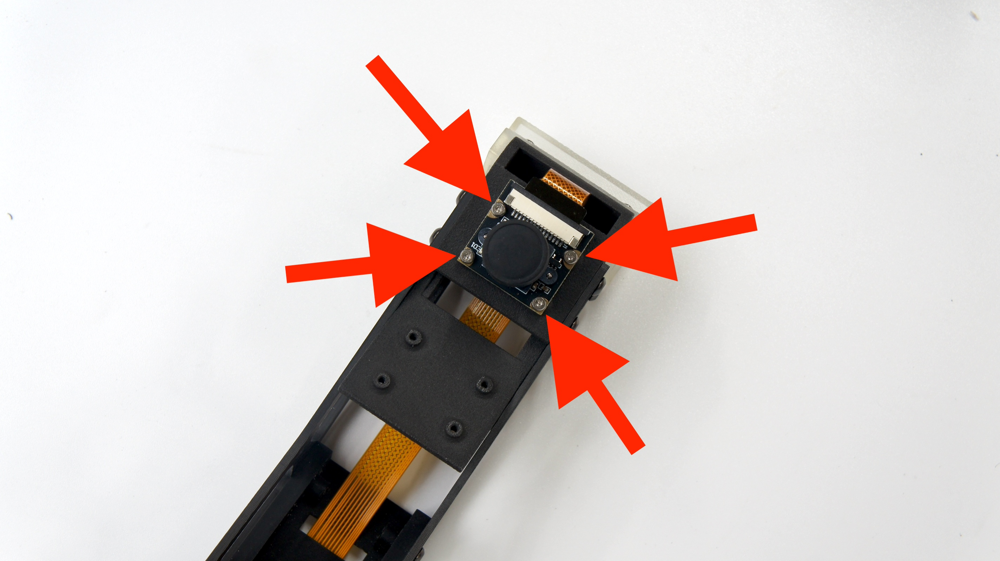

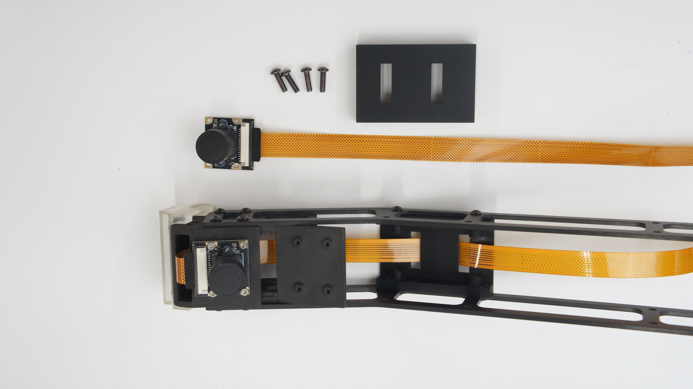

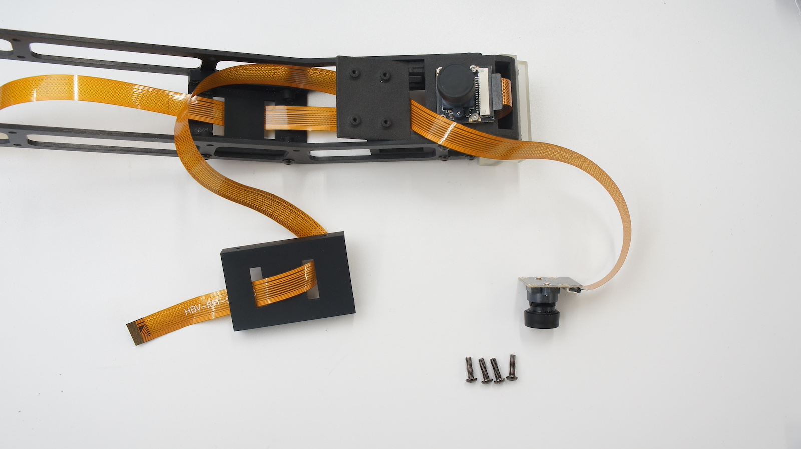

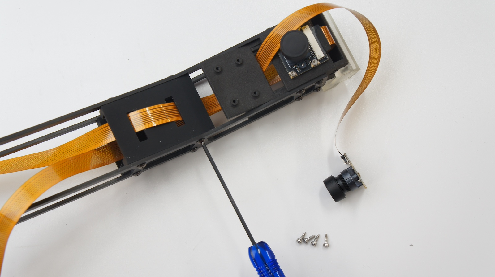

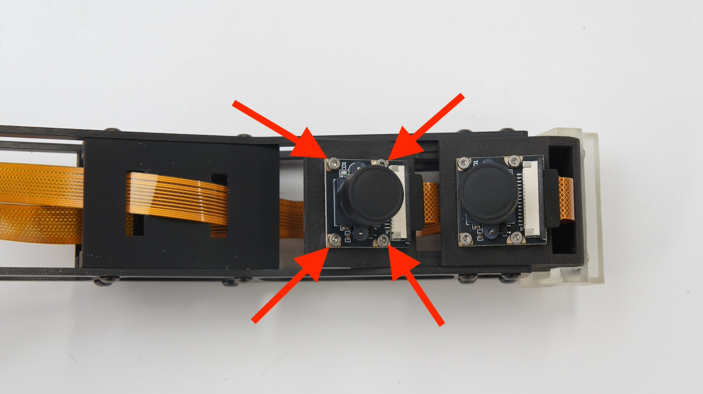

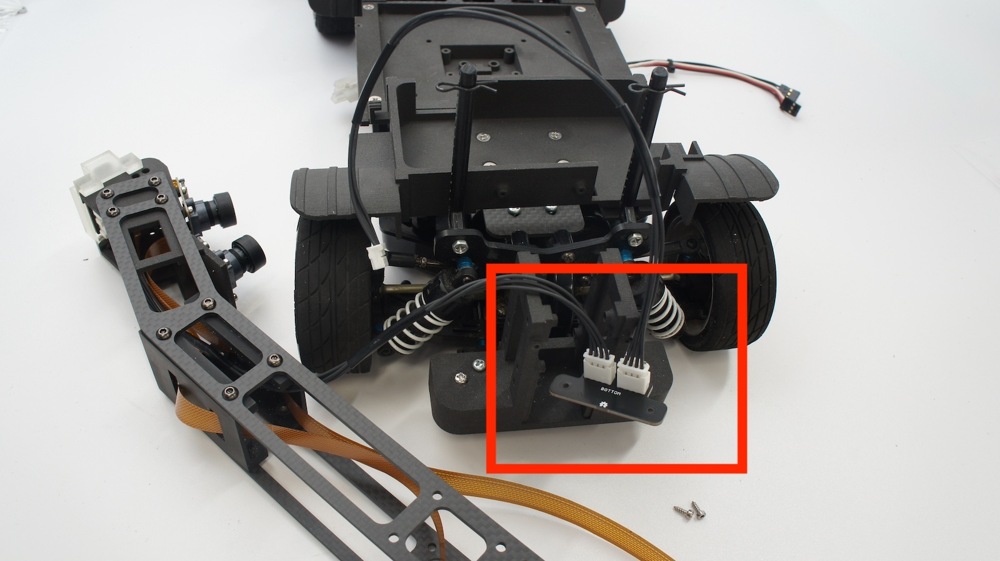

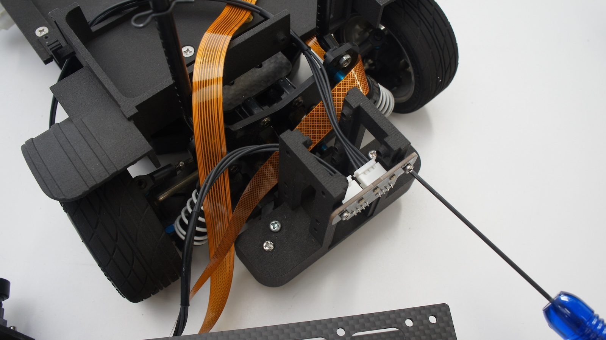

