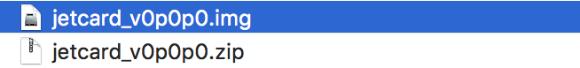

# SDカードの作成

## SDカードのイメージ　

|SDカードの種類|Download|
|:--|:--|
|Samsung 32 EVO Plusを使用の場合|[jetcard_v0p0p0.zip](https://drive.google.com/open?id=1wXD1CwtxiH5Mz4uSmIZ76fd78zDQltW_)|

[jetcard_v0p0p0.zip](https://drive.google.com/open?id=1wXD1CwtxiH5Mz4uSmIZ76fd78zDQltW_) をダウンロードし、解凍します。生成される`jetcard_v0p0p0.zip`をEtcherを使用しSDカードに焼き込みます。

NVIDIA-AI-IOTのJetracerの[Wiki](Software Setup)のページが参考になります。

## SDカードの焼き込み

SDカードへの焼き込みには、[Etcher](https://www.balena.io/etcher/)を用いる。

## JetBotの起動

SDカードをJetson Nanoに差し込み起動する。

|項目|内容|
|:--|:--|
|ID|jetson|
|Pass|jetson|
