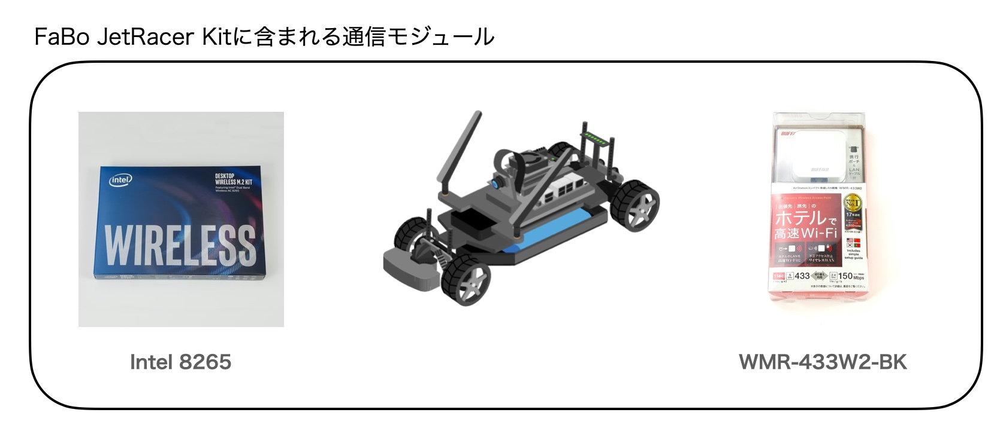
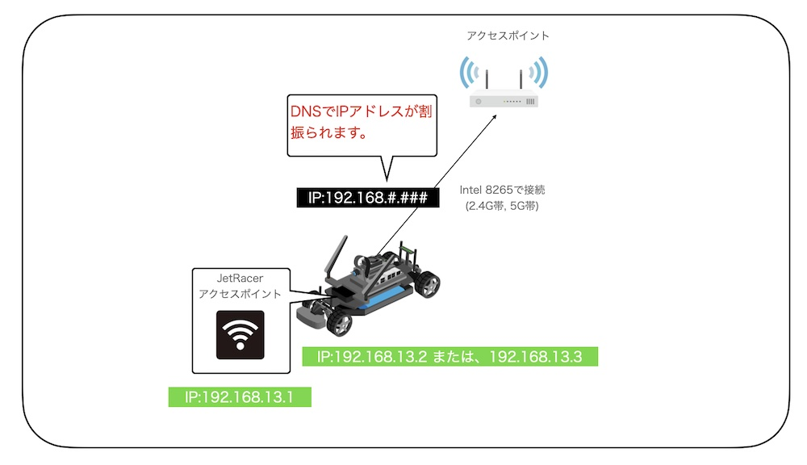
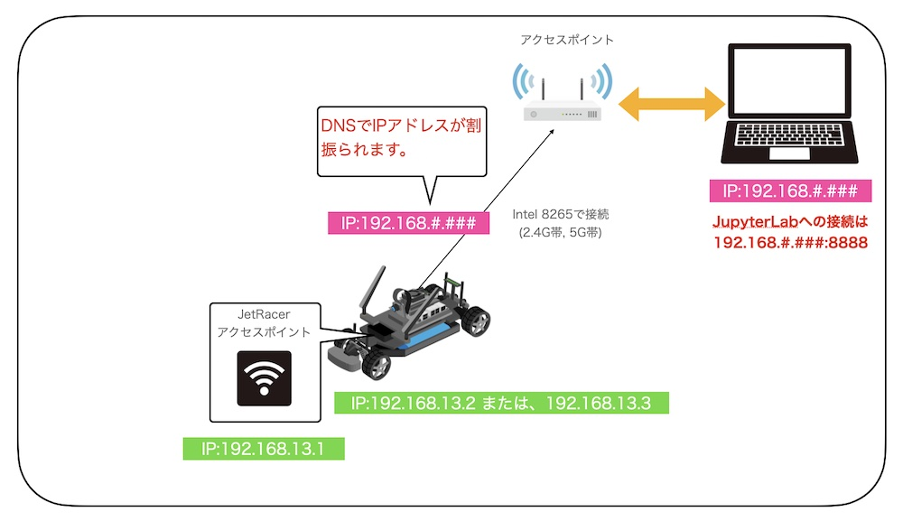

# ネットワーク構成

全項目では、Wi-Fiモジュールを経由し、インターネットに接続し、JetRacerに必要なパッケージをインストールしました。JetRacerの実際の走行には、Wi-Fi環境のない場所や屋外等での操作が必要になるケースがあります。拡張ルーターは、そのようなケースに便利なアイテムです。

## FaBo JetRacer Kitに含まれるネットワークモジュール

## 2つのモジュールの配置

## ネットワーク構成図

## JetRacerへの接続経路

