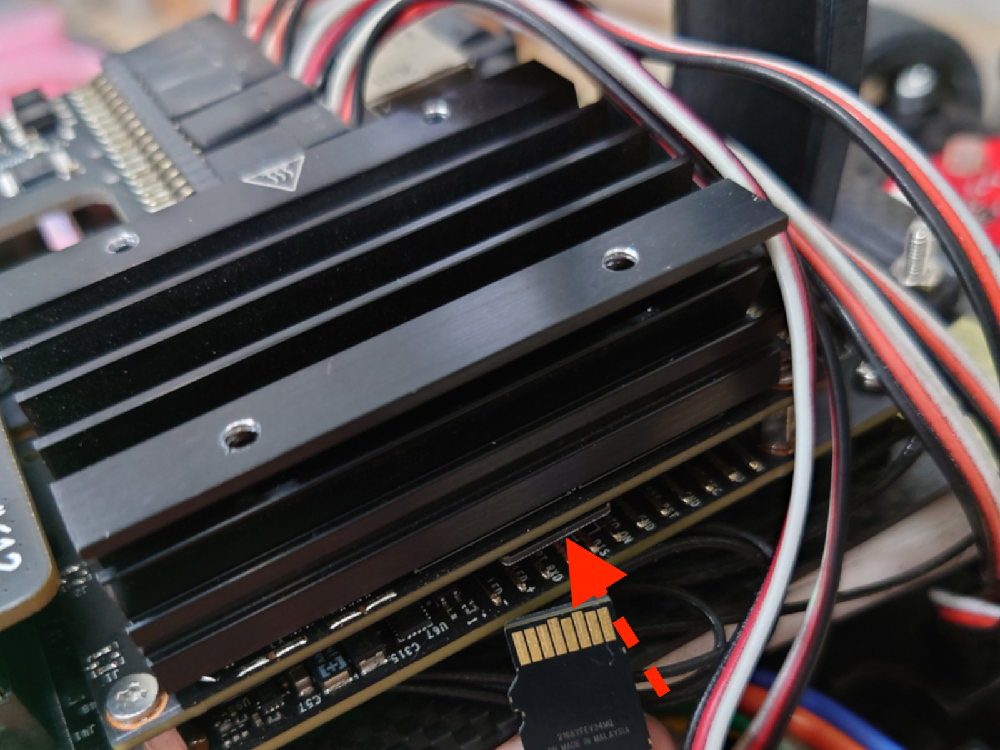
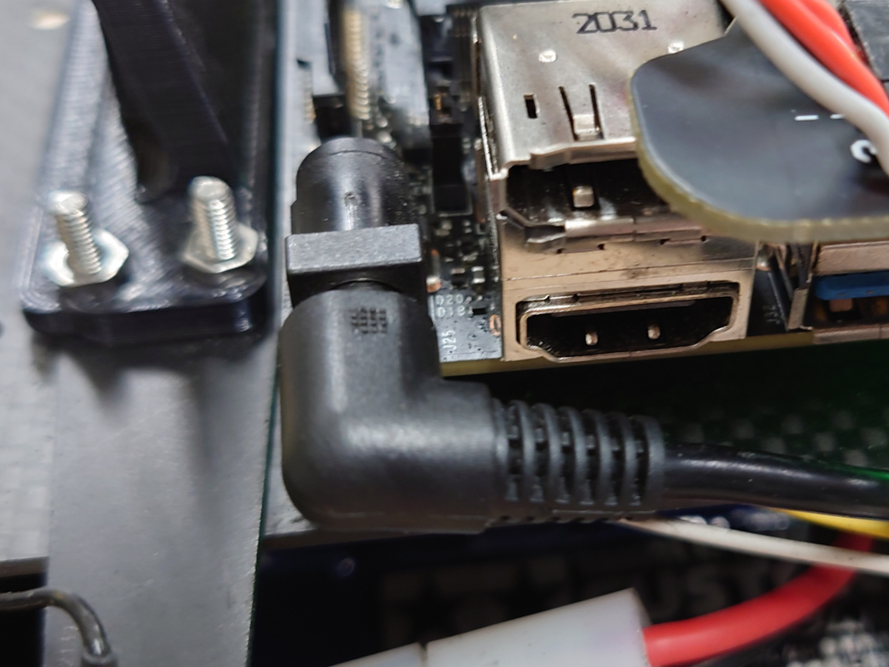
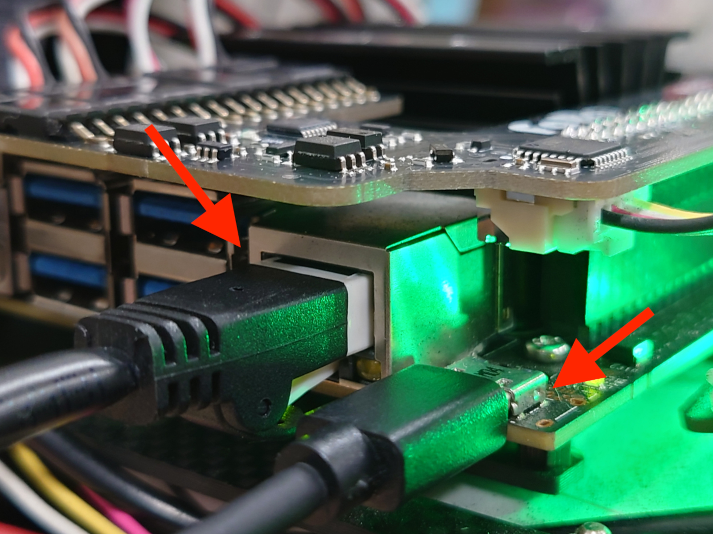
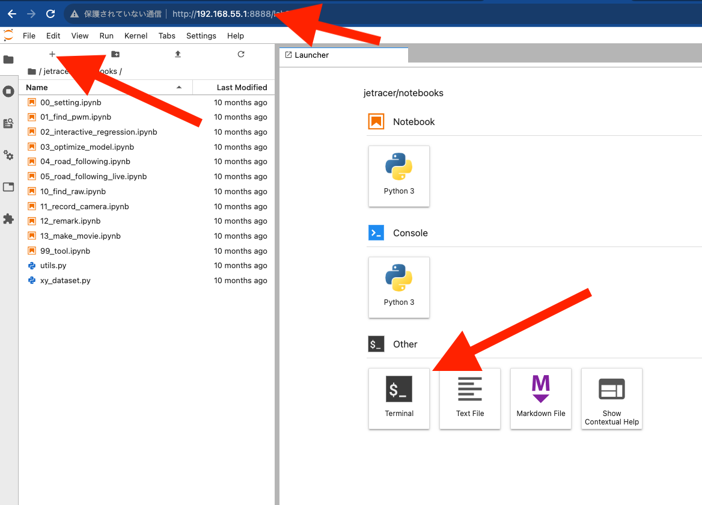

# 各種設定

## 解説動画


## Intel WiFiモジュールAX200付属の場合

{: .bom_listsize}

AX200の場合は、初期設定が必要になります。ドライバーをインストールするためには、有線LAN等のインターネット環境が必要となります。

付属のSDカードをJetsonNanoに挿入し、Jetson Nanoの電源を繋いでJetson Nanoを起動させます。有線LANでJetsonNanoをネットワークに繋いで
有機ELディスプレイに表示されるIPアドレス:8888またはUSBマイクロ接続の場合、192.168.55.1:8888をGoogle Chromeのアドレスバーに入力しパソコンからJetsonNanoにアクセスします。
＋をクリックして新しいランチャーを開き、ターミナルを起動します。以下のコマンドを実行しドライバーをインストールします。

SDカード挿入

{: .bom_listsize}

DCプラグをDCジャックに刺します。

{: .bom_listsize}

マイクロUSBでパソコンとつなぎインターネットに接続された有線LANを繋ぐ。

{: .bom_listsize}

chromeブラウザを起動し192.168.55.1:8888と入力する。terminalを選択する。

{: .bom_listsize}

```Python
sudo add-apt-repository ppa:canonical-hwe-team/backport-iwlwifi
```
デフォルトのパスワードはjetsonになります。

```Python
sudo apt-get update
```

```Python
sudo apt-get install backport-iwlwifi-dkms
```
インストールには約３０分ほど時間がかかります。（環境により異なります。）

```shell-session
DKMS: install completed.
Setting up linux-headers-4.15.0-212-generic (4.15.0-212.223) ...
/etc/kernel/header_postinst.d/dkms:
 * dkms: running auto installation service for kernel 4.15.0-212-generic
   ...done.
Setting up linux-headers-generic (4.15.0.212.195) ...
Processing triggers for man-db (2.8.3-2ubuntu0.1) ...
```

上記が表示されたら正常にインストールされました。

```Python
sudo reboot
```
99_tools.ipynbでWi-Fiを設定または、以下のコマンドで

```Python
sudo nmcli device wifi connect SSID password パスワード
```

有線LAN、マイクロUSBを取り外しします。

JetRacerのOLEDディスプレイにIPアドレスが表示されるはずです。

例）192.168.XX.XX:8888にアクセスします。
