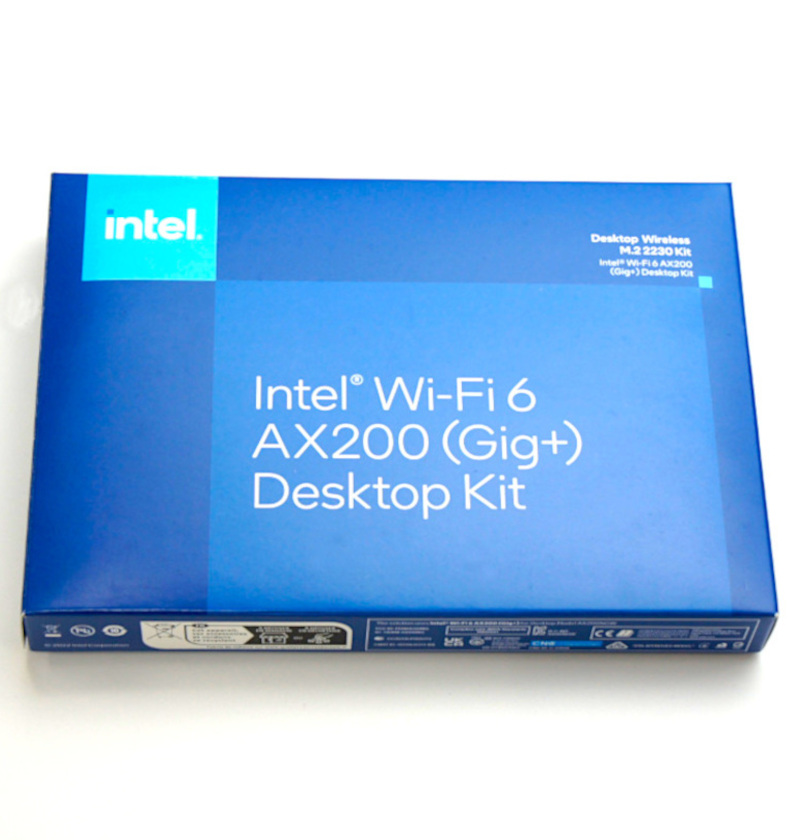

# 各種設定

## 解説動画


## Intel WiFiモジュールAX200付属の場合

{: .bom_listsize}

初期設定が必要になります。

有線LANでJetsonNanoをネットワークに繋いで
有機ELディスプレイに表示されるIPアドレス:8888またはUSBマイクロ接続の場合、192.168.55.1:8888をGoogle Chromeのアドレスバーに入力しパソコンからJetsonNanoにアクセスします。
＋をクリックして新しいランチャーを開き、ターミナルを起動します。以下のコマンドを実行しドライバーをインストールします。

```
sudo add-apt-repository ppa:canonical-hwe-team/backport-iwlwifi
```

```
sudo apt-get update
```

```
sudo apt-get install backport-iwlwifi-dkms
```
インストールには約３０分ほど時間がかかります。（環境により異なります。）

```shell-session
DKMS: install completed.
Setting up linux-headers-4.15.0-212-generic (4.15.0-212.223) ...
/etc/kernel/header_postinst.d/dkms:
 * dkms: running auto installation service for kernel 4.15.0-212-generic
   ...done.
Setting up linux-headers-generic (4.15.0.212.195) ...
Processing triggers for man-db (2.8.3-2ubuntu0.1) ...
```

上記が表示されたら正常にインストールされました。

```bash
sudo reboot
```

99_tools.ipynbを実行してWi-Fi接続します。Wi-Fi接続が完了しましたら、有線LAN、マイクロUSBを取り外しします。
