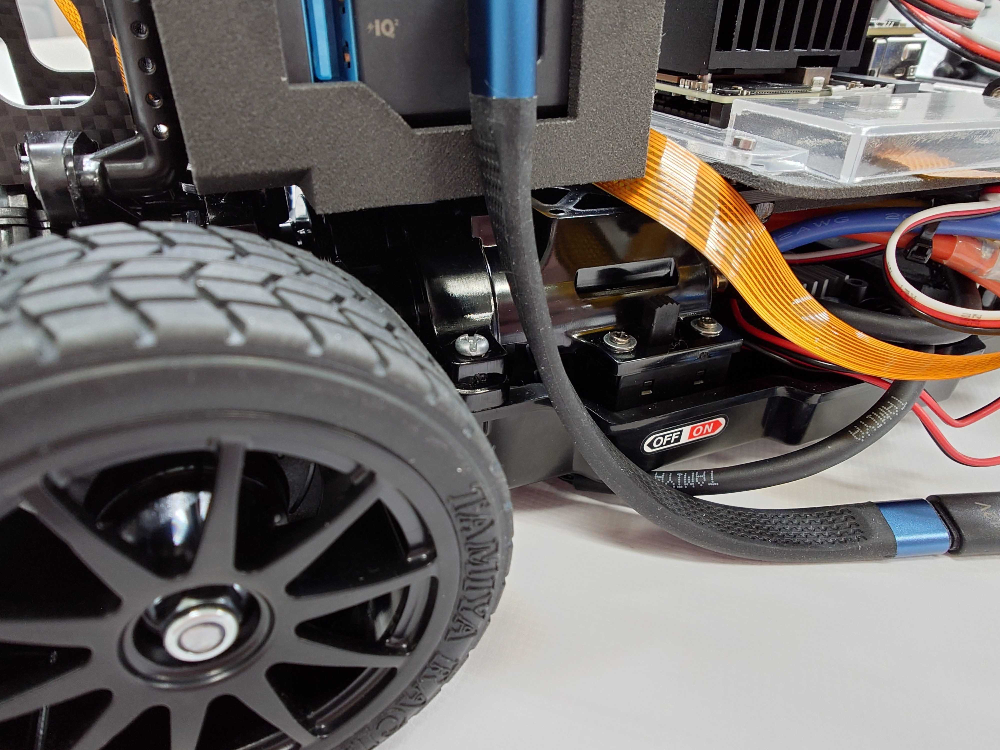
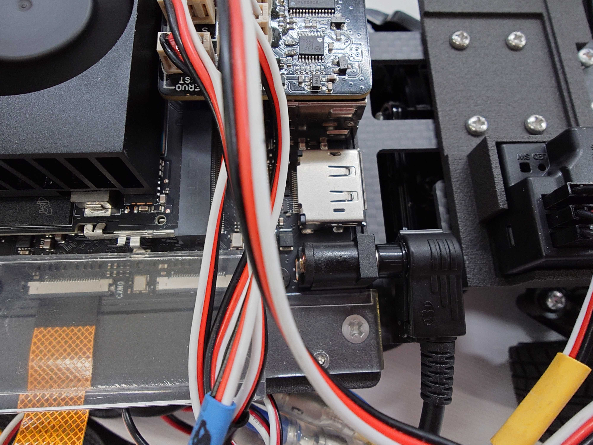
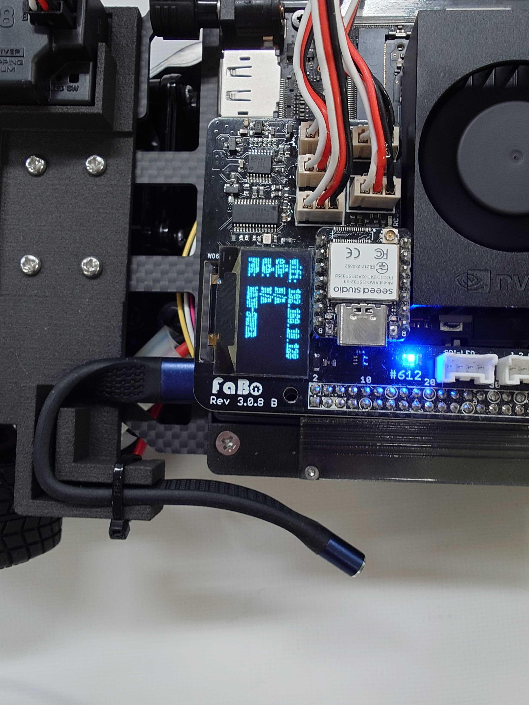
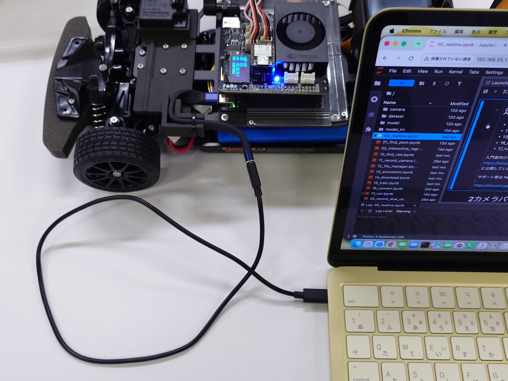

# JetRacer Wi-Fi設定

作成日：2026年9月7日

| 対象 | 型番 |
| --- | --- |
| Jetson Orin Nano / Jetson Orin Nano Super開発者キット搭載製品 | JR2025-R,JR2025-B,JR2025-R-NV,JR2-S-A-A,JR2-S-N-A,JR2025SRX-R |

本ページでは、Jetsonにディスプレイ、キーボード、マウスを接続せず、USBケーブルを使用してWi-Fiを設定する方法を説明します。

Jetson Orin Nano開発者キット、Jetson Orin Nano Super開発者キットはWi-Fiモジュール搭載済です。

!!! warning "安全上の注意"
故障や予期しない動作を防ぐため、通電中はコネクター類を抜き差ししないでください。

設定中はRCカーの電源をオフにし、台などに載せて車輪を浮かせてください。
## 1. 準備

Jetson用モバイルバッテリーとRCカー用バッテリーを、あらかじめ充電しておきます。

RCカーの電源がオフになっていることを確認し、台などに載せて車輪を浮かせます。RCカー用バッテリーの充電が完了したら、RCカーに接続します。



## 2. 電源投入

Jetson Orin NanoがマイクロSDカードが挿入されていることを確認し、電源を投入します。
RCカーの電源はオフのままです。トリガーケーブルでモバイルバッテリーからJetson Orin Nanoへ給電します。

しばらく経つとOLEDが表示されます。


## 3. USBケーブル接続

市販品のUSBケーブルを用意し、パソコンに接続します。
しばらくするとOLEDディスプレイに192.168.55.1が表示されます。パソコンのブラウザから192.168.55.1:8888とアドレスバーに入力してください。



[Windowsの場合](https://faboplatform.github.io/JetracerDocs/tips/02.wificonectionhadling/)

## 4. パスワード入力

jupyter labが表示されパスワードはjetsonになります。

## 5. Wi-Fi設定

jupyter lab画面からターミナルを開き

SSIDを確認します。

```bash
nmcli device wifi list
```

Jetson Orin NanoをWi-Fiに接続します。

``` bash
sudo nmcli device wifi connnect 'ssid' password 'password'
```

接続状態を確認します。

```bash
nmcli device status
```

成功するとOLEDディスプレイにWi-FiのIPアドレスが表示されます。

詳細確認　wlP1s0

``` bash
ifconfig -a
```

[NetworkManagerのコマンド例](https://www.networkmanager.dev/docs/api/1.36/nmcli-examples.html)


会社や学校でユーザー名・証明書などが必要なWi-Fiでは、管理者から案内された認証方式で設定してください。

## 6. Wi-Fi設定終了
　Wi-Fi設定が成功したのなら、OLEDディスプレイで表示されたIPアドレスをブラウザに入力します。IPアドレス:8888
　jupyter labが表示できたら成功です。JetsonからUSBケーブルを抜き、以後はWi-Fiでアクセスします。
