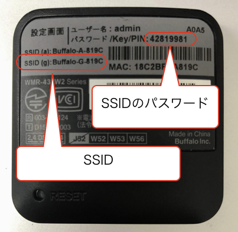

# Jetracerへの接続

## IPの割り振り

Jetson Nanoには、`192.168.13.2` または`192.168.13.3`が割り振られ、Wifiルーターには、`192.168.13.1`(固定)が割り振られます。

## Wifiルーターへの接続

ルーター裏面記載のSSIDとパスワードでPCから接続します。

## JetracerのJupyterへの接続

`192.168.13.2:8888` または、`192.168.13.3:8888` でJetracerに接続します。

