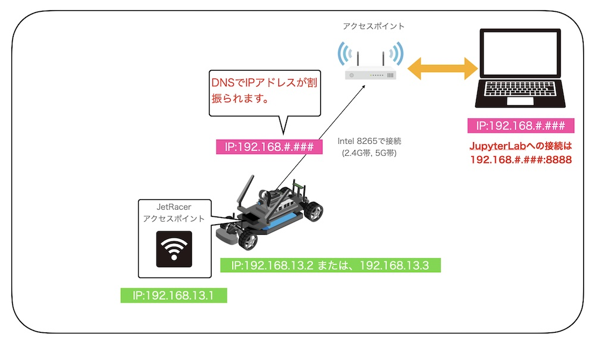

# 8265またはAX200経由でのJetRacerへの接続



## IPの割り振り

Jetson Nanoには、アクセスポイントルーターよりDNSでIPアドレスが(例 `192.168.#.###`)割振られていると思います。

## Jetson NanoのIPアドレス

Jetson NanoのTerminal上もしくは、SSHでログインし、下記コマンドで`wlan0`のIPアドレスを確認します。

```console
ifconfig -a
```

## JetRacerのJupyterへの接続

DNSで割り振れれたIPアドレスに8888番ポート経由で接続します(例 `192.168.#.###:8888`)。


