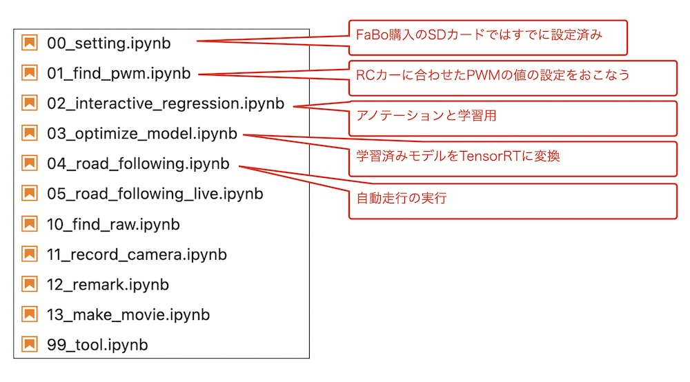

# Notebooks

## 使用するNotebooks

## 流れ

|順番|notebook|内容|
|:--|:--|:--|
|1|00_setting.ipynb|パッケージ等の設定, FaBoストア購入車体ではすでに設定済み|
|2|01_find_pwm.ipynb|RCカー用にPWMの値を設定|
|3|02_interactive_regression.ipynb|アノテーションと学習|
|4|03_optimize_model.ipynb|軽量化モデル(TensorRT)への変換|
|4|04_road_following.ipynb|自動走行|
