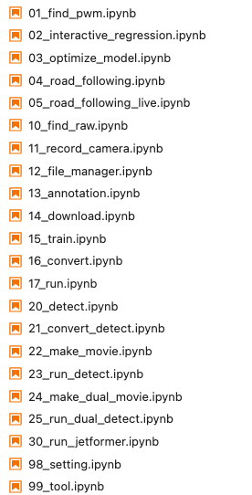

# Notebooks

## 使用するNotebooks

### Notebookの場所

`/home/jetson/jetracer/notebooks`にあります。

FaBoの付属のSDカードご使用ならばソフトウェアがインストールと設定済みで、すぐにJetRacerを使うことができます。

## AI86 Version2

[最新版入手先：AI86 Version2のSDカードイメージダウンロード　AI86 Version2.0.3](https://faboplatform.github.io/JetracerDocs/sd_fabo/01.image/)

Google Colaboratoryによるクラウドでの学習を追加しました。Jetson Nanoでは難しかった大きなデータセットの学習にも対応させております。

オートアノテーション機能追加

画像カット編集機能追加

環境情報判断追加　２つのカメラを利用してターゲットとなる環境であると画像で判断したらモデルを入れ替えることができます。（周回数をカウントなどに利用）※Jetson Orin Nano対象

### フロー

順番に従って実行するとスムーズに行うことができます。

|コード番号|Jetsonボード|
|:--|:--|
|01,10~17|Jetson Nano Developer Kit B-01,A-02,Jetson Orin Nano|
|20~25|Jetson Orin Nano|

|順番|notebook|内容|
|:--|:--|:--|
|1|01_find_pwm.ipynb|RCカー用にPWMの値を設定|
|-|02_interactive_regression.ipynb|アノテーションと学習 AI86 Version1|
|-|03_optimize_model.ipynb|軽量化モデル(TensorRT)への変換 AI86 Version1|
|-|04_road_following.ipynb|自動走行 AI86 Version1|
|-|05_road_following_live.ipynb|自動走行（ライブ） AI86 Version1|
|2|10_find_raw.ipynb|PWMの値の吸い上げ　受信機信号計測|
|3|11_record_camera.ipynb|走行の録画(データセット用のデータの作成)|
|4|12_file_manager.ipynb|ファイルマネージャー 画像カットなど|
|5|13_annotation.ipynb|アノテーション　教師データ入力|
|6|14_download.ipynb|ダウンロード　GoogleColaboratory使用のための複数のファイルをZip化、圧縮および解凍|
|7|15_train.ipynb|学習　GoogleColaboratoryへのリンクおよびJetsonでの学習し動画で検証|
|8|16_convert.ipynb|TensorRTへの変換と動画で検証|
|9|17_run.ipynb|自動走行、走行録画|
|10|20_detect.ipynb|環境情報判断　コース場所を検知|
|11|21_convert_detect.ipynb|環境情報判断　TensorRTへの変換|
|12|22_make_movie.ipynb|環境情報判断　評価用動画の作成|
|13|23_run_detect.ipynb|自動走行と環境情報判断　走行検証|
|14|24_make_dual_movie.ipynb|自動走行と環境情報判断　動画検証|
|15|25_run_dual_detect.ipynb|自動走行と環境情報判断　条件により走行モデル切替|
|16|30_run_jetformer.ipynb|-------|
|-|98_setting.ipynb|JetRacerに必要なライブラリのインストール（実行済み）|
|-|99_tool.ipynb|Wi-Fi設定、I2Cデバイスアドレス確認、カメラ認識の確認、電力モード確認、コードのリカバリー|

## AI86 Version1

### フロー

|順番|notebook|内容|
|:--|:--|:--|
|1|00_setting.ipynb|パッケージ等の設定, FaBoストア購入車体ではすでに設定済み|
|2|01_find_pwm.ipynb|RCカー用にPWMの値を設定|
|3|02_interactive_regression.ipynb|アノテーションと学習|
|4|03_optimize_model.ipynb|軽量化モデル(TensorRT)への変換|
|5|04_road_following.ipynb|自動走行|

 
 

