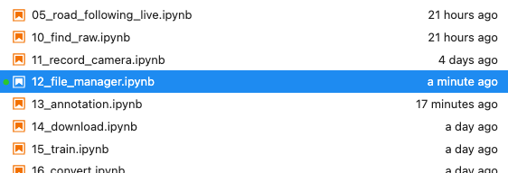
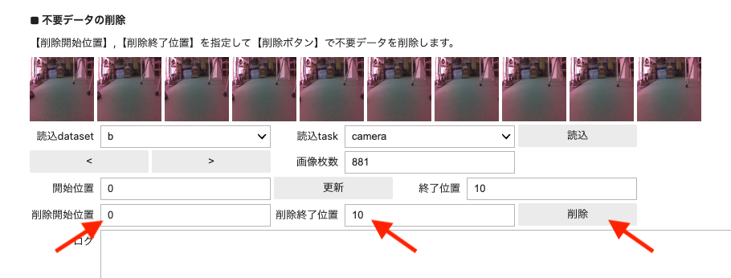
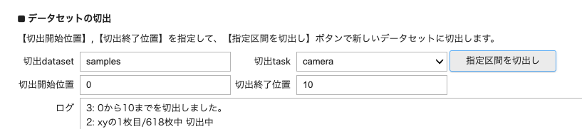
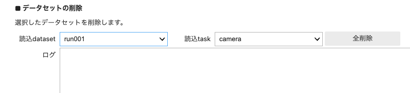
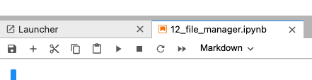
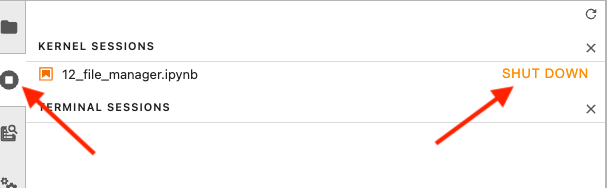

# 画像カット

録画した走行画像にはアノテーション作業に録画開始時など不要な画像やノイズが含まれますのでアノテーション作業の前に画像をカットします。

##　開始

12_file_manager.ipynbを実行し
セルを順番に上から実行して、shift + Enterキーまたは、▶️ボタンを押していきます。

##　不要データ削除

録画したデータセットを読み込みボタンを押して呼び出します。すると０番からの１０枚の画像が列挙されて表示されます。左（戻る）右（進む）のボタンを押して不要な画像の範囲番号を入力して削除ボタンを押して画像を削除します。

##　切り出し

ある範囲のデータだけを取り出してフォルダ名をつけることができます。

##　データセット削除

不要になったデータセットのフォルダごと削除できます。

## 終了

タブを閉じます。

シャットダウンします。

