# アノテーションと学習方法

## 解説動画

<div style="text-align:right;">


</div>


!!! Tips
    走行ラインを修正する画像を追加するとうまく走ります。

!!! Tips
    推論している状態で、走行ラインを確認し上手くできない場所を追加学習行い狙ったラインに走行するように調整すると、さらによく走ります。

<br>
<br>
<div style="text-align:right;">

</div>

## AI86 Version2

11_record_camera.ipynbで走行録画して、その走行画像を12_file_manager.ipynbでアノテーションしやすいように不要画像カットします。

次に13_anotation.ipynbを実行します。

!!! Danger
    １コマつづ実際のステアリングやスロットルの動きを実機のRCカーで再現しますRCのAIモードにすると動き出すので作業台に置いて必ず実行してください。使用しないときはRCカーの電源をOFFにするか、RCモードでご使用ください。


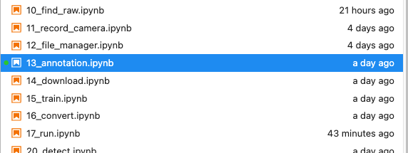

セルを順番に上から実行して、shift + Enterキーまたは、▶️ボタンを押していきます。しばらくすると下のような画面が現れます。

作成した走行モデルがない場合は、[new]でload modelボタンを押します。

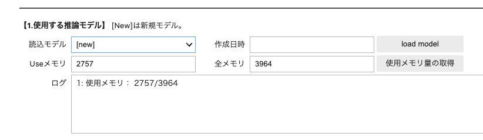

すでに作成した走行モデルがある場合は読み込みモデルを選択してload modelボタンを押して読み込みます。

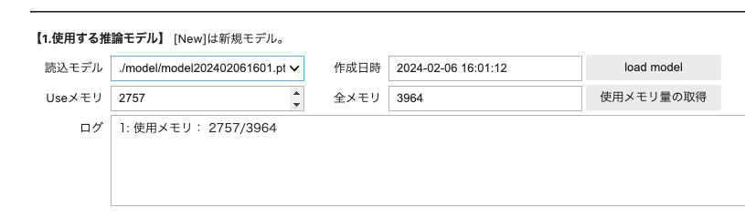

読み込みのデータセットを選択して読込みボタンを押します。走行録画はcameraフォルダまたはrunフォルダにあります。使用メモリはJetsonのRAMメモリです。画像データが多いと不安定になったり止まったりすることがあります。使用メモリの取得ボタンを押して、メモリをチェックしましょう。

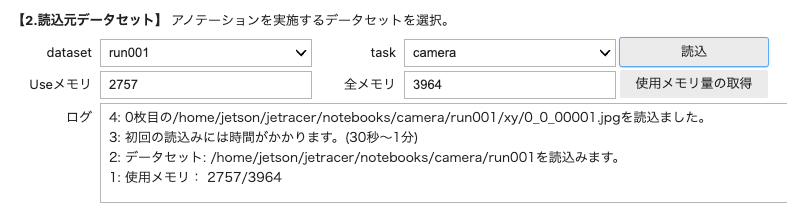

新規に保存するデータセットフォルダを作る場合は、Nameにデータセット名をつけてcreate datasetボタンを押して新規フォルダを選択します。（既存にあるデータセットを選択する場合は、taskでフォルダを選んでdatasetを選択します。）

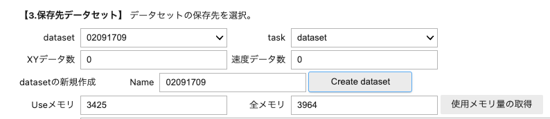

画像１枚１枚に対して教師データを追加していきます。画像の◯はステアリング値、画像の縦棒はスロットル値を表します。

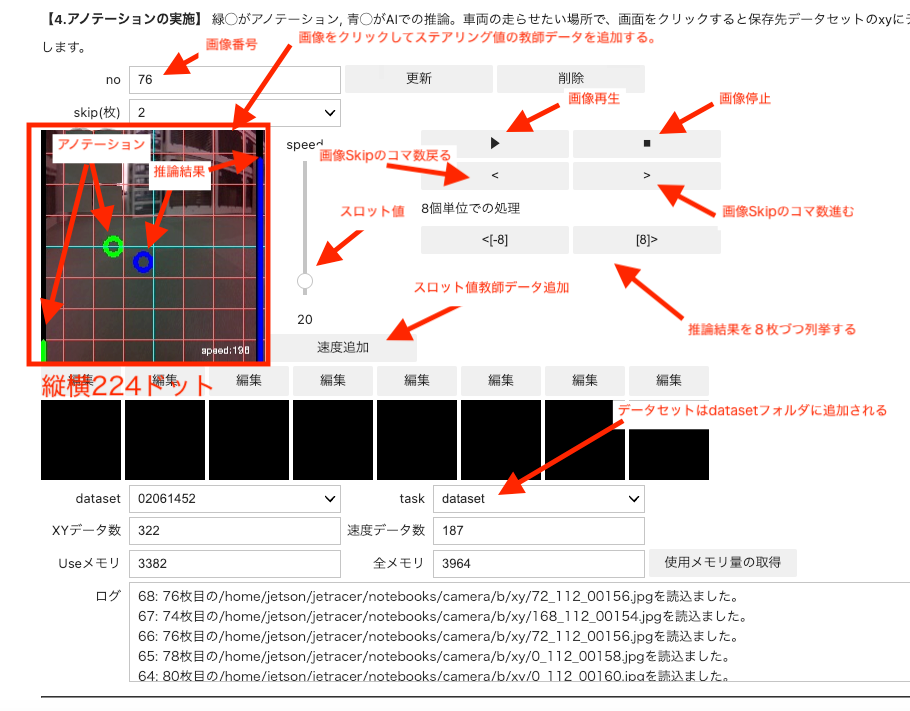

エポック数を入力します。保存モデル名を入力してtrainボタンを押します。しばらくするとlossが表示されます。ephocsがゼロになると学習終了です。終了しましたら、モデル名をつけてsave_modelをボタンを押します。できたモデルはmodelフォルダにあります。

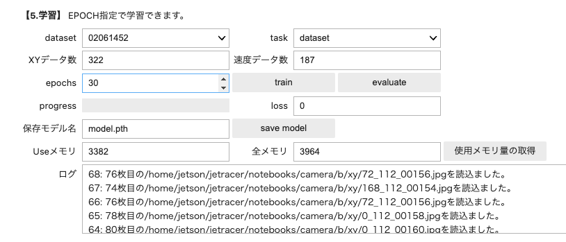

動画を作成します。検証に使う画像は学習に使われていない画像を使います。

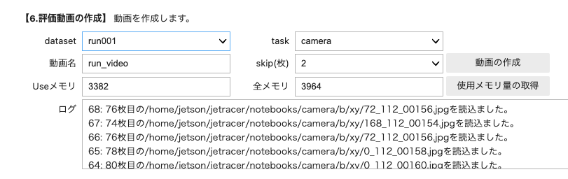

生成された動画ファイルはvideoフォルダに保存されます。

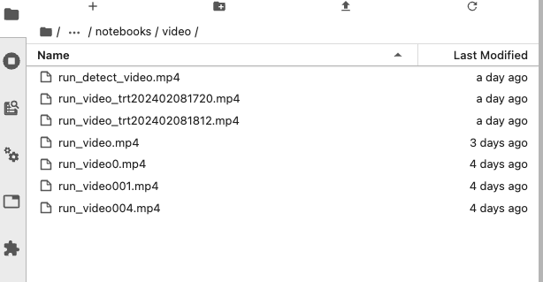

動画再生するには、ファイルをマウス右クリックでダウンロードしPCにて再生します。動画結果が悪いと判断した場合は、再びアノテーションをしてデータを追加し、学習をしてモデルを作ります。

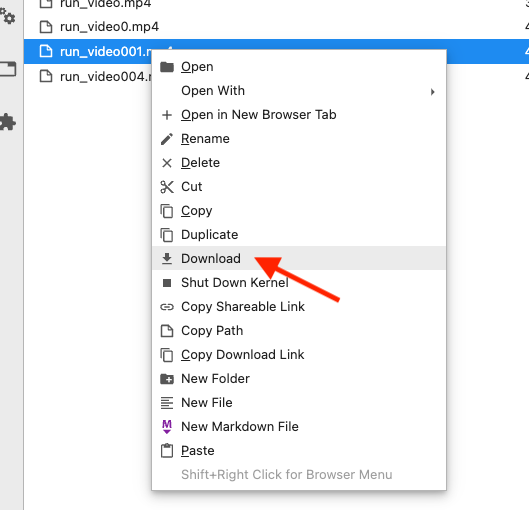

終了するには、タブを閉じます。

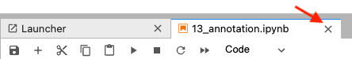

シャットダウンします。

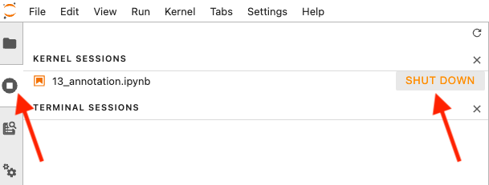

生成されたモデルは、RC走行では重く遅延が生じます。そこでTensorRTで最適化が必要になります。

16_convert.ipynbにてモデルの最適化します。


### 学習が止まってしまう場合は？

空のファイルを見つける

```
sudo find ./ -empty
```

空のファイルの削除する。

```
sudo find ./ -empty -delete
```

!!! Info
    時刻が取得できないなど環境によっては、画像ファイルのタイムスタンプにより前後する場合があります。