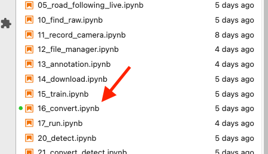
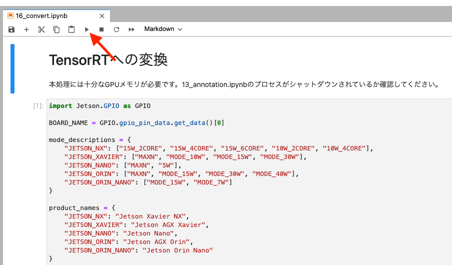
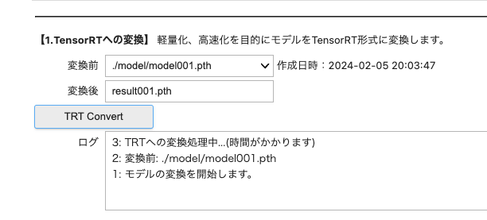
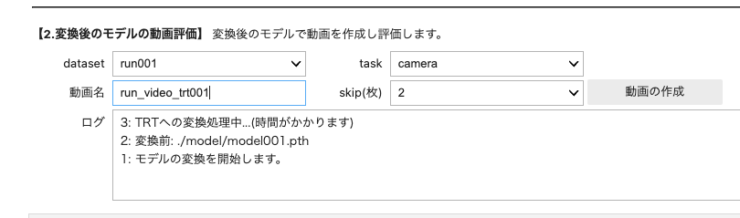
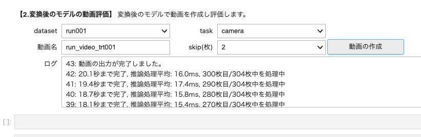
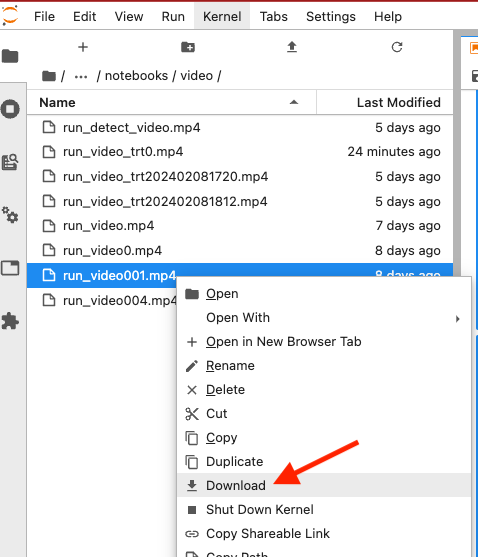
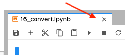
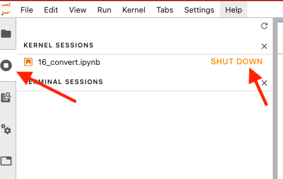
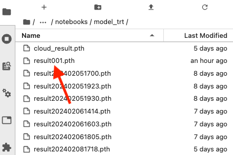

# TensorRTへの変換

モデルはできましたが、このままでは推論時間が時間がかかりRCカーの速度についていけません。ここでは軽量化して推論時間を短縮化させます。

## 解説動画

## AI86 Version2

15.train.ipynbまたは13_annotation.ipynbでモデルを完成しましたら、推論の実行速度向上のため、16.convert.ipynbでモデルをTensor RTで変換いたします。

セルを順番に上から実行して、shift + Enterキーまたは、▶️ボタンを押していきます。

しばらくすると、ウェジェットが現れて変換したいモデルを選んで変換後の名前をつけて、TRT Convertボタンを押して変換します。約１分弱ほど変換時間がかかります。

変換が完了後、動画で評価をします。datasetのドロップダウンリストから検証で使いたい画像を選びます（今回は、13_annotation.ipynbでアノテーション済みの画像を選択します。）

推論します。ログより推論時間が少なくなったことが確認できます。

右クリック選択で、videoフォルダからダウンロードしパソコンで動画ファイルを再生し確認します。

タブを閉じます。

シャットダウンします。

変換したモデルはmodel_trtフォルダに保存されます。

いよいよ次は、自動走行です。

