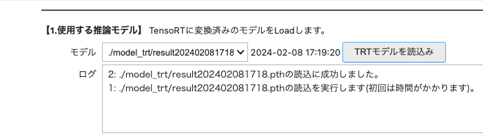
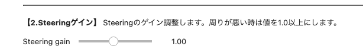
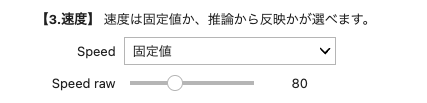
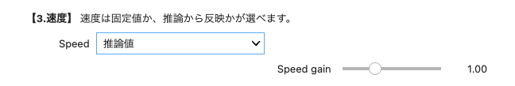
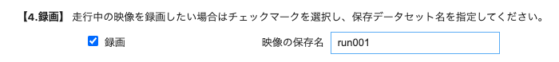
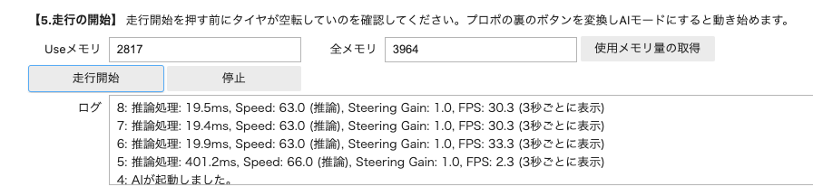
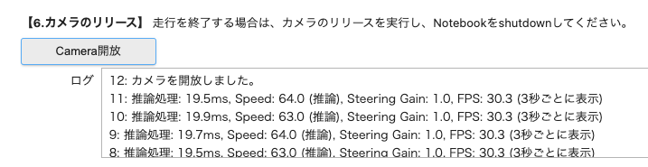
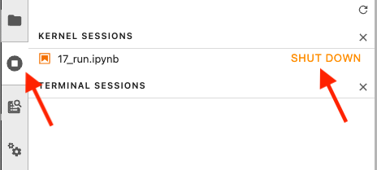
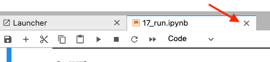

# 自動走行

## 解説動画

!!! Info
    04_road_following.ipynbの場合は、走行録画データはrunフォルダに蓄積されます。

 

AI86 Version2の自動走行では、17_run.ipynbを使います。
ステアリングだけでなくスロットルに対しても推論を実行することができます。

セルを順番に上から実行して、shift + Enterキーまたは、▶️ボタンを押していきます。

しばらく経つと以下の画面が現れます。走行したいモデルを選んでTRTモデル読み込みを押します。呼び出しには数十秒かかります。

ステアリングゲインは、実際の走行し、調整します。（初めは１.０）

スピードゲイン（スロットルのゲイン）は固定値か推論値で選べます。スロットルは一定の場合は、固定値を選びます。こちらも実際走行しよく走るような値を調整します。

スロットルのアノテーションして学習させた場合は、推論値を選びます。

走行を録画したい場合は、録画にチェックを入れ、ファイル名を記入します。

走行開始ボタンを押してしばらく経つと、AIが起動し下記のようなログが現れます。プロポにあるボタンを押してAIモード（ピンク）にします。実際走行が始まり壁などに衝突しそうになりましたら、即座にRCモード（グリーン）に切り替えて衝突を回避するか、停止してください。走行が終了したい場合は、プロポのボタンを押して、RCモード（グリーン）にして車体を停止から停止ボタンを押します。

カメラの開放ボタンを押します。

シャットダウンします。

タブも閉じます。

!!! Info
    17_run.ipynbでの走行録画データはcameraフォルダに蓄積されます。こちらのデータを元に教師データを追加して再び学習させます。

