# アノテーション（remark)

road_following_liveおよび、road_followingの自動走行でうまくいかない場合は、再度、interactive_regressionでデータセットの追加と転移学習を実施する方法（再学習）がございますが、
remarkは、作成済みのモデルに推論させ録画済みのデータやアノテーションした画像データを一枚一枚検証し、アノテーションを変更、追加、スキップできます。アノテーションを追加または修正した画像で一から学習させます。画像データを結合したりできるので便利です。

まず、12_remark.ipynbを開いて

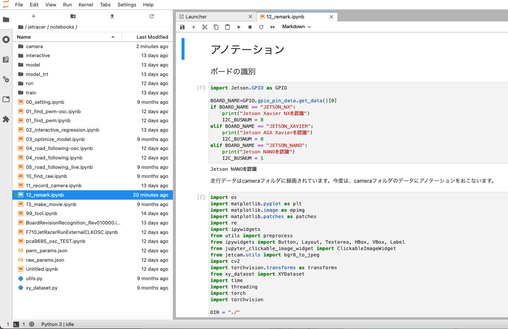

!!! Danger
    １コマつづ実際のステアリングやスロットルの動きを実機のRCカーで再現しますRCのAIモードにすると動き出すので作業台に置いて必ず実行してください。使用しないときはRCカーの電源をOFFにするか、RCモードでご使用ください。
    
!!! warning
    実行には、01_find_pwm.ipynbで生成したpwm_params.jsonファイルが必要になります。

セルを全て実行すると、下の画面が現れます。

### データセットの入出力

road_followingやrecord_cameraで録画した画像を呼び出します。

record_cameraで録画しcameraフォルダを指定した場合は、loadの項目にあるtaskをcameraを選択、road_followingで録画した場合はrunを選択します。datasetは編集したいフォルダ名を選択します。

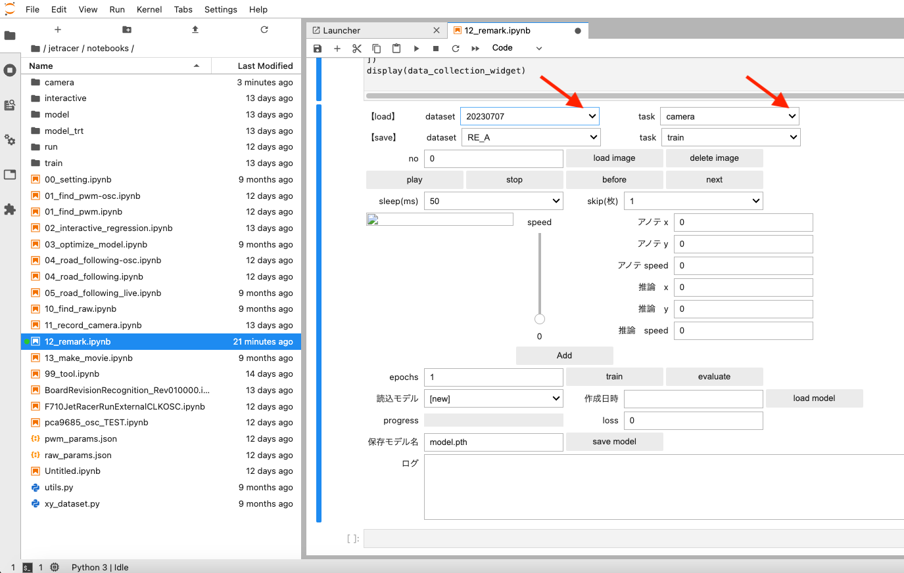

load imageをボタンを押して画像をロードします。ロードが開始されるとBusyになり、読み込みが完了するどIdleになります。（枚数によっては時間がかかります）時系列で画像が表示されます。

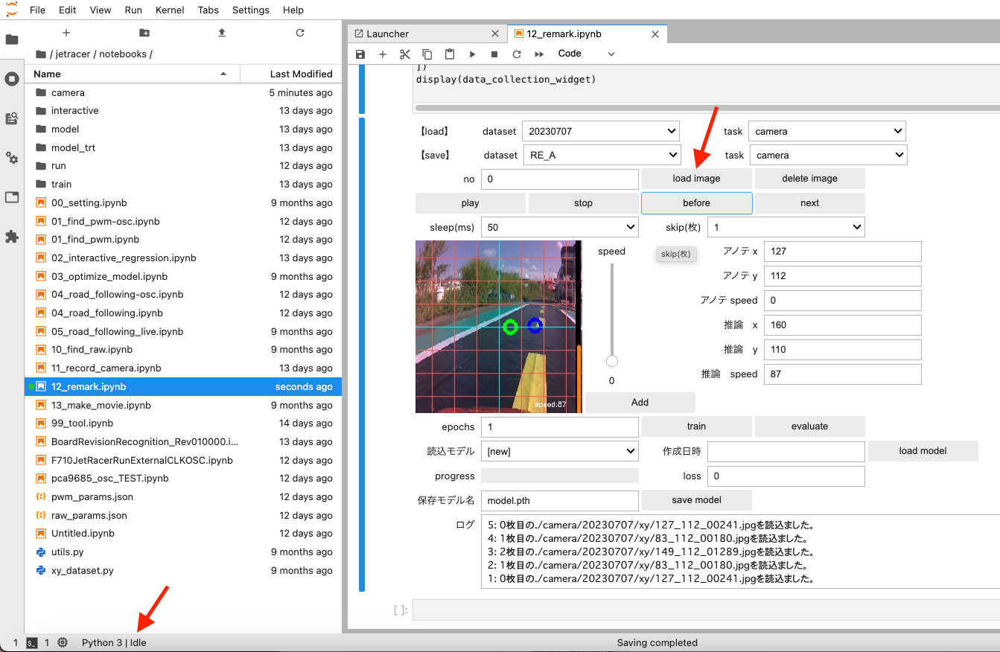

すでに作成済みモデルがある場合(modelフォルダ内にあるファイル）は、読み込みモデルのドロップダウンリストから選択し、load modelをボタンを押します。画像を推論するためevaluteボタンを押します。（通常、数秒間で実行）

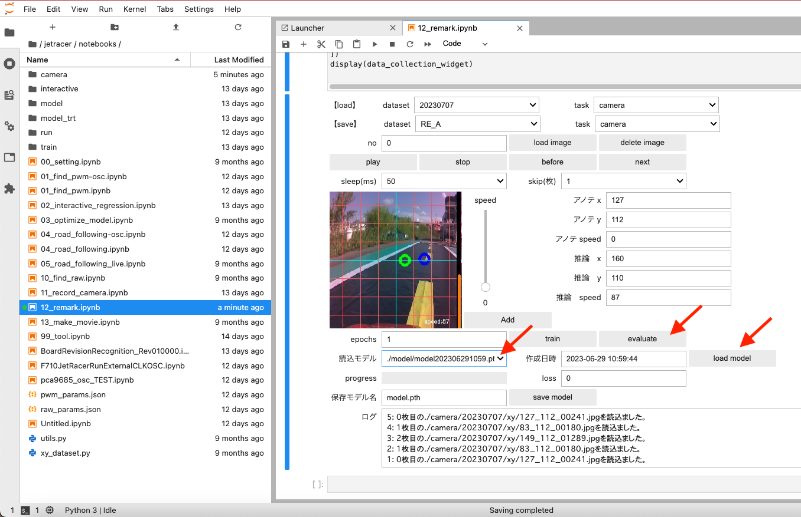

しばらく経って、Playボタンを押すと画像が次々と表示されます。表示が速い場合は、sleep(ms)のドロップダウンリストで一枚表示の時間を選べます。

画像をスキップしたい場合は、１〜５枚の範囲でスキップできます。(スキップしない場合は１枚を選択します。)

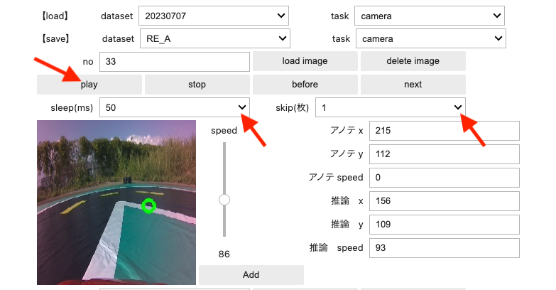

stopボタンでPlayを中断、beforeで前の画像へ、nextで次の画像に移動できます。noは画像の番号になります。

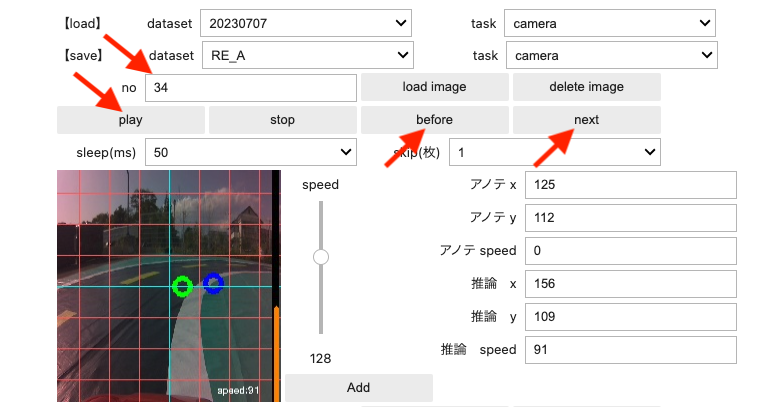

再アノテーションした画像を保存する場所を選択します。saveにあるデータセット(RE_A,RE_B,RE_C,RE_Dのいずれか),taskは通常trainまたはcameraを選択します。

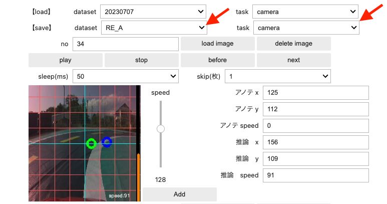

推論結果と実行結果を検証して、アノテーション修正や画像をスキップしていきます。画像をクリックするとxyフォルダにデータが保存されます。

### ステアリング値のアノテーション

緑色のマーカーがステアリング走行(xy)のデータ（既存のアノテーション）、青色のマーカーがステアリングの推論データとなります。下の画面内をクリックして再びアノテーションします。

RE_Aの直下（例）のxyフォルダに画像データが保存されます。

※画面サイズは縦横２２４ドットであり、中央値は１１２となります。原点は左上。

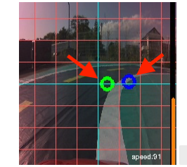

保存されましたら、nextボタンを押して次の画像をアノテーション作業をします。

### スロットル値のアノテーション

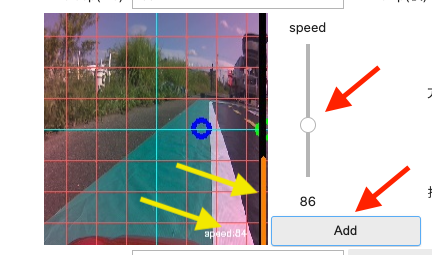

また、スロットル量のアノテーションを追加したい場合は、speedのスライダーを変化させAddボタンを押します。RE_Aの直下（例）のspeedフォルダに画像データが保存されます。

※黄色い矢印はスロットル量の推論値です。（オレンジの縦のバー０〜２２４）

nextボタンを押して次のアノテーションを行い、

全てのアノテーション作業が終了したのなら、saveにあるこれまでの作業で行われた蓄積したデータセットを最初から学習させます。

### 学習

任意のepochs（学習数）※のテキストボックスに入力してtrainボタンを押します。

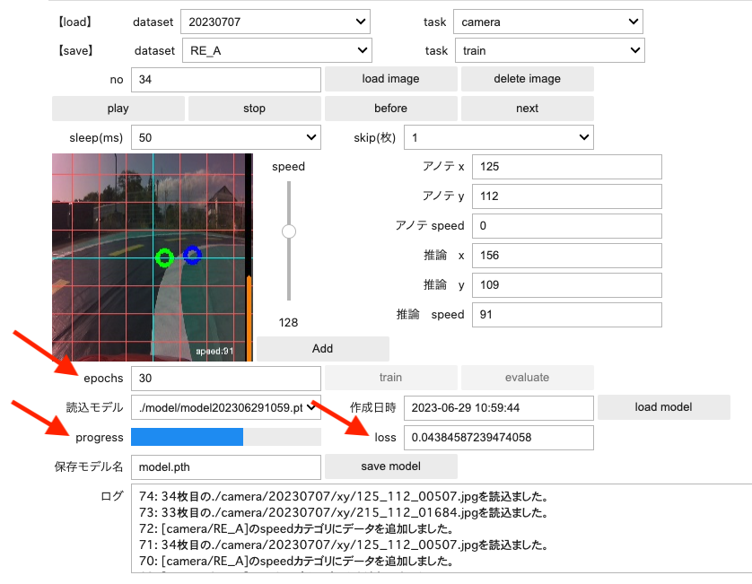

しばらくすると学習が開始され、progressとlossが表示されます。学習が止まってしまう場合は、画像ファイルが壊れている可能性がございます。

壊れている画像ファイルを取り除いてください。

[詳しくはFaBoブログをご覧ください](https://www.fabo.io/2022/07/jetbot-jetracer.html "詳しくはブログをご覧ください。")

※lossが十分に低くかつ学習時間がなるべく短くなるようにepochsを決めてください。

学習が終了したら、任意の保存モデル名に変更しsave_modelボタンを押します。

保存されたモデルはmodelフォルダに保存されます。

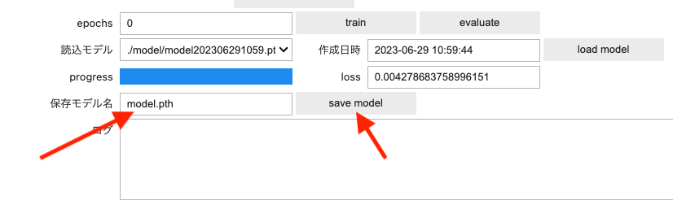
