# Google Colaboratoryを使ったクラウド学習


<div style="text-align:right;">

</div>

Jetson Nanoだけでもエッジでの学習はできますが、インターネット環境があればクラウドでも学習はできます。

Google Colaboratory(Google Colab)を使用することでGPUなどのハードウェアなしで使うことができます。
Jupyter NoteBookは初めから用意されており、リッチな環境により学習時間を短縮、画像枚数もより多く扱うことが容易になります。


### データセットをzipファイルにまとめる

11_record_camera.ipnbで録画した画像データを12_file_manager.ipynbで編集し13_anotation.ipynbで教師データを作り、収集したデータセットをクラウドへアップします。JetsonNanoの14_download_data.ipynbを開いて

データセット（画像データ）を一つのzipファイルにしてGoogle Colaboratoryへのファイルアップロードできるようにします。

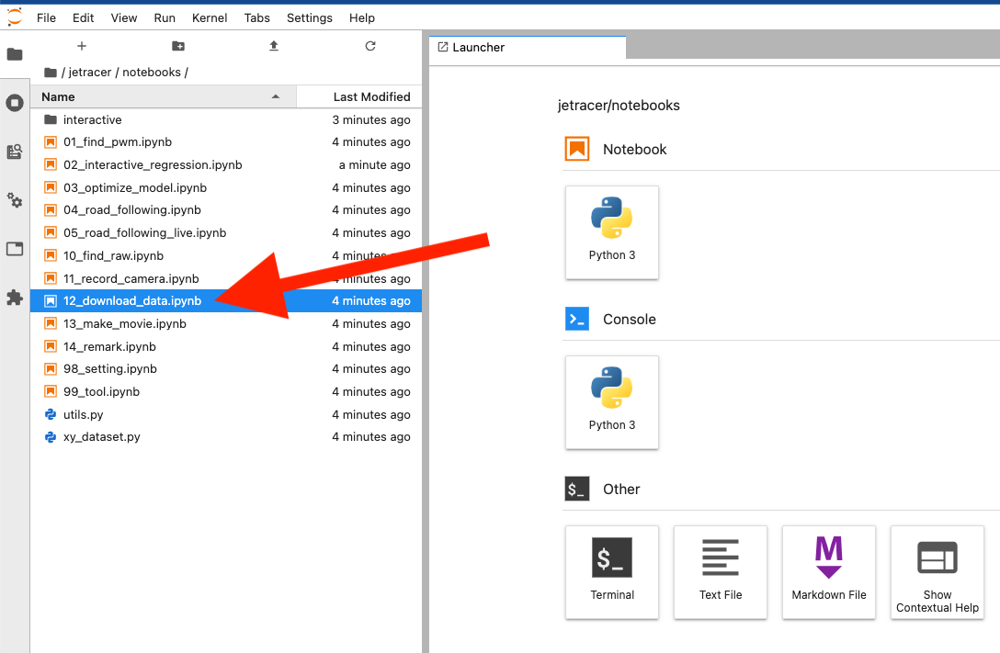{: .bom_listsize}

ディレクトリ（タスク）をドロップダウンリストから選んで、圧縮したいデータセットフォルダを選択します。

ZIPボタンを押すと圧縮が始まり、圧縮が完了するとログに処理終了が表示されZIPフォルダが生成されます。

ZIPフォルダに圧縮されたファイルがあり、このファイルをGoogleドライブにアップロードします。

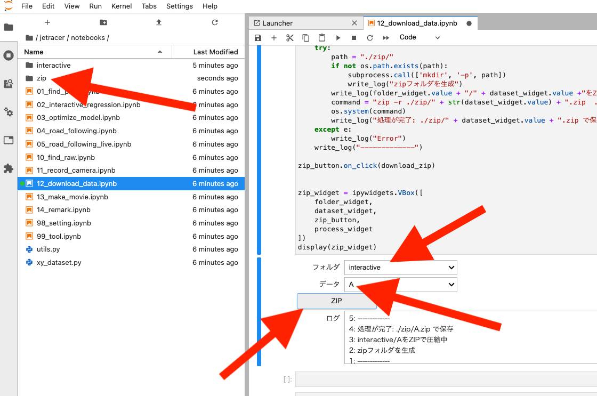{: .bom_listsize}

画像ファイル枚数によって終了時間が異なります。処理完了が出るまで待ちましょう。

### Googleのマイドライブへデータセットをアップロードする

作成したzipファイルは、zipフォルダにあります。ダウンロードしたいファイルを右クリックDownloadを選択します。

一旦、お使いのパソコンにダウンロードします。

右クリックでダウンロードします。

Google Colaboratoryを使用する前に、事前にGoogleアカウントが必要です。Googleにログインします。

事前に、Googleドライブ内にJetRacer_WorkSpeaceという名前の専用のフォルダを作りましょう。

zipファイルをGoogleドライブにアップロードします。

{: .bom_listsize}

新規ボタンをクリックして、作業フォルダ（etRacer_WorkSpeace/dataset/）を作り、そのフォルダ内にzipファイルをアップロードします。

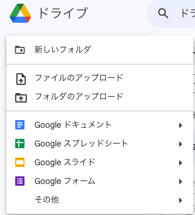{: .bom_listsize}

（例）保存先のディレクトリ
JetRacer_WorkSpeace/dataset/

### Google Colaboratory　を使うための準備

Google Colaboratoryにアクセスします。

[https://colab.research.google.com/?hl=ja](https://colab.research.google.com/?hl=ja)

Google Colaboratoryにようこそ

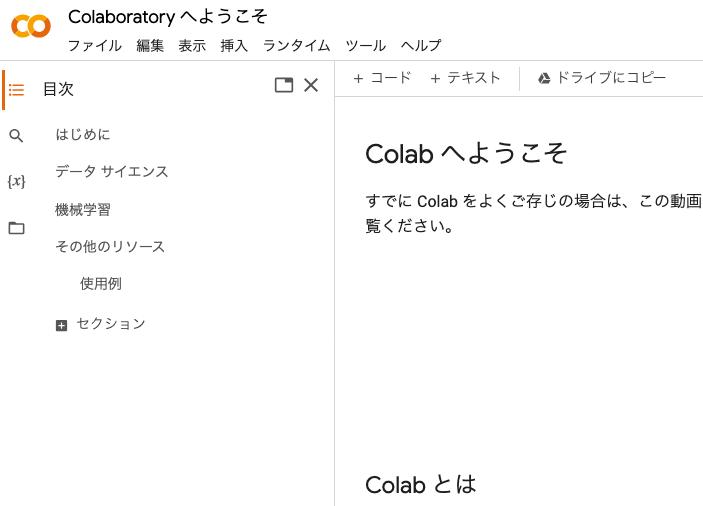{: .bom_listsize}


### データセットのファイルのパス

Googleのマイドライブではなく、ファイルGoogle Colaboratoryのディレクトリにアクセスの場合は、

"drive/MyDrive/workspace_jetracer/dataset/......."

モデルの出力先は、modelディレクトリを作成しておきましょう。

"drive/MyDrive/workspace_jetracer/model/......."

ZipファイルをGoogleのマイドライブへアップロードします。

### データセットのzip解凍

右クリックしてアプリでもファイル解凍できますが、ファイル数が多くなると時間がかかるのでGoogle Colaboratoryで解凍します。

Googleドライブの新規ボタンを押して、その他を選択、Google Colaboratoryをクリックします。

保存先がGoolgeドライブのマイドライブの場合はGoogle Colaboratoryからアクセス権限を与えます。

下記のマウントするコードを実行するか、フォルダの左側にあるアイコンをクリックします。

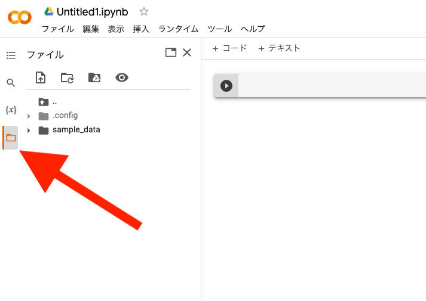{: .bom_listsize}

グーグルドライブをマウントします。

セル内に以下のコードをコピーアンドペーストして実行します。

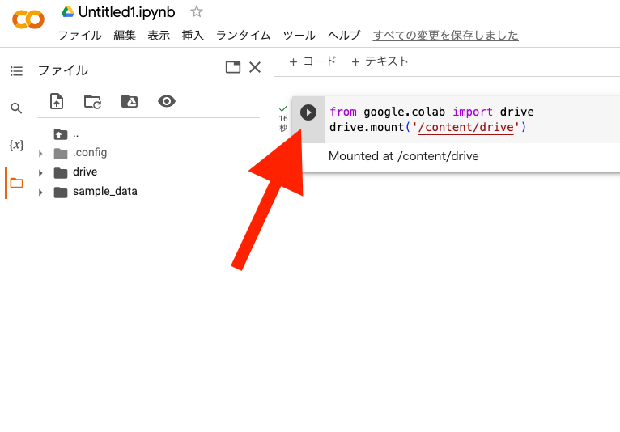{: .bom_listsize}

```Python
from google.colab import drive
drive.mount('/content/drive')
```
Linuxコマンドの先頭に！をつけるとJupyterNoteBook上でコマンドが実行できます。

MyDriveでないcontent以下に展開先を指定し、任意のディレクトリに解凍させます。

```Python
!unzip /content/drive/MyDrive/workspace_jetracer/dataset/xxxxxxxxxx.zip -d /content/
```

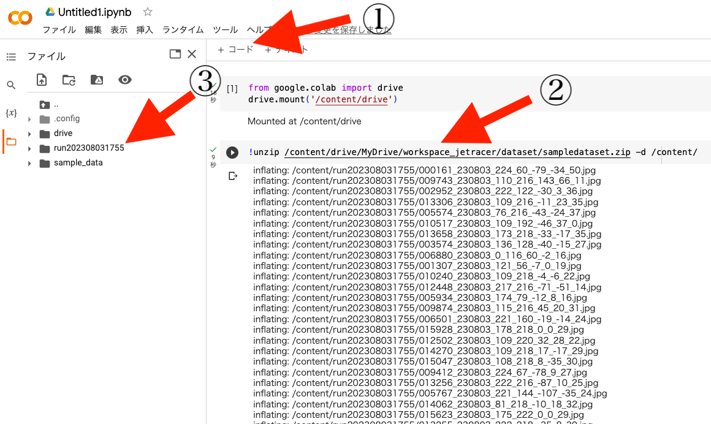{: .bom_listsize}

①　＋コードクリック（セルを追加）

②　上記コードをコピーアンドペーストして実行

③　解凍先を確認

!!! Note
    Myドライブ（/content/drive/MyDrive/）の大量の数のファイルは、処理が途中で止まることがありますのでMyDrive以外のディレクトリに展開させます。
※ここでは/content/の直下に解凍しています。

解凍が終了すると画面一番下のバーに完了時間が表示されます。

###　Google Colaboratoryによる学習

ファイルをクリックし、ノートブックを開くを選択します。

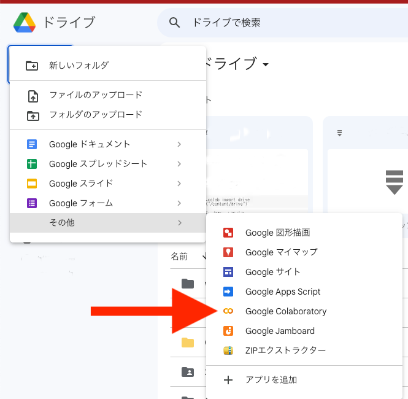{: .bom_listsize}

Zipファイルをドラックアンドドロップかファイル選択してGoogle Colaboratoryへアップロードします。

[JetRacerCloudBeta000.ipynb](./python/JetRacerCloudBeta000.ipynb)をダウンロードします。

マイドライブにJetRacerCloudBeta000.ipynbをアップロードします。

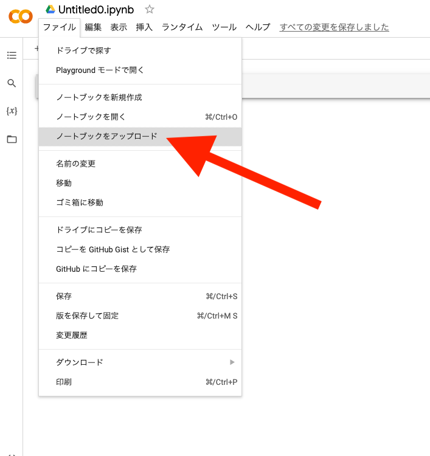{: .bom_listsize}

Googleドライブにあるデータセットのファイルのパスは、例　：　"/content/drive/MyDrive/workspace_jetracer/dataset/{フォルダ名}"

Colaboのドライブにあるデータセットのファイルのパスは、例　：　"/content/{フォルダ名}"

```Python
LOAD_DATA_PATH = "/content/drive/MyDrive/workspace_jetracer/dataset/DirectryName"
```

ダウンロードしたファイルを上から実行していきます。

{: .bom_listsize}

JetRacerのコードをダウンロード

```Python
!wget https://raw.githubusercontent.com/NVIDIA-AI-IOT/jetracer/master/notebooks/utils.py
!wget https://raw.githubusercontent.com/NVIDIA-AI-IOT/jetracer/master/notebooks/xy_dataset.py
```

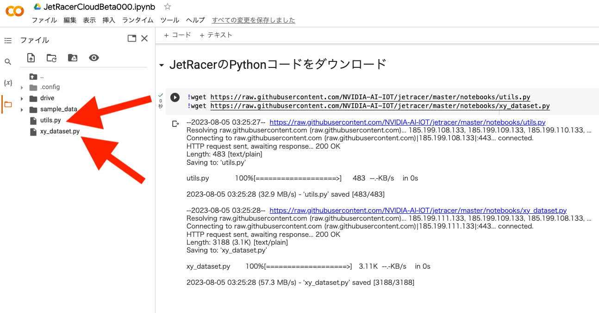{: .bom_listsize}

GPUを有効にします。ダイヤログが出ることがありますが利用できるGPUを使用します。

```Python
device = torch.device('cuda')
```

lossが低くなるように任意のエポック数に変えて、学習させます。（無料でのご使用の場合は、時間制限があります。ご注意ください。）

学習（エポック）が終了したのなら、出来たモデルを名前のつけてGoogleドライブに保存します。

```python
SAVE_MODEL = "xxxxxxxxxxxxx.pth"
torch.save(model.state_dict(), SAVE_MODEL)
```

出来たモデルの評価を撮影済みの画像を使って評価します。結果が芳しくなかった場合は、データセットを増やしたり、エポック数を増やして再び学習し調整します。

コードのエポック数のデフォルト値は120です。

!!! Tip
    Google Colaboratoryでの無料でお使いの場合は、GPUの使用時間制限がございます。データセット枚数とエポック数を調整しましょう。

```python
BATCH_SIZE = 8
EPOCH = 120

optimizer = torch.optim.Adam(model.parameters())

def train_eval(is_training):
    global model
    dataset = XYDataset(LOAD_DATA_PATH, SAVE_CATEGORIES, TRANSFORMS, random_hflip=True)
```

!!! Tip
    データセットの枚数が大きいとログが表示されるまで数十分以上〜数時間かかることがあります。

### 動画検証によるモデルの評価

評価したいモデルのパスに変更します。

```Python
model_name = "/content/model.pth"
```

評価に使う画像のパスに変更します。

```Python
CAMERA_PATH = '/content/drive/MyDrive/workspace_jetracer/dataset/{ファイル名}'
```

動画ファイルが生成され動画が映し出されます。青い丸が推論結果の座標になります。ダウンロード、再生速度が設定出来ます。

保存した学習済みモデルをダウンロードしてそのファイルをJetson Nanoのmodelディレクトリ(/home/jetson/jetracer/notebooks/model)へアップロードします。

Jetson NanoのJupyter labのアップロードボタンをクリックして、モデルpthファイルを/home/jetson/notebooks/model/へアップロードし03_optimize_model.ipynbにてTensorRTにてモデルの最適化し、
04_road_following.ipynbにて自動走行します。

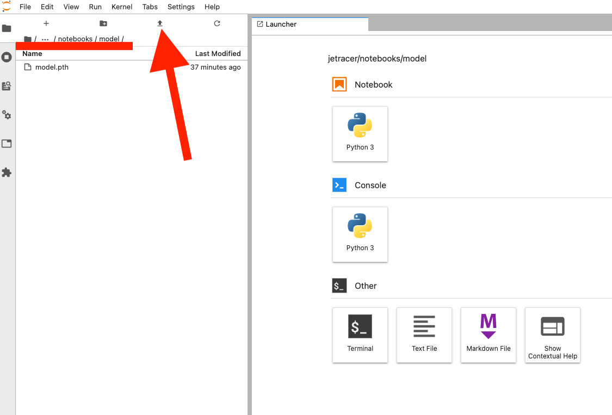{: .bom_listsize}
