# Google Colaboratoryを使ったクラウド学習


<div style="text-align:right;">

</div>

<div align="right"><p><b>FaBo JetRacerCloud Version 2.0.7</b></p></div>

Jetson Nanoだけでもエッジでの学習はできますが、インターネット環境があればクラウドでも学習はできます。

Google Colaboratory(Google Colab)を使用することでGPUなどのハードウェアなしで使うことができます。
Jupyter NoteBookは初めから用意されており、リッチな環境により学習時間を短縮、画像枚数もより多く扱うことが容易になります。

## 準備

13_anotation.ipynbで作成した教師データのsample001と11_record_camera.ipnbで作成した走行画像のsample001をあらかじめ用意しておきます。

### データセットをzipファイルにまとめる

11_record_camera.ipnbで録画した画像データを12_file_manager.ipynbで編集し13_anotation.ipynbで教師データを作り、収集したデータセットをクラウドへアップします。JetsonNanoの14_download_data.ipynbを開いて

データセット（画像データ）を一つのzipファイルにしてGoogle Colaboratoryへのファイルアップロードできるようにします。

{: .bom_listsize}

ディレクトリ（タスク）をドロップダウンリストから選んで、圧縮したいデータセットフォルダを選択します。

ZIPボタンを押すと圧縮が始まり、圧縮が完了するとログに処理終了が表示されZIPフォルダが生成されます。

ZIPフォルダに圧縮されたファイルがあり、このファイルをGoogleドライブにアップロードします。

学習用のデータ(datasetフォルダのアノテーションで作成されたデータ)を１つのファイルにまとめます。ZIPに圧縮ボタンを押します。

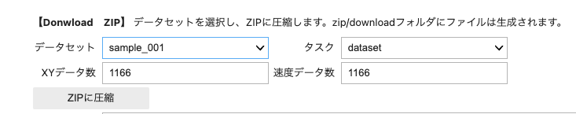{: .bom_listsize}

続きまして、テスト用データ（cameraフォルダにあるデータ）を１つのファイルにまとめます。

{: .bom_listsize}

画像ファイル枚数によって終了時間が異なります。処理完了が出るまで待ちましょう。

zip化されたファイル名は、アノテーション済みのdataset、走行録画はcameraがデータセット名に接頭辞がつきます。

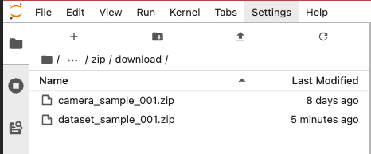{: .bom_listsize}

dataset_sample_001.zipとcamera_sample_001.zipができます。こちら２つのファイルをお使いのPCにダウンロードします。

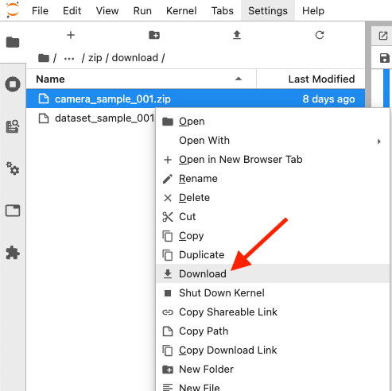{: .bom_listsize}


### Googleのマイドライブへデータセットをアップロードする

作成したzipファイルは、zipフォルダにあります。ダウンロードしたいファイルを右クリックDownloadを選択します。

一旦、お使いのパソコンにダウンロードします。

右クリックでダウンロードします。

Google Colaboratoryを使用する前に、事前にGoogleアカウントが必要です。Googleにログインします。

事前に、Googleドライブ内にworkspace_jetracerという名前の専用のフォルダを作りましょう。

zipファイルをGoogleドライブにアップロードします。

{: .bom_listsize}

新規ボタンをクリックして、作業フォルダ（workspace_jetracer）を作り、そのフォルダ内にzipファイルをアップロードします。

{: .bom_listsize}

14_download.ipynbでzipにしたdataset_sample_001.zipとcamera_sample_001.zipをPCからGoogleドライブにアップロードします。

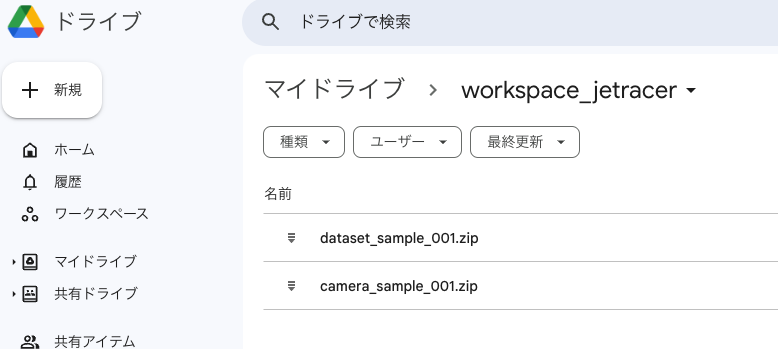{: .bom_listsize}

（例）保存先のディレクトリ
workspace_jetracer/

### Google Colaboratory　を使うための準備

Google Colaboratoryにアクセスします。

[https://colab.research.google.com/?hl=ja](https://colab.research.google.com/?hl=ja)

Google Colaboratoryにようこそ

{: .bom_listsize}

###　Google Colaboratoryによる学習

15_train.ipynbにあるリンク先にアクセスします。

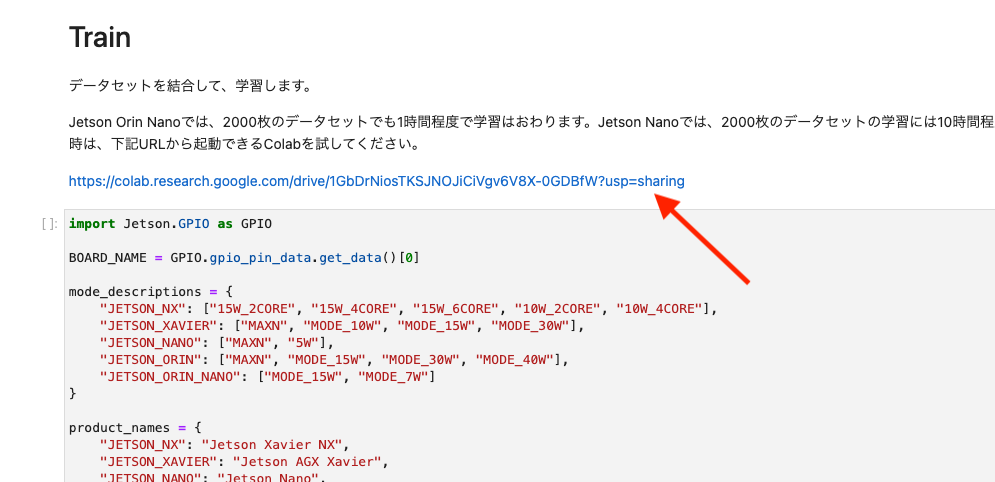

[https://colab.research.google.com/drive/1GbDrNiosTKSJNOJiCiVgv6V8X-0GDBfW?usp=sharing](https://colab.research.google.com/drive/1GbDrNiosTKSJNOJiCiVgv6V8X-0GDBfW?usp=sharing)

下の矢印にあるセルに移動してShift＋Enterを実行します。２つのファイルが/content/にコピーされます。

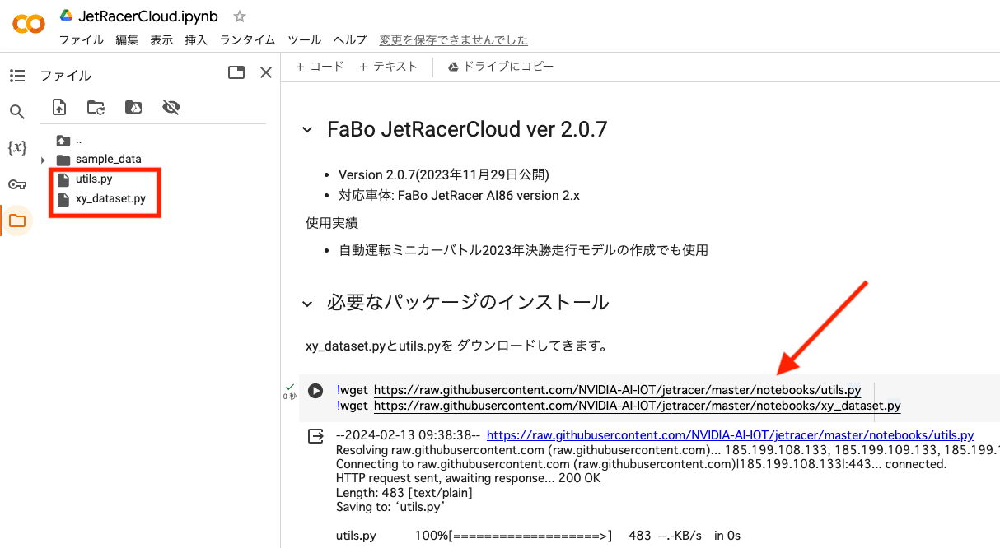{: .bom_listsize}

下のコードを実行するとダイアログが表示されます。GoogleDriveへのアクセスを許可します。

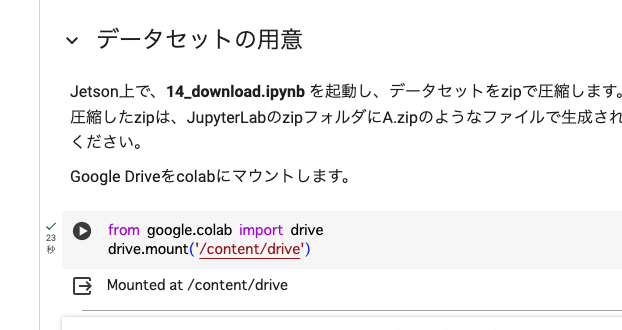{: .bom_listsize}

今回は学習用のデータセットが１つの場合は、矢印のところに、DATA_ZIP = ["dataset_sample_001.zip"]を追記します。

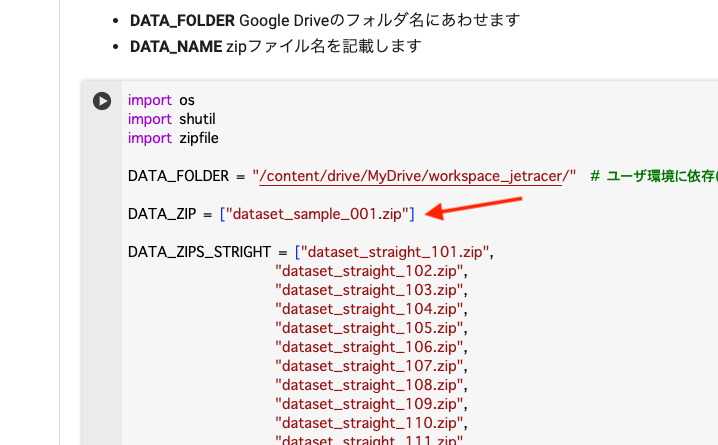{: .bom_listsize}

また、同じセル内で下の矢印のように

```
DATA_ZIPS = DATA_ZIP
#DATA_ZIPS = DATA_ZIPS_STRIGHT
```
と変更する。

{: .bom_listsize}

実行すると/content/ディレクトリにdatasetフォルダに解凍されるはずです。/content/dataset/sample001/ 

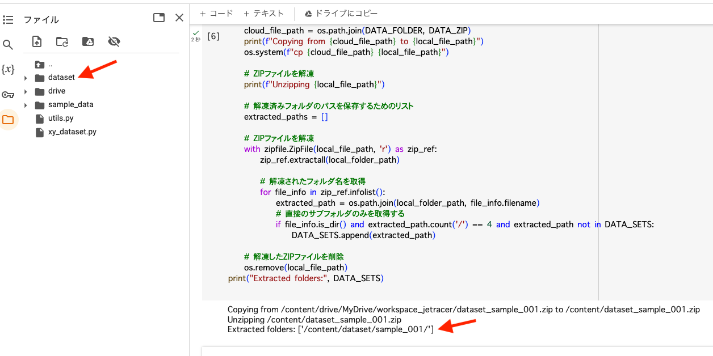{: .bom_listsize}

ファイルの結合、ファイルの枚数を確認します。

データ存在確認

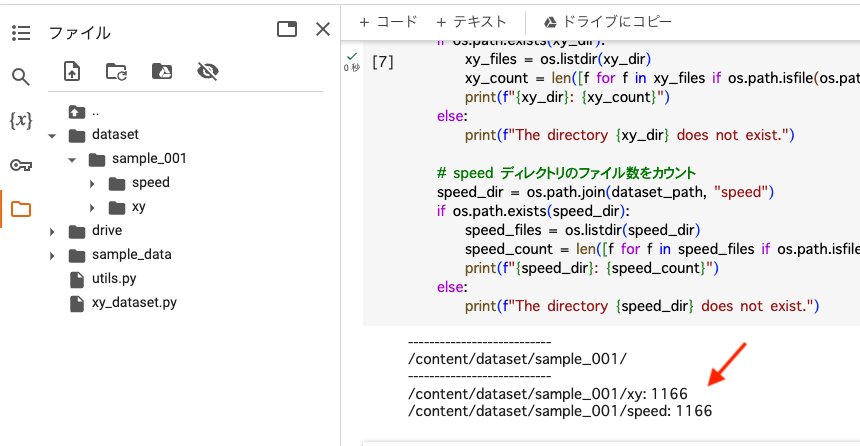{: .bom_listsize}

データの結合（データが1つしかないので結合はしません。）

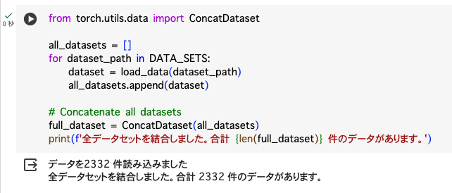{: .bom_listsize}


学習を実行します。エポック数はデフォルトで１００になっています。状況に合わせて調整してください。３０エポック改善が見られなかった場合は、その時のモデルをベストモデルとして、学習をストップして終了とします。

{: .bom_listsize}

/content/ディレクトリにモデルが保存されます。

{: .bom_listsize}


学習が完了し!cp /content/cloud_best_model.pth {DATA_FOLDER}を実行するとGoogleドライブにモデルがコピーされます。

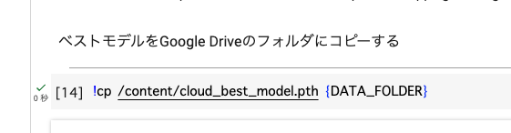{: .bom_listsize}

モデルが追加されました。

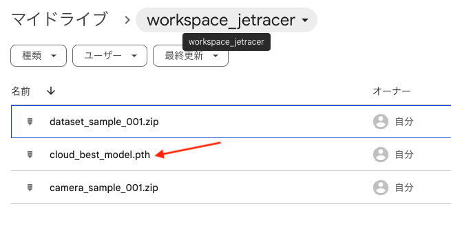{: .bom_listsize}

以下を実行されますと作成したモデルがお使いのPCにダウンロードされます。こちらのファイルをJetsonのnotebookアップロードボタンで modelフォルダにアップロードします。

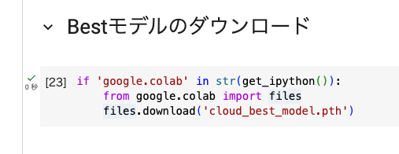

log.txt(実行結果)も保存されます。

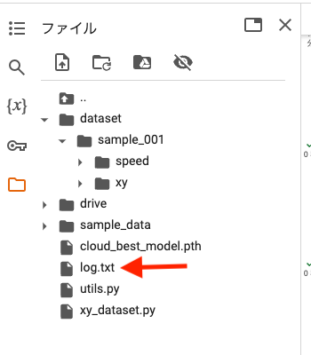{: .bom_listsize}

lossが低くなるように任意のエポック数に変えて、学習させます。（無料でのご使用の場合は、時間制限があります。ご注意ください。）


## 動画を作成

Googleドライブworkspaceにある画像データ(camaera_sample_001.zip)を使用します。

以下を変更します。

```
CAMERA_DATA_NAME = "camera_sample_001.zip"
```

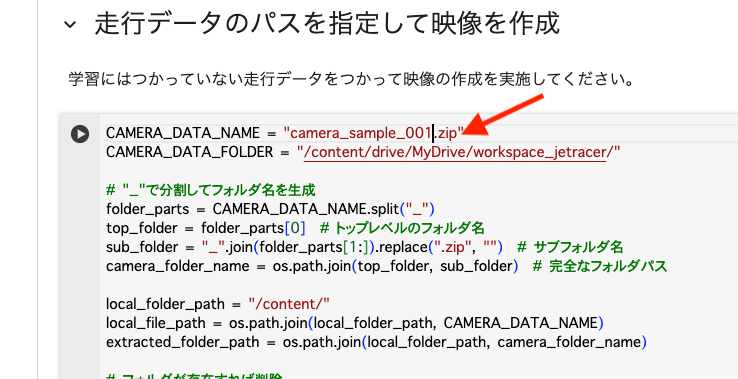{: .bom_listsize}

Googleドライブからコピーして解凍します。

{: .bom_listsize}

動画を実行するとmp４ファイルが作成され自動でPCにダウンロードされます。動画を再生し検証します。動画ファイルが生成され動画が映し出されます。青い丸が推論結果の座標になります。

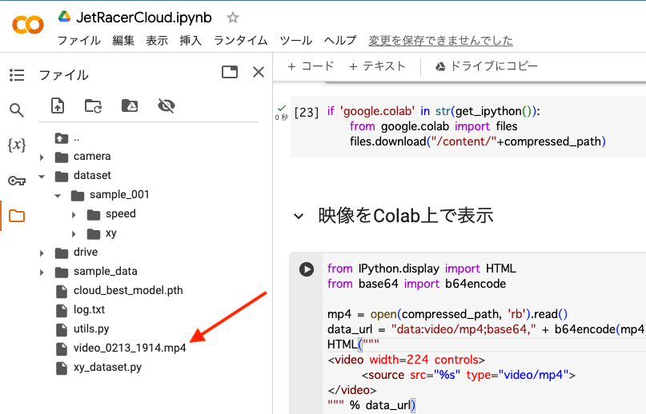{: .bom_listsize}


Googleコラボ上でも確認できます。

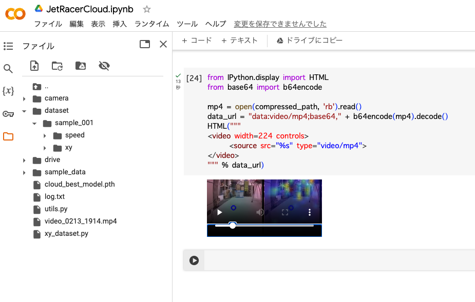{: .bom_listsize}


出来たモデルの評価を撮影済みの画像を使って評価します。結果が芳しくなかった場合は、データセットを増やしたり、エポック数を増やして再び学習し調整します。

!!! Tip
    Google Colaboratoryでの無料でお使いの場合は、GPUの使用時間制限がございます。データセット枚数とエポック数を調整しましょう。

保存した学習済みモデルのファイルをJetson Nanoのmodelディレクトリ(/home/jetson/jetracer/notebooks/model)へアップロードします。

Jetson NanoのJupyter labのアップロードボタンをクリックして、モデルpthファイルを/home/jetson/notebooks/model/へアップロードし16_convert.ipynb(TensorRT)にてモデルの最適化し、
17_run.ipynbにて自動走行します。


