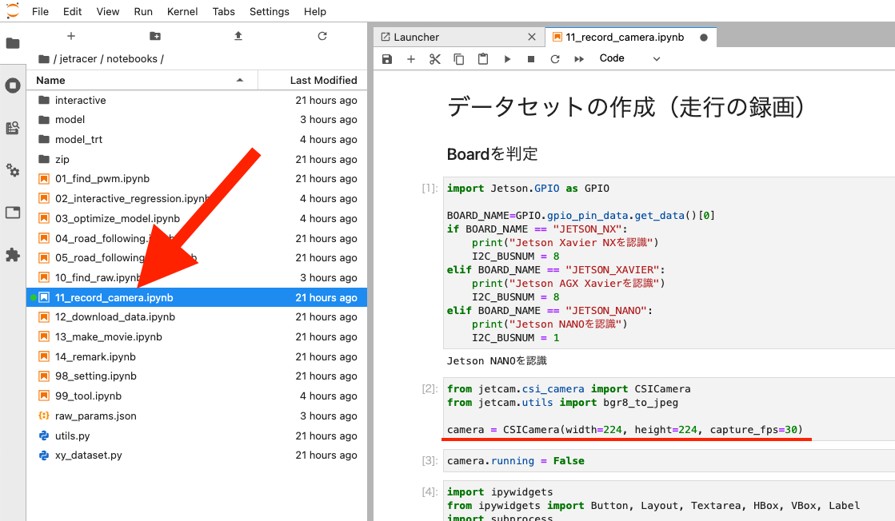
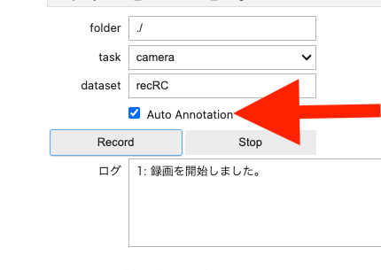
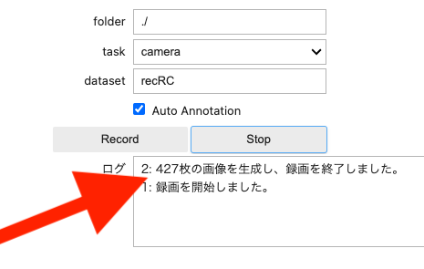
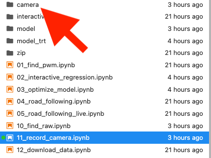
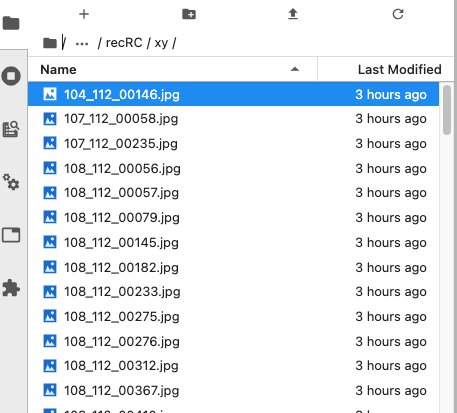
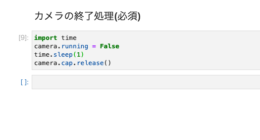

# 走行録画(アルファ版)


<div style="text-align:right;">

※
</div>

走行を一定間隔で写真撮影します。オプションでプロポ信号を計測し自動でアノテーションをする機能があります。

!!! Info
    オートアノテーション機能は、コントロール基板　#6112 JetRacer Rev 2.0.9以降の基板のみ対応  

11_record_camera.ipynbを開きます。

{: .bom_listsize}

!!! Info
    AI86 version1のお使いの方は、第5セル５１行目のtime.sleep(0.100)を削除するか、先頭に#をつけて、コメントアウトしてください。

!!! Danger
    １コマつづ実際のステアリングやスロットルの動きを再現しますRCのAIモードにすると動き出すので作業台に置いて必ず実行してください。

下記のコードが示す通り、縦横224ドットFPSは３０での撮影するようになっています。状況によって調整してください。

```Python
from jetcam.csi_camera import CSICamera
from jetcam.utils import bgr8_to_jpeg

camera = CSICamera(width=224, height=224, capture_fps=30)
```

!!! warning
    オートアノテーションを実行する場合は、10_find_raw.ipynbで事前にプロポ信号の計測が必要になります。

切り替え信号をRCモードにしてプロポを使って任意の時間、走行します。オートアノテーションを実行する場合は、Auto Anotationにチェックを付けます。
チェックを付けない場合は、アノテーションのデータは付加されず後でアノテーション付けを手作業でします。(12_remark.ipynb,AI86 version2は、14_remark.ipynb)

folderは./で/home/jetson/jetracer/notebooks/

taskはデフォルトではcameraになります。データセットは任意の名前をつけます。Recordボタンをクリックすると録画が開始されます。

{: .bom_listsize}

ストップボタンを押すと、録画が停止されます。撮影された枚数が表示されます。

{: .bom_listsize}

データがcameraフォルダへ蓄積されます。

{: .bom_listsize}

保存したファイルはステアリングのフォルダ(xy)とスロットルのフォルダ(speed)にそれぞれ保存されます。

ファイル名の一部がアノテーションデータになります。

{: .bom_listsize}

X座標データ、Y座標データ、連番.jpg ファイル

撮影が終了し、ファイルを閉じる場合はカメラも終了して、カーネルも終了してください。

{: .bom_listsize}

!!! warning
    カメラの終了処理を実行しないで終了すると、カメラが再起動できずJetsonNanoごと再起動が必要となります。

!!! warning
    画像ファイルが壊れている場合があります。findコマンドでファイルが壊れていないかチェックが必要な場合がございます。
