# 受信機信号計測(アルファ版)

## 概要

実際のRCカー受信機の信号をもとに自動でアノテーション作業を実行するようにします。（11_record_camera.ipynb）

RCカーは、プロポ（送信機）から受信機で信号を受信し、ステアリング信号（ST)とスロットル信号（TH)でRCカー制御していますが、その受信機から出ている２つのPWM信号を計測します。
信号の周期は約６０Hz、波長は、おおよそ１０００μ秒〜２０００μ秒になります。

!!! Danger
    作業台に置いて必ず実行してください。

!!! Info
    コントロール基板　#6112 JetRacer Rev 2.0.9以降の基板のみ対応    

## 計測方法

制御信号を計測しているのは、JetsonNanoではなく、コントロール基板のマイコンが受信機からの制御信号を計測しています。I2Cのデバイスアドレスは0x08になります。

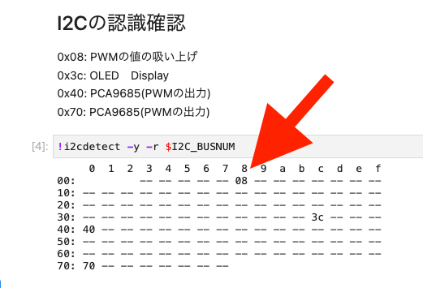

事前にRCモードでトリム調整した走行が良い状態を維持し、設定後は、ステアリングトリム、スロットルトリム、リバーススイッチはなるべく動かさないようにしてください。

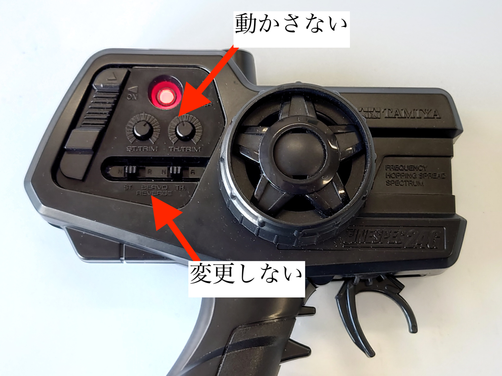{: .bom_listsize}

**必ずJetRacerを作業台に設置し**、プロポの後ろのボタンによりRCカーモード（赤色）に切り替えます。

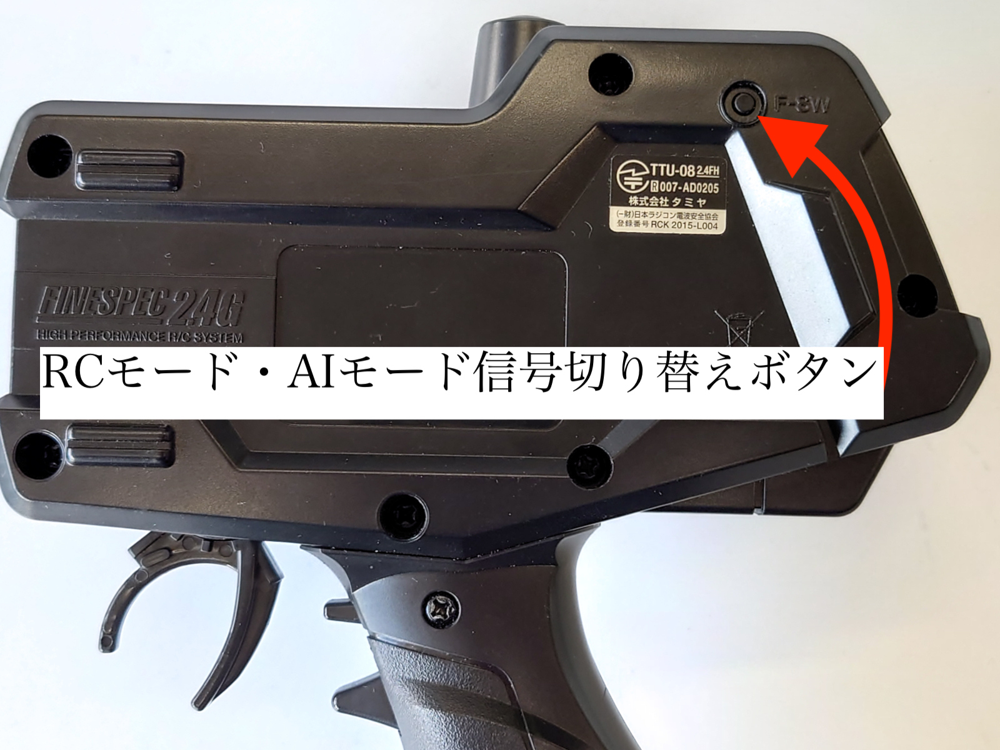{: .bom_listsize}

10_find_raw.ipynbを開ます。

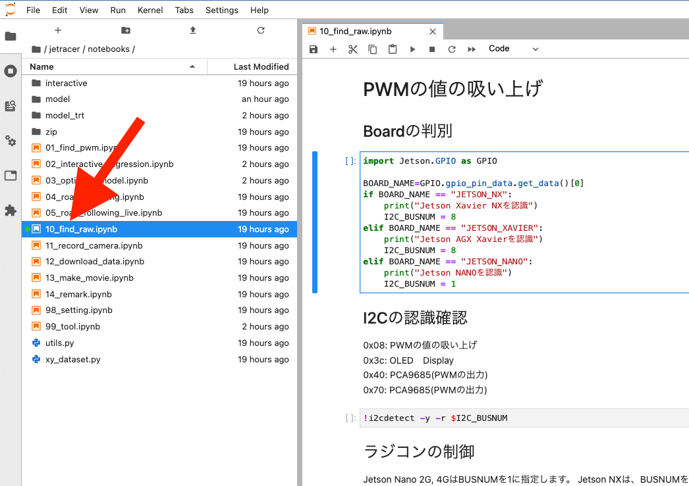

## ステアリング信号を計測

RCカー電源をONにして、プロポの電源もONにします。

!!! Info
    ピーピーと音が聞こえる場合は、ESC（アンプ）が制御信号を受信できてない時に音が鳴ります。

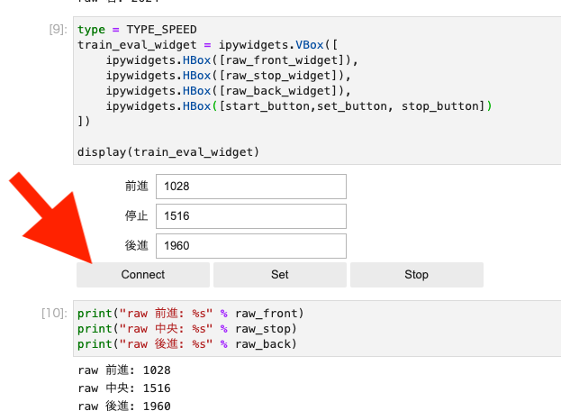

Connectボタンをクリックします。

プロポのステアリングを左にいっぱいに切り、計測します。

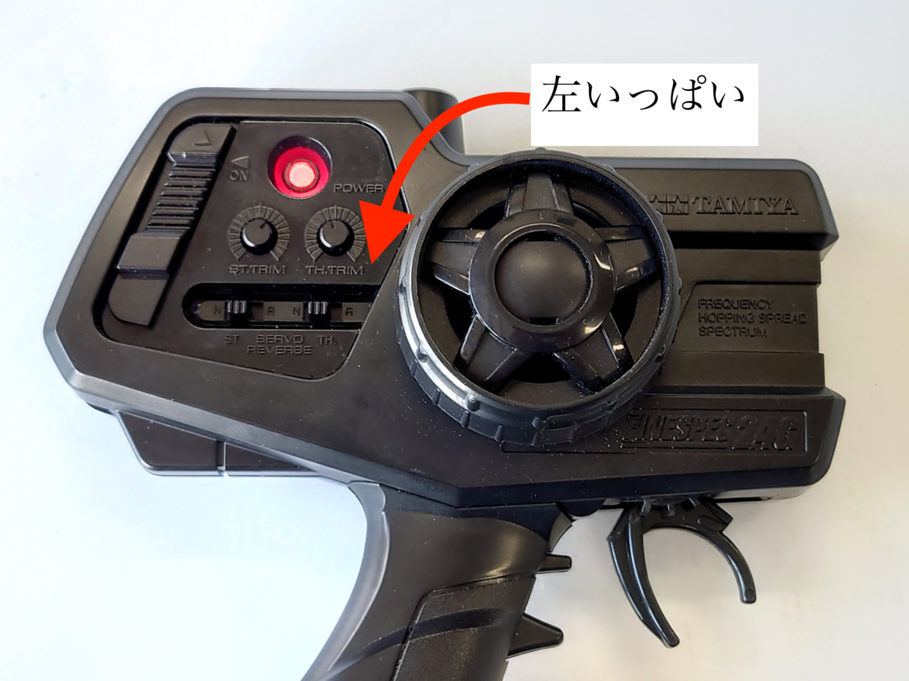{: .bom_listsize}

Setボタンをクリックします。

プロポのステアリングを中立にし、計測します。

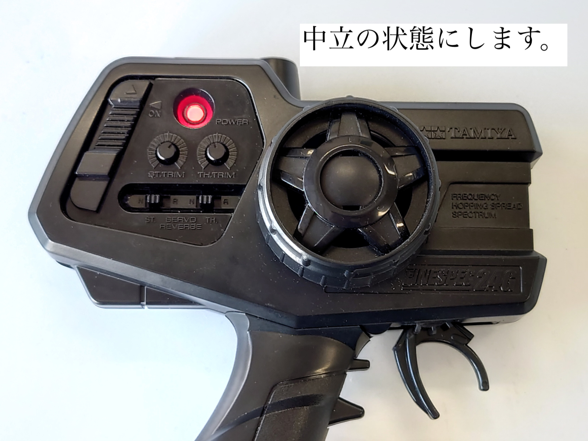{: .bom_listsize}

Setボタンをクリックします。

プロポのステアリングをを右にいっぱいに切り、計測します。

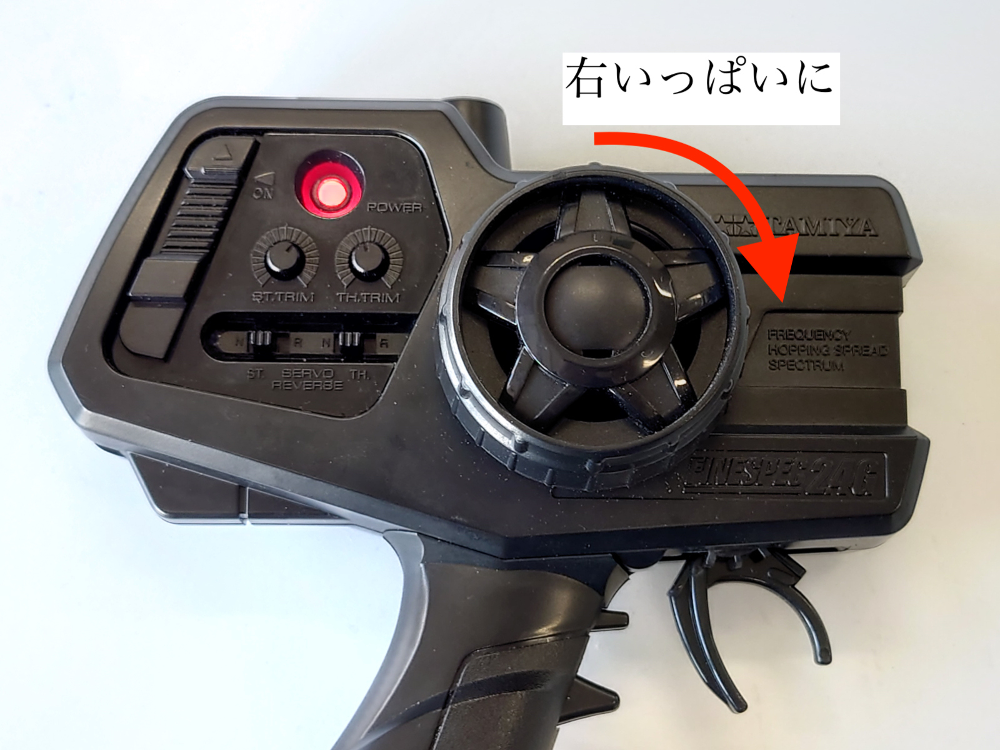{: .bom_listsize}

Setボタンをクリックします。

## スロットル信号を計測

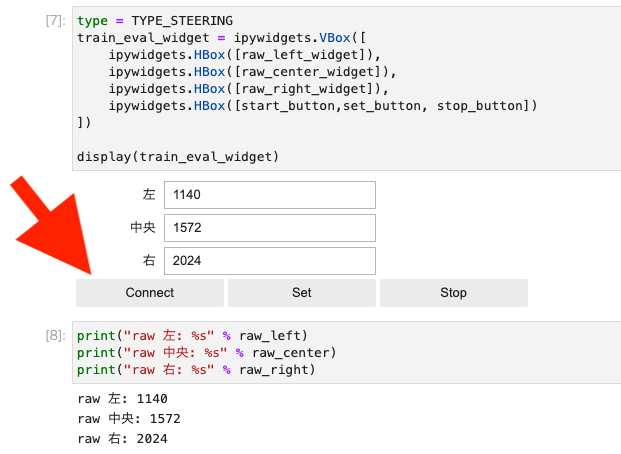

プロポのレバーを引いて前進状態にして計測します。

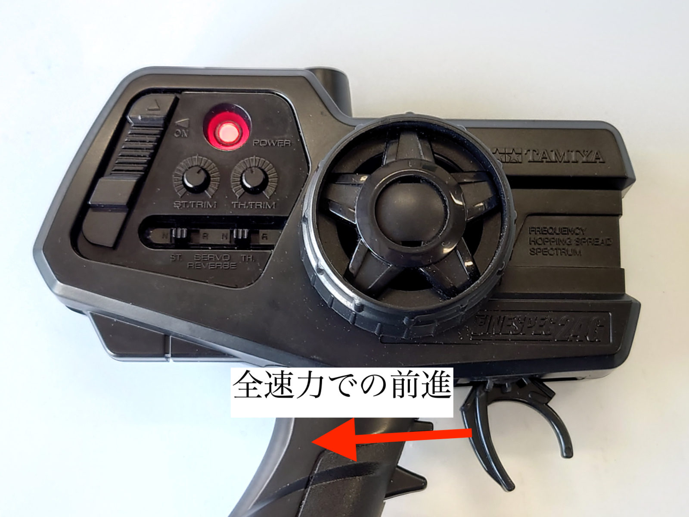{: .bom_listsize}

Setボタンをクリックします。

プロポのレバーを離します。中立状態にして計測します。

{: .bom_listsize}

Setボタンをクリックします。

プロポのレバーを前に引いて後進状態にして計測します。

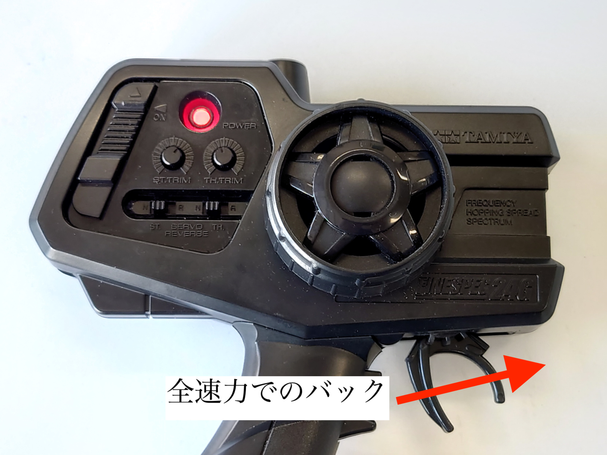{: .bom_listsize}

Setボタンをクリックします。

計測されたデータはraw_params.jsonファイルへ記憶されます。実際、計測された数値が正しいか確認してください。

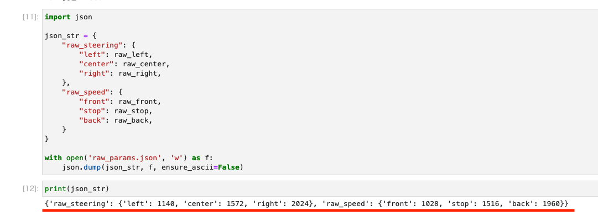

/home/jetson/jetracer/notebooksにraw_params.jsonファイルが生成されます。

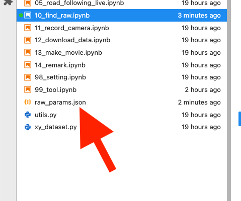
