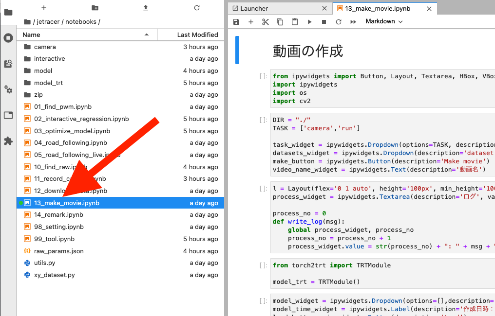
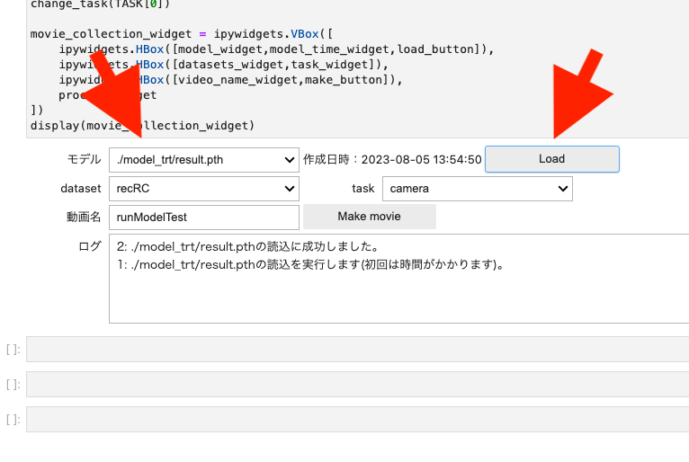
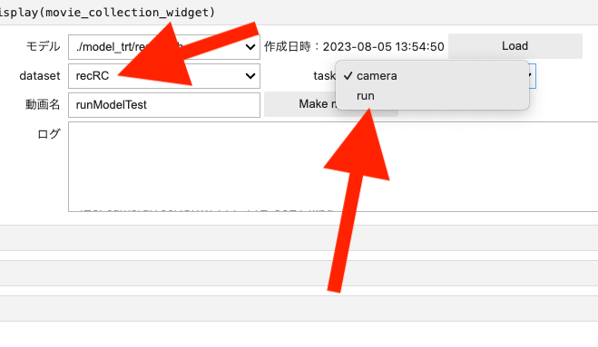
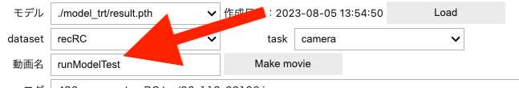
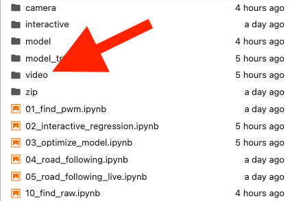
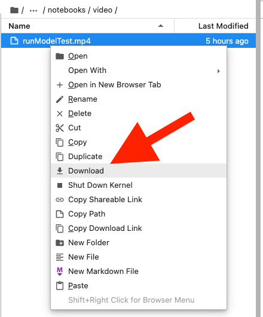

# 動画の作成

録画した一枚一枚の撮影した写真を動画にします。出来上がったモデルを動画で検証できるので便利です。

13_make_movie.ipynbを開きます。

{: .bom_listsize}

TensorRTのモデルを選び画像をLoadボタンをクリックして読み込みます。

{: .bom_listsize}

動画にしたい画像データを選択します。taskはcameraかrunを選びます。cameraは、11_record_camera.ipynbで録画したファイル群、runは04_road_following.ipynbで録画したファイル群になります。

{: .bom_listsize}

動画名に名前を付けます。

{: .bom_listsize}

Make Movieボタンをクリックします。Videoディレクトリが生成されmp4ファイルができあがります。

{: .bom_listsize}

ファイルを右クリックしてお使いのパソコンにダウンロードし、動画を確認します。

{: .bom_listsize}

青は推論結果、緑はアノテーションになります。
