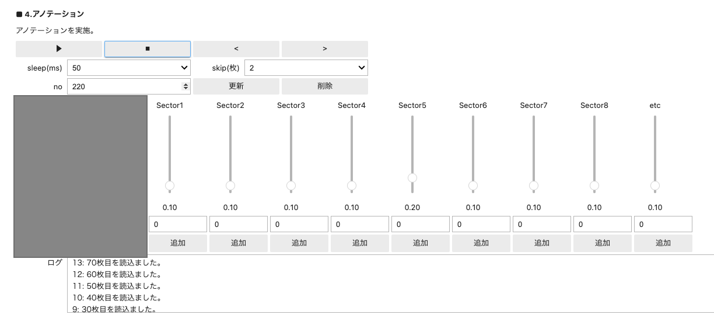

# 環境情報判断

<h1>本ページ、チュートリアル工事中</h1>

ここでは、１つのカメラからカメラの画像による場所を推論します。

Jetson Orin Nano環境で行いましょう。

20_detect.ipynbを開きます。

もとのコードを以下のようにカテゴリ名を変更します。

例：Sector１から９そしてetに変更いたします。

{: .bom_listsize}

Jetson Orin Nanoをインターネットに繋ぎ、ダウンロードします。

{: .bom_listsize}

モデルはNewを選択して読み込みます。既存のモデルがある場合は、モデルを読み込みます。その場合は、スライダーによって各画像に対しての推論結果が表示されます。

{: .bom_listsize}

学習に使用するアノテーション後のデータセットのフォルダ名を設定します。作成したフォルダはdetectフォルダの直下に作成されます。もうすでにデータセットがある場合はdatasetのドロップダウンリストから選択します。

{: .bom_listsize}

画像が表示され、特定の場所をそれぞれアノテーションしていきます。▶︎ボタンで再生、＞コマ送り、＜コマ戻しになります。アノテーションは、追加ボタンを押します。画像を追加した数が表示されます。アノテーションした画像はdetectフォルダ直下の各フォルダへ保存されます。

{: .bom_listsize}

任意のエポック数で学習します。学習が終了しましたら、モデル名をつけて保存します。

{: .bom_listsize}

できたモデルがうまく推論しているかどうかを確認します。ビデオファイルが作成され、右クリックで動画をダウンロードしてPC上で確認します。動画の左上に推論した各確率が表示されます。

{: .bom_listsize}

学習結果が良ければ、TensorRTへ変換して推論時間を短縮します。20_detect.ipynbを閉じてシャットダウンし21_convert_detect.ipynbへ進みましょう。

21_convert_detect.ipynbを実行して、20_detect.ipynbで生成されたモデルをTesnsor RTへ変換します。

次に、22_make_movie.ipynbでは環境モデルの動作を撮影画像で確かめます。

さらに、23_run_detect.ipynbは実際走行してみて、環境モデルにより周回カウントがカウントされているのかを実際の走行によって確かめます。

確かめるために、24_make_dual_movie.ipynbでは走行モデルと環境モデルの動作を撮影画像で確かめます。

25_run_dual_detect.ipynbは、Aモデル、Bモデルの走行モデルを奇数、偶数の周回数によってモデルを使い分けて推論走行させます。

