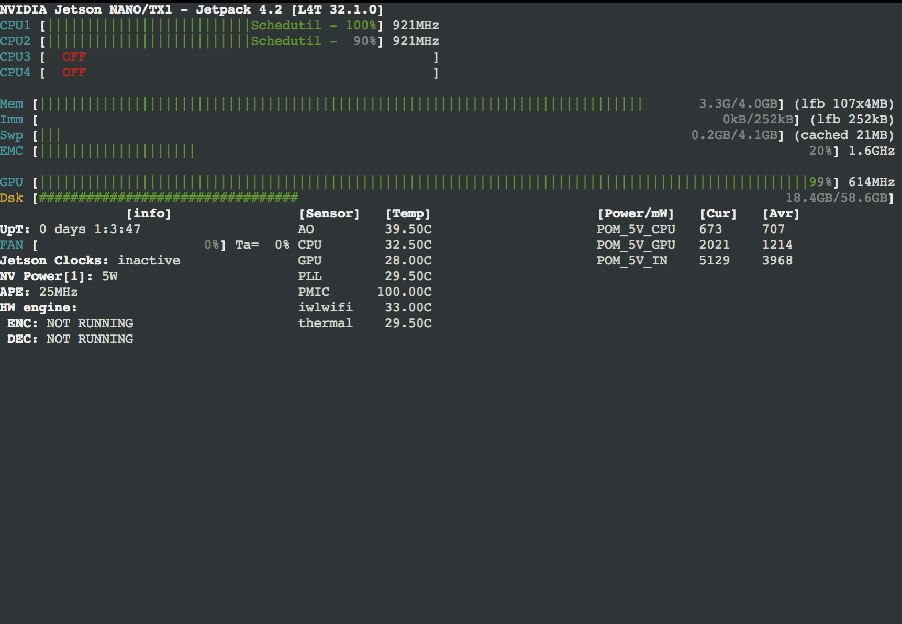

# Jetsonシリーズのメモリ

## Jetsonシリーズのメモリ

|Jetson|メモリ|速度|使用電力|
|:--|:--|:--|:--|
|Nano|4GB|0.5TFLOPS(FP16)|5-10W|
|TX2|8GB|1.3TFPLOPS(FP16)|7.5-10W|
|XAVIER NX|8GB|6TFLOPS(FP16) 21 TOPS(INTT8)|10-15W|
|AGX XAVIER|8GB|20-32TOPS(INT8) 5.5-11TFLOPS(FP15)|10-30W|

Nanoのメモリサイズは4GBなので、メモリ使用を最低限にするように心がける。

## 学習時のメモリ使用

