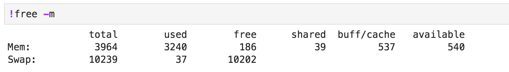

# メモリの使用量

JetRacerのNotebookでは、カメラの遅延等不安定になる事があります。考えられる主な要因は、ネットワーク遅延とメモリの枯渇です。

## jetson-stats

Jetson用のメモリ監視ツールに`tegrastats`が存在しますが非常にわかりくいので、`jetson-stats`を使用します。


jetson-statsのインストール

```
sudo -H pip3 install jetson-stats
```

実行

```
sudo jtop
```


## free

freeコマンドでもメモリ状況を確認可能です。

```
free -m
```



!!!warning "メモリの残量"
	100MBより少なくなるとNotebookがカクついてまともに動かなくなります。
