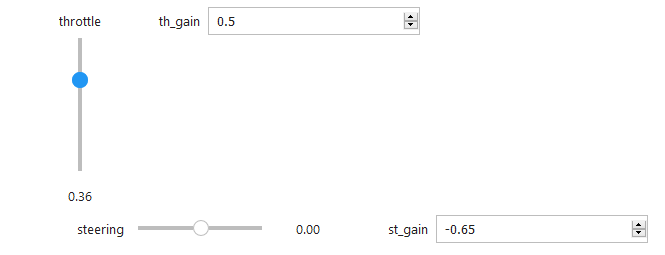
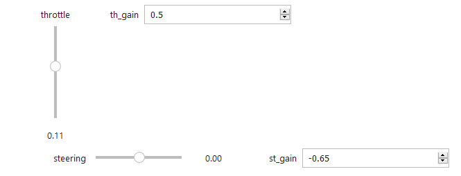

# JetRacer用のNotebook

## Notebookの場所

`/home/jetson/jetracer/notebooks`にインストールされています。

## 各ノートブックの役割

|notebook|用途|
|:--|:--|
|basic_motion.ipynb|ラジコンの動作確認、キャリブレーション確認用|
|dataset.ipynb|データセットの推論の学習用|
|interactive_regression.ipynb|走行デーアの学習とその確認用|
|jetutil.ipynb|便利なツール群|
|road_following.ipynb|学習済みモデルでの実車走行用|

## スロットルについて
JetRacerはステアリング操作は学習結果を用いますが、速度は等速走行になります。 
basic_motion.ipynb（車体の動作確認）とroad_following.ipynb（自動走行）ではスロットルの値を設定する必要があります。 
TT-02の場合、ニュートラル範囲はおおむね0.11から0.36の範囲になります。 
 
 
