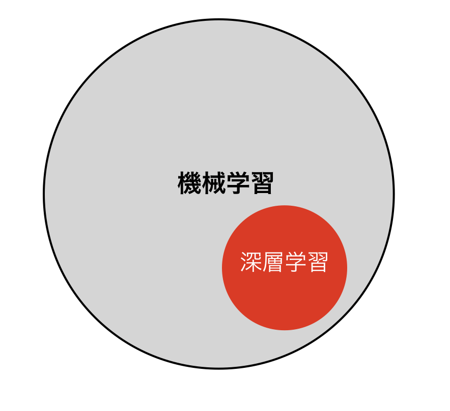
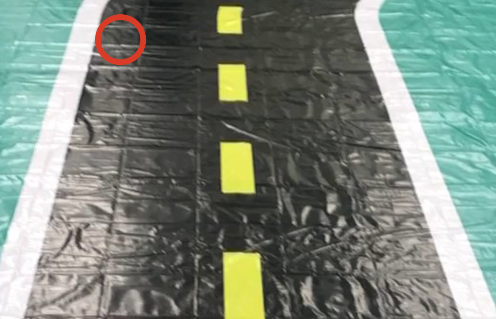
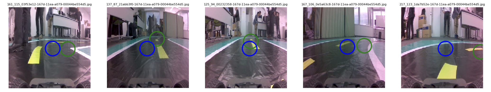

# 学習

JetRacerでは、走行用の推論は、[ResNet](https://arxiv.org/abs/1512.03385)の転移学習でおこないます。

データセット規模は、標準コースで200-300枚程度必要です。

## 学習の流れ

|No|手順|Notebook|
|:--|:--|:--|
|1|コースの画像を100枚程度撮影|interactive_regression.ipynb|
|2|20 epoch学習|interactive_regression.ipynb|
|3|推論の確認|dataset.ipynb|
|4|テストラン|road_following|
|5|うまく走行できない場所を再度撮影|interactive_regression.ipynb|
|6|1 epoch学習|interactive_regression.ipynb|
|7|テストラン, 以後 4〜6の繰り返し||

## 学習の位置づけ

|手順|対応|
|:--|:--|
|教師あり学習|○|
|教師なし学習||
|強化学習||

今回は、`教師あり学習`の転移学習を用いてコースの学習をおこないます。

## 転移学習

転移学習で用いる学習済みモデルは、[ResNet](https://arxiv.org/pdf/1512.03385.pdf)です。[ResNet](https://arxiv.org/pdf/1512.03385.pdf)の学習済みモデルに、新たな層を追加し、学習させる事で、ラジコンの自動走行を実現します。

## Dataset

Jetracerでは、画像に対して走行したい(X,Y)座標の組み合わせを、ResNetの転移学習でおこないます。

(X,Y)座標は、画像データのファイル名に付与され、学習時に画像を呼び出す際に、(X,Y)を数値として取り出し、それを学習させます。

この事で、学習済みモデルでは、画像を渡すと(X,Y)が推論されます。その(X,Y)を走行データに変換する事で自動走行します。

