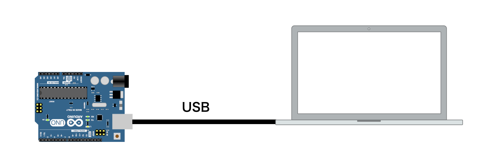
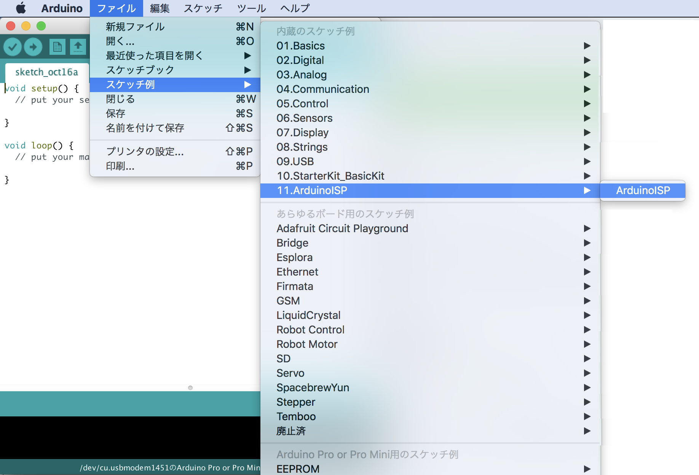
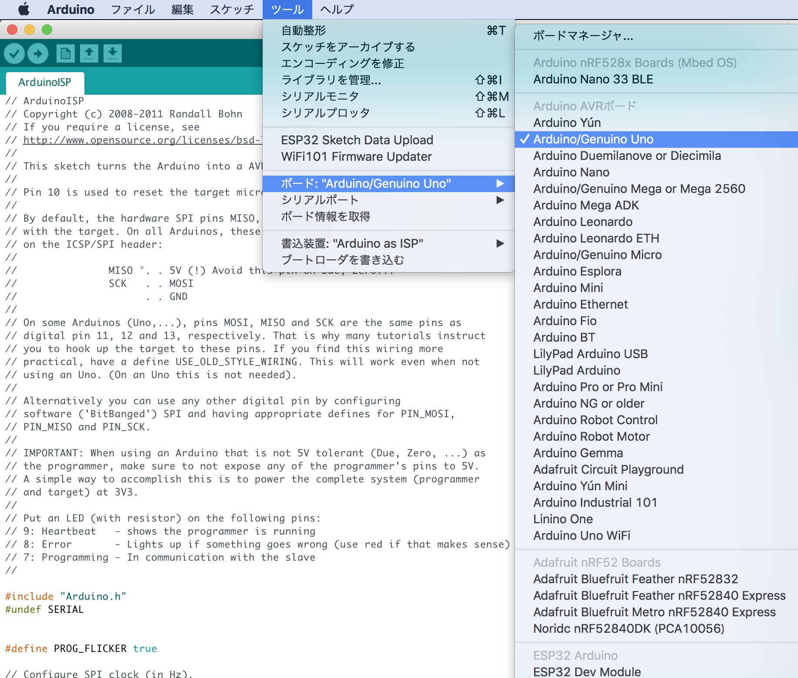
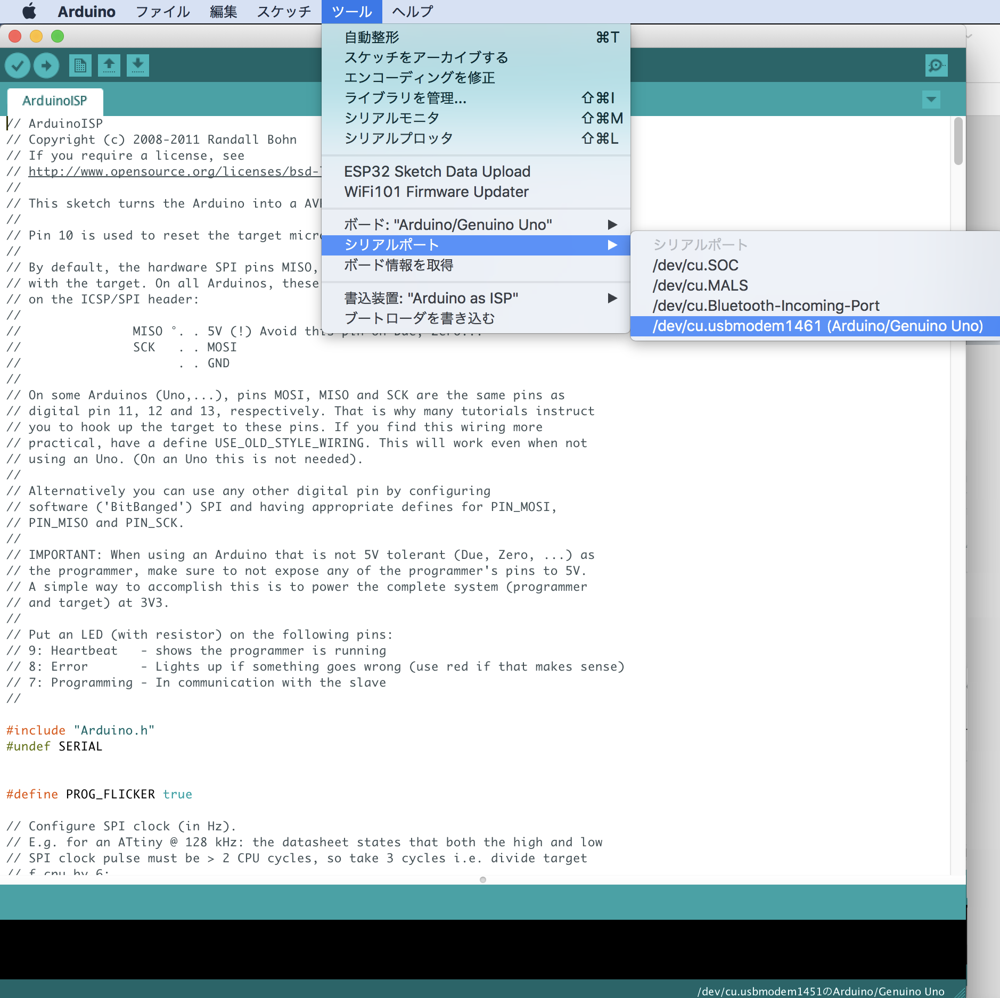
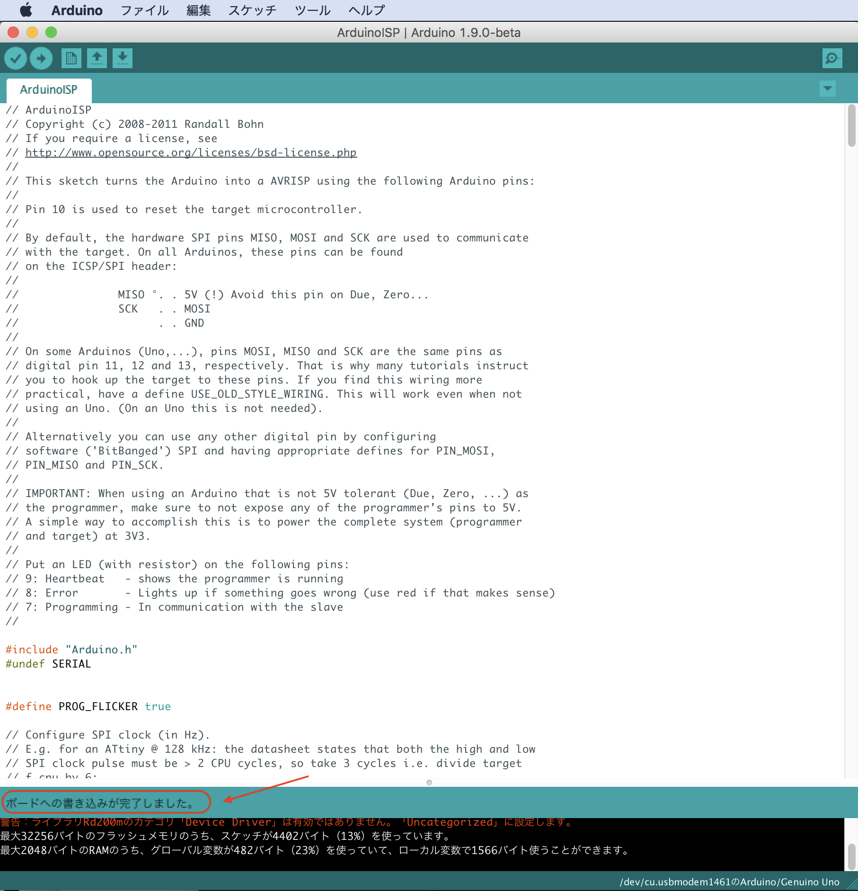
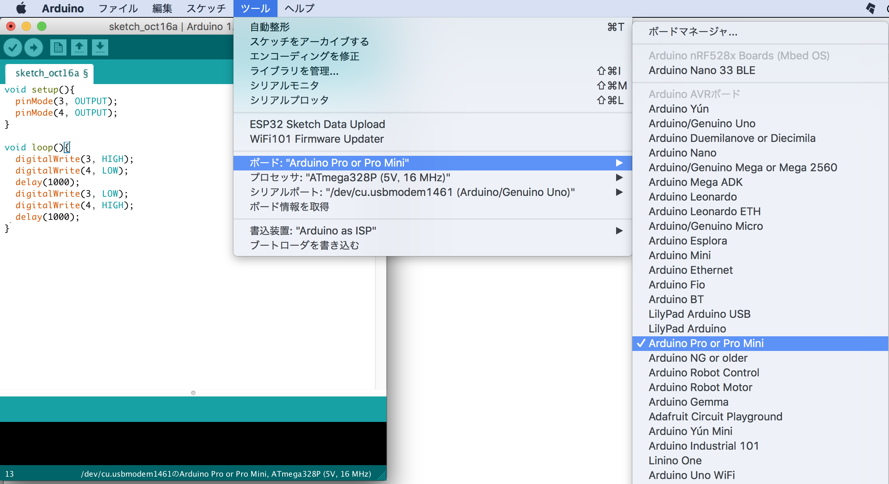
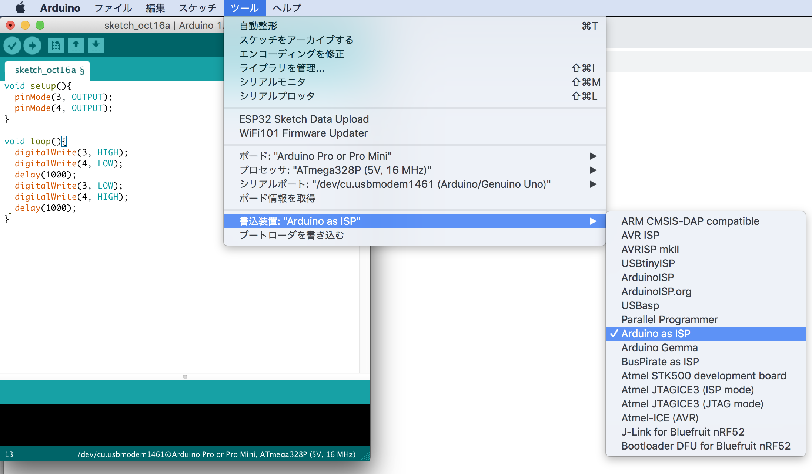
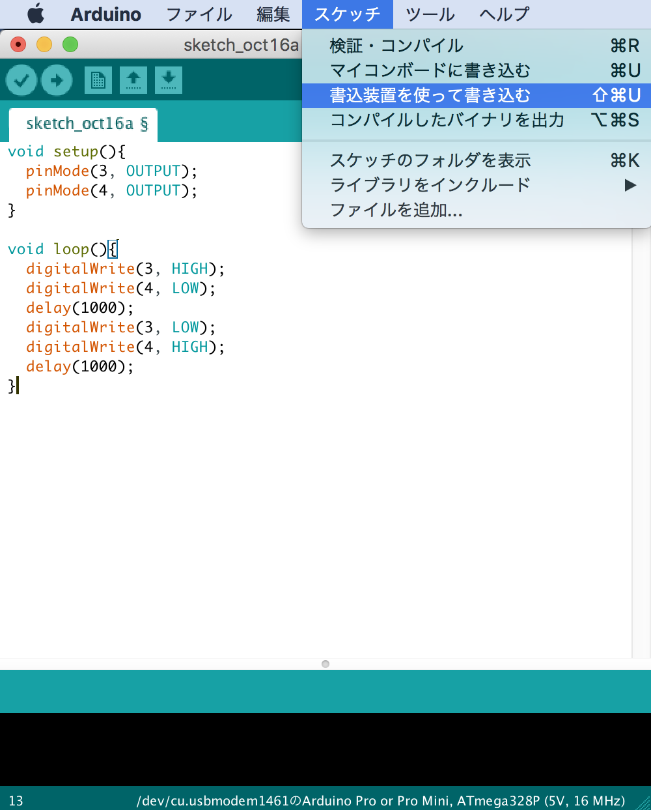

# Firmwareの開発　

## 必要な部材

|名称|用途|
|:--|:--|
|Arduino UNO|Firmware転送用|
|FaBo #604|ROM Writer Sheild|
|Tag-Connect|Firmware焼き込み|
|FaBo JetRacer #612|マルチクレスタを含む制御用途|

## 焼き込み環境の準備　

Arduino UNOとPCをつなぎ、ArduinoISPのソースをBuildし、Arduinoに焼き込みます。











## 転送の手順

Arduino UNOにFaBo #604を差し込み、TAG-Connectを接続します。

Arduinoで下記サンプルコードを作成します。

```c
void setup(){
  pinMode(3, OUTPUT);
  pinMode(4, OUTPUT);
}

void loop(){
  digitalWrite(3, HIGH);
  digitalWrite(4, LOW);
  delay(1000);
  digitalWrite(3, LOW);
  digitalWrite(4, HIGH);
  delay(1000);  
}
```








