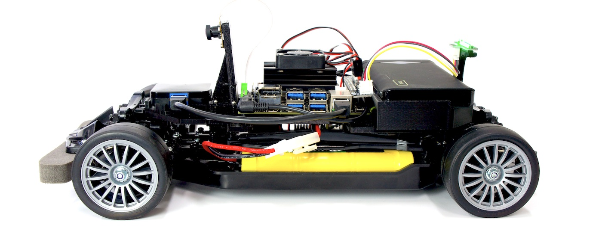

# JetRacer Docs

※写真は開発中のものです。

## JetRacer Docsについて

JetRacer Docsは、FaBo JetRacerの学習用ドキュメントです。

## 修正依頼等

GithubのRepoに[Issues](https://github.com/FaBoPlatform/JetracerDocs/issues)をあげる。

## 購入先(FaBo Store)
- [FaBo Store](https://www.fabo.store)

## 本ドキュメントでのセミナーの実施

- 2019年12月5日 JetRacerハンズオン(主催 NTTコムエンジニアリング)(35台)
- 2019年12月17日 JetRacerハンズオン(主催 NTTコムエンジニアリング)(35台)
- 2019年12月24日 JetRacerハンズオン(主催 NTTコムエンジニアリング)(35台)

## 関連記事

- [誰もが童心に帰って楽しくAIを習得できるJetRacerハンズオン](https://blogs.nvidia.co.jp/2020/02/21/nttceng-jetbot-jetracer/)
- [NTTコムエンジが社員のAI学習教材に Jetson Nano搭載「JetRacer」を採用　深層学習とAI推論を体験　マクニカらが提供](https://robotstart.info/2019/12/27/nttcom-eng-jetracer.html)

## FaBo AI 教材
- [JetRacer Docs](https://faboplatform.github.io/JetracerDocs/)
- [JetBot Docs](https://faboplatform.github.io/JetbotDocs/)
- [DonkeyCar Docs](https://faboplatform.github.io/DonkeyDocs/)
- [EdgeAI Docs](https://faboplatform.github.io/EdgeAIDocs/)

## その他のドキュメント
- [Android Things Docs](https://faboplatform.github.io/AndroidThingsDocs/)
- [Denbun Docs](https://faboplatform.github.io/DenbunDocs/)
- [Circuit Docs](https://faboplatform.github.io/CircuitDocs/)
- [Swift Docs](https://faboplatform.github.io/SwiftDocs/)
- [NRF Docs](https://faboplatform.github.io/NRFDocs/)

