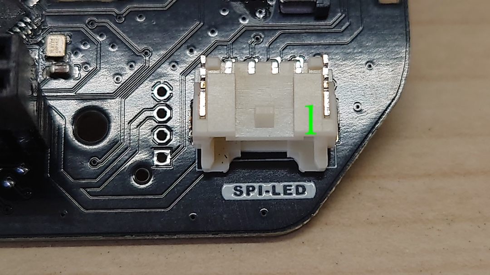

# #612 JetRacerコントロールボード

|Revison|
|:--|
|3.0.0|
|3.0.1|
|3.0.2|
|3.0.3|

※Seeed Studio XIAO ESP32S3を付属し、ファームウェア書き換えを容易にしました。

※Rev2.0.21,Rev2.0.23,Rev2.0.28,Rev2.0.29にあるモードを切り替えスイッチがありません。必要に応じてお客様が追加でファームウェアを変更し切り替えてください。

※マイコンボードのファームウェアは焼き込み済みです。XIAOのWi-Fiアンテナは使用しません。

## 名称と役割

## コントロールボード接続例

JetsonおよびRCカーの電源を停止して、以下のように接続します。

Jetson Nanoのファンコネクタをコントロールボードに予め通しておきます。ケーブルを通したらFANのコネクタをJetson Nanoに刺します。

!!!Cation "ファンケーブル"
	対象はJetson Nano開発者キットのみとなります。

フルカラーLEDを付属、お持ちの方は、４ピンケーブルをコントロール基板に接続しておきます。

コントロール基板をJetsonの４０ピンヘッダーに接続します。前後、左右ともにズレがないことを確認し、奥までしっかり接続します。

受信機を確認します。車体前方から1ch,2ch,3ch(B)になります。写真の方向の場合は、車体外側が黒（GND）、車体内側が白（信号線）

タミヤTRU-08の場合。上から1ch,2ch,B 　BのBATTは、3chとして使用します。3chのPWM信号波長が１５００ミリ秒未満だった場合は、１５００ミリ秒以上だった場合はAIモードになります。

受信機と３ピンとを繋ぐ、ケーブルが必要となります。

受信機にコネクタを刺し極性を間違いなく接続します。白　SIGNAL、赤　VCC、黒　GND ※弊社３ピンコネクタの場合

サーボからの３ピンのケーブルはSTへ接続、ESCからの３ピンのケーブルはTHに接続します。ズレなくかつ極性を間違えなく接続します。※信号線、極性に関してはそれぞれご使用のサーボまたはESC説明書をご確認ください。

以下の写真のように接続します。サーボおよびESCからの３ピンコネクタは爪があるので１個空けて接続します。※接続例です。タミヤESC、タミヤサーボのコネクタの場合

!!!Cation "逆接続に注意"
	３ピンコネクタの逆接続は破損の原因となります。電源投入前に確認しましょう。

## ブロック図

## I/O

GNDは、JetsonとRCカーいずれも共通

※SM04B-PASS-TBT(LF)(SN)使用

※SM04B-PASS-TBT(LF)(SN)使用

※ピンソケット (メス) 2×7 (14P)を２個使用。

!!!Cation "XIAO接続"
	取り付け方法をお間違えなくようにご確認ください。

!!!Cation "電圧レベル"
	本基板から出力されるPWMの電圧レベル(ST,TH)は3.３Vレベルになります。

!!!Cation "GNDに関して"
	本基板は、JetsonのGNDとRCカーのGNDは接続されております。

