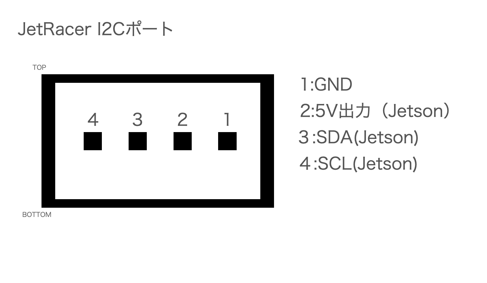
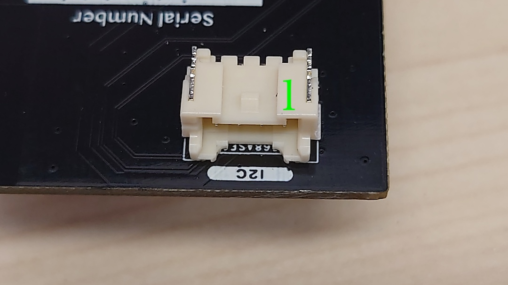
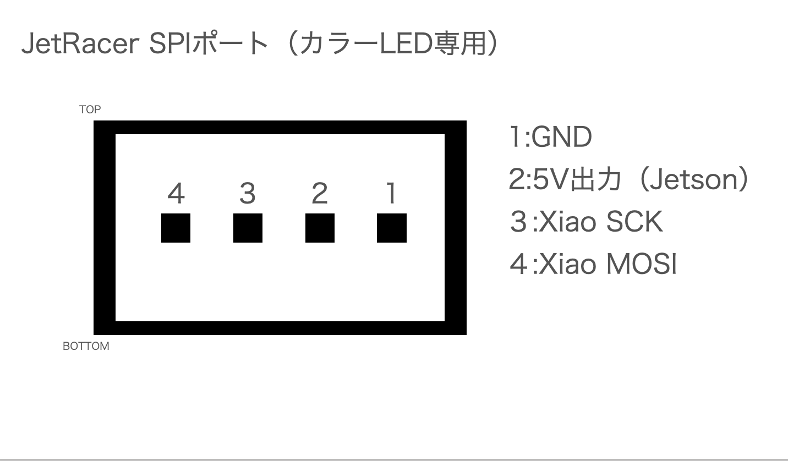
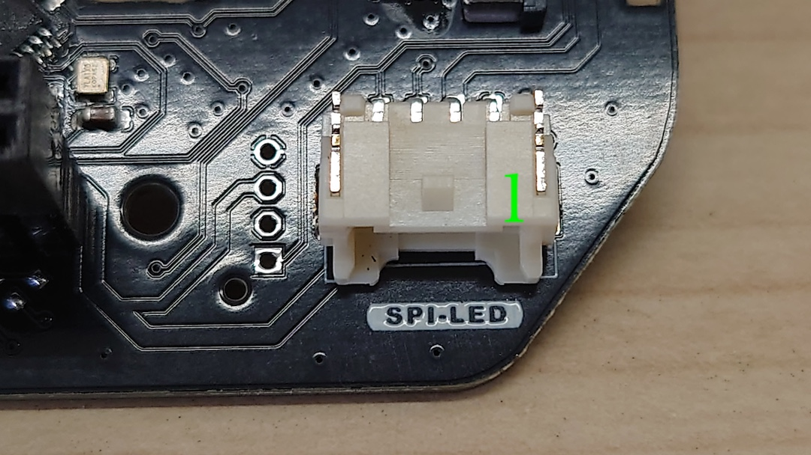
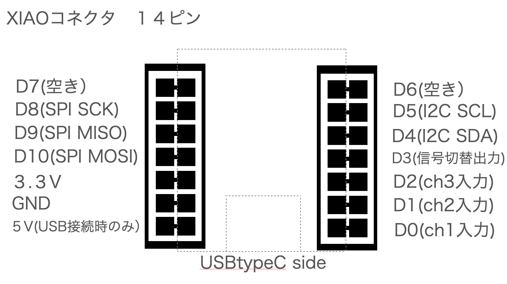
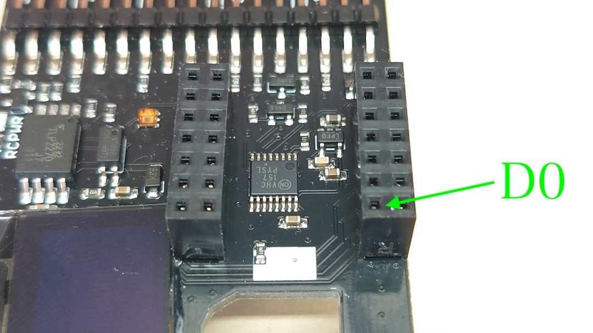

# #612 JetRacerコントロールボード

|Revison|
|:--|
|3.0.4|

Rev3.0.0,1,2,3と主な変更点

ブラシレスモータのセンサーを取得できます。（タミヤ製推奨、ブラシレスモーターセンサーコードが２本必要となります。）回転数取得可能。

フュージョンセンサー　BNO055搭載。

※動作環境　Jetson Orin Nano 8GB 開発者キット　および Jetson Nano(A-02,B-01) 開発者キットのみ

※Rev2.0.21,Rev2.0.23,Rev2.0.28,Rev2.0.29にあるモードを切り替えスイッチがありません。必要に応じてお客様が追加でファームウェアを変更し切り替えてください。

※マイコンボードのファームウェアは焼き込み済みです。XIAOのWi-Fiアンテナは使用しません。

※受信機との接続は、別途爪なしのサーボケーブルが３本必要になります。

## 名称と役割

## コントロールボード接続例

!!!Cation "逆接続に注意"
	３ピンコネクタの逆接続は破損の原因となります。電源投入前に確認しましょう。またズレて挿入も基板その他機器の故障原因となります。

## ブロック図

## I/O

GNDは、JetsonとRCカーいずれも共通

※SM04B-PASS-TBT(LF)(SN)使用

※SM04B-PASS-TBT(LF)(SN)使用

※ピンソケット (メス) 2×7 (14P)を２個使用。

!!!Cation "XIAO接続"
	取り付け方法をお間違えなくようにご確認ください。

!!!Cation "電圧レベル"
	本基板から出力されるPWMの電圧レベル(ST,TH)は3.３Vレベルになります。

!!!Cation "GNDに関して"
	本基板は、JetsonのGNDとRCカーのGNDは接続されております。

