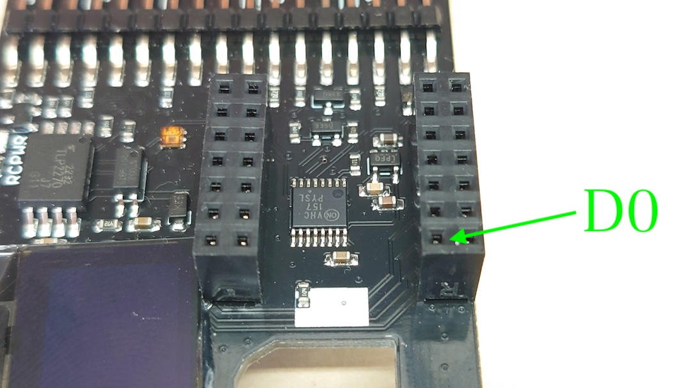

# #612 JetRacerコントロールボード（工事中）

|Revison| a|
|:--|:--|
|3.0.8|Jetson Orin Nano 開発者キット専用|
|3.0.8 B|Jetson Nanoに対応|

## Rev3.0.4と主な変更点

### 追加

 RCカーの電源ON時に、マルチプレクサへの信号を停止機能追加。

### 変更

受信機、サーボおよびESCの接続、逆接続防止のケーブルに変更。

### 削除

ブラシレスモータのセンサーを回転数計測削除。

９軸センサーBNO055を削除。

## 動作環境

動作環境　Jetson Orin Nano 8GB 開発者キット　および Jetson Nano　開発者キットのみ

Rev2.0.21,Rev2.0.23,Rev2.0.28,Rev2.0.29にある固定する切り替えスイッチがありません。必要に応じてお客様が追加でファームウェアを変更し切り替えてください。

マイコンボードのファームウェアは焼き込み済みです。XIAOのWi-Fiアンテナは使用しません。

## 名称と役割

## コントロールボード接続例

!!!Cation "逆接続に注意"
	３ピンコネクタの逆接続は破損の原因となります。電源投入前に確認しましょう。またズレて挿入も基板その他機器の故障原因となります。

## ブロック図

## I/O

GNDは、JetsonとRCカーいずれも共通

※SM04B-PASS-TBT(LF)(SN)使用

※SM04B-PASS-TBT(LF)(SN)使用

※ピンソケット (メス) 2×7 (14P)を２個使用。

!!!Cation "XIAO接続"
	取り付け方法をお間違えなくようにご確認ください。

!!!Cation "電圧レベル"
	本基板から出力されるPWMの電圧レベル(ST,TH)は3.３Vレベルになります。

!!!Cation "GNDに関して"
	本基板は、JetsonのGNDとRCカーのGNDは接続されております。

